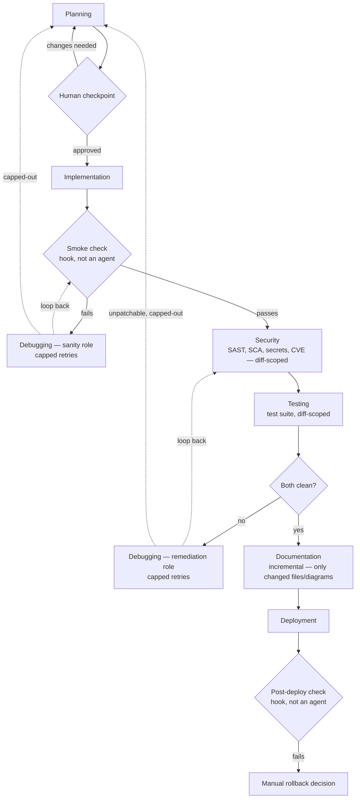

<a id="agentic-development-pipeline--planning-doc"></a>
# Agentic development pipeline — planning doc

> **⚑ Authoritative sources (read first).** This is a **chronological design log** and lags the live pipeline. For current per-agent **model / effort / wiring**, the source of truth is `global-agents/*.md` (and the synced diagram + tables in [`system_architecture.md`](system_architecture.md)). Net state as of **2026-06-29** (security later overridden to `opus`): planning `opus/xhigh`, debugging `opus/xhigh`, implementation `sonnet/high`, security `opus/high` (overrides the 2026-06-29 `sonnet/high` — step 6f added independent STRIDE-delta reasoning), plan-audit & testing `sonnet/medium`, documentation `haiku` (no effort — Haiku exposes none), deployment `sonnet` (moved from `haiku` for its pre-commit inspection step). `log-run.sh` is wired on all **8** agents (incl. `plan-audit`, which predates this table and isn't in it) and **auto-derives the model from frontmatter** (the wiring passes only `<stage>`). The `.codex` Codex mirror was deleted (Anthropic-only). The 7-agent table just below has its models refreshed; deeper embedded copies further down predate the 2026-06-29 retune and are kept as historical record.

Status: design phase, not yet implemented. Audited once for token/time efficiency (token cost prioritized over wall-clock time) — this version reflects that pass. A full internal-consistency audit was applied on 2026-06-23; the design forks it surfaced are now settled and recorded under **Resolved design decisions** in the appendix. A Claude Agent SDK alignment pass (against code.claude.com/docs/en/agent-sdk) was also applied on 2026-06-23 — see **Platform alignment (Claude Agent SDK / Claude Code)** below. A readiness pass (2026-06-23) then added the operational pieces an implementer needs — `settings.json` permissions, a prerequisites checklist, `.pipeline/` bootstrap, the enforced human-checkpoint marker, a conversational run sequence, a `CLAUDE.md` template, and `effort` levels on every agent — and corrected the `documentation` agent's tool scope (it needs `Bash` for `git diff`). An orientation & learning guide (Part I), with a map to Anthropic's docs verified live on 2026-06-23, was then added at the top for following along and learning the system. A generalization pass (2026-06-24) established language defaults (Python backend, JavaScript frontend, SQL database), threaded database migration support through the implementation, security, and deployment agents, added fill-in-the-blank hook script templates for `smoke-check.sh` and `post-deploy-check.sh`, added a greenfield project kickoff section with a `PROJECT.md` spec format, and clarified that stack-specific skills are swappable defaults rather than hard requirements. A multi-cloud pass (2026-06-24) then documented **Amazon Cognito** (auth) and **AWS CloudWatch / X-Ray** (observability) as co-equal alternatives to the Firebase/GCP defaults, made the **cloud environment a `PROJECT.md`-declared choice the planning agent validates** for fit (rather than a hard default), and added full AWS scaffolds parallel to the Firebase/Pino ones — so the pipeline is portable across cloud providers, with AWS as the first documented concrete environment.

A **major revision (2026-06-25)** then acted on a research-backed audit and settled the defaults toward simplicity and token efficiency: (1) **Finding A — the git model was reworked** — diff-scoping now measures the working tree against the last commit (tracked + untracked files), the `last_clean_commit` pointer was removed (it silently missed uncommitted/untracked work), the **deployment agent now commits the reviewed change as its first step** (the pipeline's only commit, after a new soft pre-deploy review point), and the deploy gate's currency check became a `tested_change_hash` recompute; (2) **Findings C/D/E** — one config-driven `smoke-check.sh` (Python-default, greenfield build/import fallback), a greenfield `/health` scaffold, and a machine-readable `security-status.json` so gate hooks parse with `jq` not `grep`; (3) **defaults narrowed to one documented path** — **AWS** (cloud/infra), **Firebase Auth** (decoupled from cloud), **Python** backend / **JavaScript** frontend, with Python `structlog`/Firebase-admin backend scaffolds added; non-default scaffolds (Cognito, GCP observability, JS backend, Go/Java loggers) moved to the **`pipeline-alternatives.md`** companion (documentation-only, never loaded at runtime); (4) a new **Pipeline observability & metrics** section (a `run-log.jsonl` + objective metrics) and a **planning self-audit** step; (5) **skills reduced 16 → 13** (three implementation guides merged into `code-standards`, two doc guides into `doc-conventions`) and **four conditional skills made on-demand** (auth/logging/iac/ddia), dropping planning's preload from 5 skills to 1 and implementation's from 6 to 1. Documents the current shape of the pipeline before scaffolding the actual Claude Code subagents, hooks, and skills.

A **scaffold + environment-setup pass (2026-06-25)** then built and wired the pipeline on a concrete machine (Windows 11): all 7 agents, hooks, `settings.json`, and the 13 original skills were authored; a 14th planning skill, **`containerization-conventions`** (on-demand), was added with a packaging-decision rubric, and the **deployment agent gained a feature-branch step** (it branches off the default branch before its commit so the PR has a head branch — with `git checkout`/`git symbolic-ref` added to the allow-list). Setup-specific additions: **`semgrep-scan.sh`** runs Semgrep through Docker (no native Windows build; `jq`/`osv-scanner` are native), **`log-run.sh`** appends the per-stage `run-log.jsonl` telemetry, **`templates/CLAUDE.md`** is a copy-per-project seed, and the **12 global skills are now version-controlled** in `global-skills/` (installed to `~/.claude/skills/` via `scripts/install-global-skills.sh` — repo is source of truth). See *Environment setup notes* (under *settings.json*) for the full record and the Linux/WSL alternative.

An **audit + hardening pass (2026-06-26)** then ran a full file-by-file consistency check (verdict: ready for a trial run) and applied: `Skill` added to the planning/implementation/security `tools:` lists (on-demand skills are invoked through the Skill tool); the working-tree change-set hash centralized into a shared **`compute-change-hash.sh`** hook that documentation (via the new **`write-review-manifest.sh`**), testing, and `deployment-gate.sh` all call, so the currency recompute matches byte-for-byte; explicit `jq`-presence guards added to `deployment-gate.sh` (fail-closed) and `record-clean.sh` (fail-open, non-silent); the `.env` deny widened to `Read(**/.env)`; and `[UNIMPLEMENTED]` banners placed on `log-run.sh`, `post-deploy-check.sh`, the *Pipeline observability & metrics* section, and `pipeline-refinement-loops.md`. The hook set is now nine; `terraform` 1.15.7 and `checkov` 3.3.2 were also installed locally.

A **telemetry-activation pass (2026-06-26, later)** then took the run log live before the first test project: **`log-run.sh` was wired as a `Stop` hook on all seven agents** (it no longer needs an orchestrator call) and its signature changed to `log-run.sh <stage> <model> [status] [retries]` — `feature` auto-derives from the git branch and `status`/`retries` auto-derive from each stage's `.pipeline/*` artifact, with `model` and `files_changed` added to every line and coverage/finding-count extras added for testing/security. To give the implementation stage a *real* status instead of a default `pass`, **`smoke-check.sh` now writes `.pipeline/smoke-status.json`** on every exit path and `log-run.sh` reads it. Two greenfield-safety bugs in `log-run.sh` were fixed (a `pipefail` abort and a corrupted `feature` value when no commit exists yet). The **testing agent's `maxTurns` was reduced 15 → 10** (Haiku; forces earlier escalation to debugging rather than thrashing). Known limit: a `Stop` hook does not fire on a `maxTurns` cap-out, so a capped stage is absent from the log (a missing line is itself the cap-out signal).

A **portable-install migration (2026-06-26, latest)** then moved the whole pipeline from per-project copies to a **publish-once / bootstrap-per-project** model, so a new repo no longer copies `.claude/` file-by-file. **Source of truth is now the repo's `global-agents/`, `global-hooks/`, `global-skills/`, `global-project-skills/`, and `templates/` directories**, published to the user level (`~/.claude/agents`, `~/.claude/hooks`, `~/.claude/skills`, `~/.claude/pipeline-templates`) by **`scripts/install-global.sh`** (which supersedes the old `install-global-skills.sh`, adds a manifest-backed collision guard so it never silently overwrites another user's same-named files, and a `--force` override). A new **`scripts/bootstrap-project.sh`** (run from inside any repo, also installed to `~/.claude/pipeline-templates/`) writes only the per-project files: `.claude/settings.json` (the broad command allow-list stays **project-scoped**, never elevated to global settings), `.pipeline/state.json`, the two project skills, `CLAUDE.md`/`PROJECT.md`, and `.gitignore` entries — idempotent and never committing. Consequently **all hook paths became `$HOME/.claude/hooks/…`** (frontmatter, agent bodies, skills, and the `Bash($HOME/.claude/hooks/*.sh)` allow-list), and cross-hook calls resolve self-relative via `HOOK_DIR="$(cd "$(dirname "${BASH_SOURCE[0]}")" && pwd)"`. Global-hook safety rests on three facts: hooks are wired in **agent frontmatter** so they fire only when a pipeline agent is invoked (no always-on session hook); every ambient hook opens with `[ -f .pipeline/state.json ] || exit 0` (instant no-op outside a bootstrapped project); and `deployment-gate.sh` keeps **no** guard so it fails closed where interlock files are absent. `smoke-check.sh` also gained an optional `.pipeline/smoke.env` source for per-project start/health/build commands, and **refuses to source it if git tracks it** (blocks a hostile cloned repo from shipping a committed `smoke.env` to run code on the next pipeline user). **Below, the historical `.claude/agents/*.md` and `.claude/hooks/*.sh` paths describe the original in-repo design and remain conceptually accurate; the live runtime location is now `~/.claude/`, published from the `global-*/` source dirs.**

A **robustness-roadmap pass (2026-06-30)** then implemented the seven items previously parked in
`pipeline-revision-plan.md`'s "Roadmap — robustness items" table, all as **conditional,
trigger-gated conventions that no-op unless a feature warrants them** (no new gate hook added). The
testing agent gained four conditional modes (steps 5c–5f): **migration up/down/up round-trip** (when
migration files change), **property-based / fuzz** (parsers/validators), **concurrency / idempotency**
(declared-idempotent handlers), and **load-vs-perf-budget** (when planning declares a perf budget as
an acceptance criterion); results land in new `resilience`/`perf` blocks of `test-results.json` and
only block when the guarantee is a declared acceptance criterion (riding `criteria_covered`). A later
**criterion-completeness pass (PR G, 2026-07-01)** hardened the perf path: when a perf-backed
criterion's budget names a dimension left unmeasured (`perf.measured.*` null against a non-null
`perf.budget.*`), the gate **and** the loop-exit block deterministically, so a serial-latency-only
test can no longer score a throughput criterion complete (M2 finding F1). The same pass added an
**advisory** `test-quality.json` (mutation over changed core modules + adversarial "what does this
test not catch" review — read by no gate) and surfaces branch coverage (F5). Security
gained **Trivy** container-image/Dockerfile scanning via a new `trivy-scan.sh` Docker wrapper (critical
CVEs fold into `critical_count`, so they block at the existing deploy gate like a Checkov critical),
closing the `containerization-conventions` image-scanning gap. A new on-demand **`secrets-management`**
skill (13th global skill) documents the runtime-secret fetch facade (Secrets Manager / SSM, caching,
rotation), and **`iac-conventions` + `baseline.md`** gained production-scale defaults (multi-AZ,
target-tracking auto-scaling, ALB health checks, no single point of failure). Enforcement rides the
two existing surfaces — the fail-closed security gate and `criteria_covered` — so a trigger-less
feature behaves exactly as before.

<a id="table-of-contents"></a>
## Table of contents

**Orientation & learning guide**

- [How to read this document](#how-to-read-this-document)
- [The 60-second mental model](#the-60-second-mental-model)
- [Read these first (Anthropic docs, in order)](#read-these-first-anthropic-docs-in-order)
- [The building blocks, explained](#the-building-blocks-explained)
- [Walk the pipeline end-to-end](#walk-the-pipeline-end-to-end)
- [Component-to-docs map](#component-to-docs-map)
- [First-run gotchas](#first-run-gotchas)
- [Becoming an expert: a hands-on path](#becoming-an-expert-a-hands-on-path)

**Main document**

- [Goal](#goal)
- [Platform alignment (Claude Agent SDK / Claude Code)](#platform-alignment-claude-agent-sdk--claude-code)
- [Pipeline overview](#pipeline-overview)
- [Agents](#agents)
- [The debugging agent's two roles](#the-debugging-agents-two-roles)
- [Security + testing: serial by default, documentation gated behind both](#security--testing-serial-by-default-documentation-gated-behind-both)
- [Token / performance notes](#token--performance-notes)
- [Gates, summarized](#gates-summarized)
- [Pipeline observability & metrics](#pipeline-observability-and-metrics)
- [Agent loop, goals, and session control](#agent-loop-goals-and-session-control)
  - [The agent loop](#the-agent-loop)
  - [Limiting the loop: maxTurns and budget](#limiting-the-loop-maxturns-and-budget)
  - [Three ways to keep a session running](#three-ways-to-keep-a-session-running)
  - [/goal - condition-based loop](#goal---condition-based-loop)
  - [/loop - time-interval loop](#loop---time-interval-loop)
  - [Stop hooks - custom loop control](#stop-hooks---custom-loop-control)
  - [Effort level](#effort-level)
- [Authentication design](#authentication-design)
  - [Provider options: Firebase Auth or Amazon Cognito](#provider-options-firebase-auth-or-amazon-cognito)
  - [Architecture](#architecture)
  - [Provider stack](#provider-stack)
  - [Two paths for Duo Mobile MFA](#two-paths-for-duo-mobile-mfa)
  - [Module structure (facade pattern)](#module-structure-facade-pattern)
  - [Custom claim schema](#custom-claim-schema)
  - [Key resources](#key-resources)
- [Logging and observability design](#logging-and-observability-design)
  - [The three pillars of observability](#the-three-pillars-of-observability)
  - [Observability backend: GCP or AWS](#observability-backend-gcp-or-aws)
  - [Application-level logging library (by language)](#application-level-logging-library-by-language)
  - [Standard log fields](#standard-log-fields)
  - [Log levels - when to use each](#log-levels---when-to-use-each)
  - [Alerting and SLOs](#alerting-and-slos)
  - [Key resources](#key-resources-1)
- [Cloud infrastructure (AWS) integration](#cloud-infrastructure-aws-integration)
  - [When this applies](#when-this-applies)
  - [Provider and IaC stack](#provider-and-iac-stack)
  - [Module structure (`infra/`)](#module-structure-infra)
  - [Credentials and least privilege (non-negotiable)](#credentials-and-least-privilege-non-negotiable)
  - [How infrastructure threads through the existing stages](#how-infrastructure-threads-through-the-existing-stages)
  - [Threat-model additions for cloud infrastructure](#threat-model-additions-for-cloud-infrastructure)
  - [`infra-validate.sh` (smoke-equivalent for infra changes)](#infra-validatesh-smoke-equivalent-for-infra-changes)
  - [Key resources](#key-resources-2)
- [Suggested MCP servers and skills](#suggested-mcp-servers-and-skills)
  - [MCP servers](#mcp-servers)
  - [Claude skills](#claude-skills)
- [Open / not yet decided](#open--not-yet-decided)
- [Next steps](#next-steps)

**Implementation appendix**

- [Directory layout](#directory-layout)
- [Interlock file schemas](#interlock-file-schemas)
- [Hooks](#hooks)
- [Subagent files](#subagent-files)
- [Authentication module scaffold](#authentication-module-scaffold)
- [Authentication module scaffold: Amazon Cognito (moved to companion)](#authentication-module-scaffold-amazon-cognito-aws)
- [Logging setup scaffold (Python structlog — default)](#logging-setup-scaffold)
- [Logging setup scaffold: AWS observability (CloudWatch / X-Ray)](#logging-setup-scaffold-aws-cloudwatch-and-x-ray)
- [Defaults for previously open items](#defaults-for-previously-open-items)
- [Prerequisites and environment](#prerequisites-and-environment)
- [settings.json (permissions and auto-approve)](#settingsjson-permissions-and-auto-approve)
  - [Environment setup notes (concrete reference implementation)](#environment-setup-notes)
- [Running the pipeline (v1, conversational orchestration)](#running-the-pipeline-v1-conversational-orchestration)
- [Human checkpoint protocol](#human-checkpoint-protocol)
- [CLAUDE.md template](#claudemd-template)
- [Hook script templates](#hook-script-templates)
  - [`smoke-check.sh`](#smoke-checksh)
  - [`post-deploy-check.sh`](#post-deploy-checksh)
  - [What to fill in per project](#what-to-fill-in-per-project)
- [Greenfield project kickoff](#greenfield-project-kickoff)
  - [`PROJECT.md` - project spec format](#projectmd---project-spec-format)
  - [What the planning agent produces for a greenfield run](#what-the-planning-agent-produces-for-a-greenfield-run)
  - [How to invoke planning for a greenfield project](#how-to-invoke-planning-for-a-greenfield-project)
  - [CLAUDE.md on a greenfield project](#claudemd-on-a-greenfield-project)
- [Resolved design decisions (2026-06-23 audit)](#resolved-design-decisions-2026-06-23-audit)
- [Hook wiring (per-agent frontmatter `Stop` hooks)](#hook-wiring-per-agent-frontmatter-stop-hooks)
- [Skill authoring plan (the 14 `SKILL.md` files)](#skill-authoring-plan-the-13-skillmd-files)
  - [Authoring conventions (apply to all 14)](#authoring-conventions-apply-to-all-13)
  - [Per-agent preload weight (token-efficiency note)](#per-agent-preload-weight-token-efficiency-note)
  - [Planning skills](#planning-skills)
  - [Implementation skills](#implementation-skills)
  - [Security / testing skills](#security--testing-skills)
  - [Documentation skills](#documentation-skills)
  - [Cross-cutting / orchestration skills](#cross-cutting--orchestration-skills)
  - [Build order](#build-order)
  - [Index](#index)
- [Known gaps in this appendix](#known-gaps-in-this-appendix)

---

<a id="orientation--learning-guide-read-this-first"></a>
# Orientation & learning guide (read this first)

This first part exists so you can *understand* the pipeline, not just build it. It teaches every Claude Code primitive the pipeline relies on, links each one to the authoritative page on Anthropic's documentation site, and walks a single feature through the whole machine step by step. Parts II and III (the design doc and the buildable appendix) assume you already know these concepts; this is where you learn them. Docs URLs were verified against Anthropic's site on 2026-06-23.

**Conventions in this guide:**
- **📖 Docs —** the page on Anthropic's site to read for the authoritative, current details.
- **🧠 Recap —** a one- or two-line summary of what just happened, so each step sticks.
- **⚠️ Gotcha —** something that tends to surprise people on a real first run.

> **Tip — the master index.** Every Claude Code docs page is listed at **https://code.claude.com/docs/llms.txt**. If a link here ever drifts (docs reorganize), open that file and search it — it is the source of truth for page URLs.

<a id="how-to-read-this-document"></a>
## How to read this document

The document has three parts:

1. **Orientation & learning guide (this part)** — concepts plus the docs map. Read it top to bottom once.
2. **Main document (Part II)** — the *design*: the pipeline's shape, the agents, the gates, and the rationale (token-efficiency trade-offs, the debugging agent's two roles, the auth/logging/infra designs).
3. **Implementation appendix (Part III)** — the *buildable* version: actual agent files, hook scripts, interlock schemas, `settings.json`, and the skill-authoring spec.

**Suggested path to mastery:** read this part fully → skim Part II for the *why* → build from Part III, returning to *The building blocks, explained* below whenever a primitive is unfamiliar.

🧠 **Recap —** Part I teaches, Part II justifies, Part III builds.

<a id="the-60-second-mental-model"></a>
## The 60-second mental model

Five ideas make everything else fall into place:

1. **A main thread drives.** Interactively that's *you* in Claude Code; headless, it's a top-level orchestrator. The main thread calls one specialized **subagent** per stage using the **Agent tool**. Subagents never call each other.
2. **Each subagent starts blank.** A subagent sees only its own system prompt plus the prompt string you hand it — *not* your conversation, and *not* the previous subagent's output.
3. **State travels through files.** Because contexts are isolated, stages hand off by reading and writing files under `.pipeline/` (the plan, the security report, the test results, the state file). Files are the pipeline's memory.
4. **Hooks are the deterministic gates.** A **hook** is a shell script that fires on an event (an agent finishing, a tool about to run). Hooks run with no model and no tokens — they are how the pipeline *enforces* rules instead of trusting an agent to behave.
5. **Models, effort, skills, and MCP are the tuning knobs.** Model + effort set how much thinking (and cost) each stage gets; skills preload reference knowledge; MCP servers add external tools.

🧠 **Recap —** Agents think, files remember, hooks enforce, knobs tune. Hold these five and the rest is detail.

<a id="read-these-first-anthropic-docs-in-order"></a>
## Read these first (Anthropic docs, in order)

Read these pages in this order before building. Each line is *why* you're reading it and *what to take away*.

1. **[Overview](https://code.claude.com/docs/en/overview)** — what Claude Code is and the shape of the `.claude/` directory. Take away: where agents, hooks, skills, and settings live.
2. **[Quickstart](https://code.claude.com/docs/en/quickstart)** — get a working session. Take away: the basic interactive loop you'll orchestrate from.
3. **[Create custom subagents](https://code.claude.com/docs/en/sub-agents)** — *the* core primitive of this pipeline. Take away: the frontmatter fields (`name`, `description`, `tools`, `model`, `skills`, `hooks`, …) and that each subagent has its own context and permissions.
4. **[How the agent loop works](https://code.claude.com/docs/en/agent-sdk/agent-loop)** — what one "turn" is and how tool calls cycle. Take away: why context grows and why `maxTurns` exists.
5. **[Hooks reference](https://code.claude.com/docs/en/hooks)** + **[Automate actions with hooks](https://code.claude.com/docs/en/hooks-guide)** — the full event list (~29 events) and the script contract. Take away: `PreToolUse`, `Stop`, and `SubagentStop`, and that a hook exiting with code 2 blocks the action.
6. **[Extend Claude with skills](https://code.claude.com/docs/en/skills)** — skill folders and `SKILL.md`. Take away: preloaded vs. on-demand, and the progressive-disclosure pattern.
7. **[Claude Code settings](https://code.claude.com/docs/en/settings)** + **[Configure permissions](https://code.claude.com/docs/en/permissions)** — `settings.json` and allow/deny rules. Take away: why subagents prompt without an allow-list.
8. **[Connect Claude Code to tools via MCP](https://code.claude.com/docs/en/mcp)** — external tools. Take away: per-agent scoping and deferred loading.
9. **[Agent SDK overview](https://code.claude.com/docs/en/agent-sdk/overview)** — for the headless / production path. Take away: `settingSources` / `setting_sources` must be enabled to load filesystem agents, and production auth uses an API key (not claude.ai login).
10. **[Create plugins](https://code.claude.com/docs/en/plugins)** — for packaging later. Take away: what a plugin can and cannot carry (the frontmatter caveats).

🧠 **Recap —** Subagents → agent loop → hooks → skills → settings/permissions → MCP → SDK → plugins. That sequence mirrors the order you'll build in.

<a id="the-building-blocks-explained"></a>
## The building blocks, explained

Each block is one primitive: *what it is*, *what it's responsible for in this pipeline*, and where to read more.

**1. The main thread & the Agent tool (orchestration).** The main thread is the only thing that calls subagents; subagents never call each other. It invokes each stage with the Agent tool, passing a prompt string, and routes the debug loops. Responsible for: stage ordering and the human checkpoint.
📖 **Docs —** [Create custom subagents](https://code.claude.com/docs/en/sub-agents) · [Agent SDK overview](https://code.claude.com/docs/en/agent-sdk/overview).
⚠️ **Gotcha —** include `Agent` in the orchestrator's allowed tools, or every stage invocation prompts.

**2. Subagents (filesystem agents).** A `.claude/agents/<name>.md` file: YAML frontmatter (`name`, `description`, `tools`, `model`, `effort`, `skills`, `mcpServers`, `hooks`, `maxTurns`, …) plus a system-prompt body. Responsible for: one stage's behavior, tool scope, and model. This pipeline defines eight (planning, plan-audit, implementation, debugging, security, testing, documentation, deployment).
📖 **Docs —** [Create custom subagents](https://code.claude.com/docs/en/sub-agents) · [Subagents in the SDK](https://code.claude.com/docs/en/agent-sdk/subagents).

**3. Fresh context & the interlock-file handoff.** A subagent inherits none of the parent's history, so stage N writes a `.pipeline/*` artifact and stage N+1 reads it. Responsible for: all cross-stage state — `plan.md`, `security-report.md`, `test-results.json`, `state.json`, `pr-description.md`.
📖 **Docs —** [Context window](https://code.claude.com/docs/en/context-window) · [How the agent loop works](https://code.claude.com/docs/en/agent-sdk/agent-loop).
🧠 **Recap —** if two stages must share something, it goes in a file — never "the conversation."

**4. Tools & permissions.** Each agent's `tools:` field lists what it *can* call; `settings.json` `permissions.allow`/`deny` decides what runs *without prompting*. Responsible for: least privilege (e.g. security gets no Edit) and unattended runs.
📖 **Docs —** [Configure permissions](https://code.claude.com/docs/en/permissions) · [Choose a permission mode](https://code.claude.com/docs/en/permission-modes).
⚠️ **Gotcha —** subagents do **not** inherit the parent's permissions; without allow-rules they each prompt.

**5. Hooks.** Shell scripts that fire on lifecycle events. The reference documents ~29 events; this pipeline uses two patterns: `PreToolUse` (before a tool runs — the deployment gate), and `Stop` declared in an agent's frontmatter (which fires as a **`SubagentStop`** event when that agent finishes — the smoke check, infra validate, and the clean-pass retry reset `record-clean.sh`). A hook exiting code 2 blocks. Responsible for: every deterministic gate, at zero token cost.
📖 **Docs —** [Hooks reference](https://code.claude.com/docs/en/hooks) · [Automate actions with hooks](https://code.claude.com/docs/en/hooks-guide) · [Hooks in the SDK](https://code.claude.com/docs/en/agent-sdk/hooks).
⚠️ **Gotcha —** a frontmatter `Stop` hook arrives with `hook_event_name: "SubagentStop"`, and it may **not fire at all** if the agent hits `maxTurns` first.

**6. Skills.** A folder `~/.claude/skills/<name>/SKILL.md` (global) or `.claude/skills/<name>/` (project). Listed in an agent's `skills:` frontmatter, the whole file is **preloaded** into that agent; unlisted skills stay invocable on demand. Responsible for: reusable conventions (STRIDE template, the merged `code-standards` guide, diff-scoping logic, …). See Part III's *Skill authoring plan* for all 14.
📖 **Docs —** [Extend Claude with skills](https://code.claude.com/docs/en/skills) · [Agent Skills in the SDK](https://code.claude.com/docs/en/agent-sdk/skills).
⚠️ **Gotcha —** preloaded means it costs context on *every* run of that agent — keep `SKILL.md` lean and push bulk into sibling files.

**7. MCP servers.** External tool servers attached per-agent via `mcpServers:`. Responsible for: capabilities beyond the built-in tools (Context7 docs, Sentry errors, GitHub PRs). Deferred loading keeps idle tool definitions out of context until searched.
📖 **Docs —** [Connect Claude Code to tools via MCP](https://code.claude.com/docs/en/mcp) · [Connect to MCP servers](https://code.claude.com/docs/en/mcp-quickstart).

**8. Models & effort.** `model:` picks the engine (`opus` / `sonnet` / `haiku` / `fable` / `inherit`); `effort:` sets reasoning depth per turn. Together they are the primary cost lever — strong reasoning where it matters (planning, debugging, and — since 6f added independent reasoning — security), cheap elsewhere (docs).
📖 **Docs —** [Model configuration](https://code.claude.com/docs/en/model-config) · SDK reference for setting options ([TypeScript](https://code.claude.com/docs/en/agent-sdk/typescript) / [Python](https://code.claude.com/docs/en/agent-sdk/python)).

**9. Session control (keeping a stage running).** `maxTurns` and `maxBudgetUsd` cap a run; `/goal`, `/loop`, and prompt-based Stop hooks keep a session working without re-prompting. Responsible for: bounding the debug loops and (optionally) driving interactive runs to a condition.
📖 **Docs —** [Keep Claude working toward a goal](https://code.claude.com/docs/en/goal) · [Run prompts on a schedule](https://code.claude.com/docs/en/scheduled-tasks) · [Configure auto mode](https://code.claude.com/docs/en/auto-mode-config).

**10. Plugins (packaging).** A bundle of `agents/`, `hooks/`, `skills/`, and `commands/` for reuse across projects — the eventual goal. But plugin subagents **ignore** the `hooks`, `mcpServers`, and `permissionMode` frontmatter fields, so those move to `settings.json` / `.mcp.json` when packaging.
📖 **Docs —** [Create plugins](https://code.claude.com/docs/en/plugins) · [Plugins reference](https://code.claude.com/docs/en/plugins-reference).

🧠 **Recap —** eight agents, scoped by tools/permissions, tuned by model/effort, taught by skills, extended by MCP, gated by hooks, and one day shipped as a plugin.

<a id="walk-the-pipeline-end-to-end"></a>
## Walk the pipeline end-to-end

Follow one feature — "add file upload to the API" — through every stage. For each step: *who runs*, *what they read*, *what they write*, *what fires*.

**Step 0 — Setup (once per project).** Create `CLAUDE.md` (stack + "what done means"), `.claude/settings.json` (permissions), and run `mkdir -p .pipeline`.
🧠 **Recap —** the project now has conventions, an allow-list, and a handoff directory.

**Step 1 — Planning.** You call `Agent(planning, "Plan file upload…")`. It reads `CLAUDE.md` and the code (read-only on source), then writes `.pipeline/plan.md` including a STRIDE threat model, and stops for review. *Responsible for:* scope, approach, and the threat model — nothing else.
🧠 **Recap —** a plan now exists on disk; no code has changed.

**Step 2 — Plan-audit + human checkpoint.** `Agent(plan-audit, …)` runs automatically first: a structural completeness check plus ambiguity/dependency/version flags, each tagged material vs. advisory, written to `.pipeline/plan-audit.md`. If it sets `revision_recommended: true`, the orchestrator re-invokes planning **once** to address the material flags before you see the plan. You then read `.pipeline/plan.md` + `plan-audit.md`; if it's good, `touch .pipeline/plan-approved`, else re-run planning with feedback. *Responsible for:* catching a wrong direction at the cheapest possible point.
⚠️ **Gotcha —** the implementation agent refuses to start without that marker, so this gate can't be silently skipped.

**Step 3 — Implementation.** `Agent(implementation, "Implement .pipeline/plan.md")`. It verifies the approval marker, reads the plan, writes code (SOLID / Clean Code / facade), and stops. On stop, its frontmatter `Stop` hooks fire as `SubagentStop`: `smoke-check.sh` (boots the app, hits `/health`) and `infra-validate.sh` (no-ops unless `infra/` changed). *Responsible for:* turning the plan into code; the hooks decide whether it actually runs.
🧠 **Recap —** code exists and the deterministic smoke check has already judged it — zero tokens spent on that judgement.

**Step 3a — Debugging (sanity role), only if smoke fails.** You call `Agent(debugging, "<smoke error>")`. It checks `debug_retry_count.sanity` against `max_retries` in `state.json`, fixes the root cause, increments the counter, and you re-run the smoke check. Capped; if the cap is hit it escalates to planning for human review.
🧠 **Recap —** failures loop through debugging, not implementation, and the loop is bounded.

**Step 4 — Security.** `Agent(security, …)`. It reads `state.json` (creating it on first run with just the retry counters), scopes to the working-tree change set since the last commit (tracked changes + untracked files), runs Semgrep + OSV Scanner (+ Checkov if `infra/`), and writes `.pipeline/security-report.md` (human-readable) plus `.pipeline/security-status.json` (machine-readable; status `clean` unless `critical_count > 0`). *Responsible for:* finding vulnerabilities; never editing code.
🧠 **Recap —** a parseable security verdict now sits on disk, scoped to just what changed.

**Step 5 — Testing.** `Agent(testing, …)`. It writes missing tests, runs the suite with coverage, and writes `.pipeline/test-results.json` (including `tested_change_hash`, a hash of the change set it tested). On stop, `record-clean.sh` fires (as `SubagentStop`): if *both* gates are clean, it resets the retry counters. *Responsible for:* test coverage and the pass/fail verdict.
🧠 **Recap —** when both gates are green, the retry budget resets; the actual commit happens later, at deploy.

**Step 5a — Debugging (remediation role), only if security has a critical finding or a test fails.** Same agent, remediation counter. After a fix you re-run *both* security and testing (a fix can break either). Capped; unpatchable findings escalate to planning.
🧠 **Recap —** remediation always re-checks both gates, never just the one that failed.

**Step 6 — Documentation.** `Agent(documentation, …)` — only once both gates are clean. It uses `git diff` (hence its `Bash` tool) to find touched directories, updates their READMEs, refreshes `system_architecture.md` diagrams, and writes `.pipeline/pr-description.md`. *Responsible for:* keeping docs current and producing the PR description the deploy gate checks for.
🧠 **Recap —** documentation is incremental — only what changed — and gated behind passing code.

**Step 6a — Pre-deploy review (you).** After documentation, read the finished result — code, tests, docs, and `pr-description.md` — before invoking deployment. This is a soft checkpoint (not hook-enforced), but it matters because deployment's first action commits *exactly this state*. It's the natural second place (after the planning checkpoint) for a human to look before anything ships.
🧠 **Recap —** you review the precise bytes that get committed and deployed.

**Step 7 — Deployment.** `Agent(deployment, …)`. Before its commit, the `PreToolUse` hook `deployment-gate.sh` runs and blocks unless all five hold: tests pass, acceptance criteria fully covered (`criteria_covered`), security clean, `pr-description.md` exists, and the working tree still matches documentation's `reviewed_change_hash` (currency). The currency check applies to the commit; once committed, the tree is clean, so the gate lets the follow-up push/PR commands through. Its **first action is to commit** the reviewed change (`git add -A && git commit` — the pipeline's only commit); then it pushes and opens a PR on GitHub (`git push` prompts for human approval; `gh pr create` follows). *Responsible for:* getting the reviewed, gate-verified change into GitHub — nothing beyond that.
⚠️ **Gotcha —** `git push` is intentionally left out of the allow-list, so it prompts for human approval even after the gate passes.

**Step 8 — After the PR.** Production deployment (CI checks, infrastructure apply, app deploy, DB migrations, App Store submission) happens outside this pipeline, triggered by CI after the PR is merged. See `pipeline-deployment-targets.md` for those patterns when you are ready to add them.
🧠 **Recap —** the pipeline's job ends at a gate-verified commit on GitHub. What happens after merge is conventional CI/CD — separating the two keeps the pipeline blast radius local.

> **Note — this walkthrough is one app-only feature, kept simple for legibility.** Three more threads engage when a feature needs them, and none of them change the stage shape above: (1) if the change touches the database, implementation writes a **migration** and security scans it for unsafe operations — the migration itself runs in CI after merge, not in this pipeline; (2) if it touches cloud infrastructure, `infra-validate.sh` runs against `infra/` and planning adds cloud-specific entries to the STRIDE model — `terraform apply` runs in CI after merge, not here; (3) planning **validates the stack defaults** against the project (default cloud **AWS**, default auth **Firebase**, default backend **Python** — read from `PROJECT.md` / `CLAUDE.md`), endorsing or recommending alternatives at the human checkpoint. A brand-new project starts planning in **greenfield mode** from a `PROJECT.md` spec instead of from existing code. See Part II and Part III for each of these paths, and `pipeline-deployment-targets.md` for the full CI/CD patterns.

<a id="component-to-docs-map"></a>
## Component-to-docs map

Every pipeline element and where to read its authoritative docs:

| Pipeline element | What it is / does | Anthropic docs |
|---|---|---|
| `.claude/agents/*.md` | Per-stage subagent definitions | [Create custom subagents](https://code.claude.com/docs/en/sub-agents) |
| The Agent tool / orchestration | Main thread invoking stages | [Subagents](https://code.claude.com/docs/en/sub-agents) · [SDK overview](https://code.claude.com/docs/en/agent-sdk/overview) |
| Turns & context growth | The execution loop | [Agent loop](https://code.claude.com/docs/en/agent-sdk/agent-loop) · [Context window](https://code.claude.com/docs/en/context-window) |
| `.claude/hooks/*.sh` | Deterministic gates | [Hooks reference](https://code.claude.com/docs/en/hooks) · [Hooks guide](https://code.claude.com/docs/en/hooks-guide) |
| `tools:` / `permissions` | Tool scope & auto-approve | [Permissions](https://code.claude.com/docs/en/permissions) · [Permission modes](https://code.claude.com/docs/en/permission-modes) |
| `.claude/settings.json` | Permissions & config | [Settings](https://code.claude.com/docs/en/settings) · [The .claude directory](https://code.claude.com/docs/en/claude-directory) |
| `~/.claude/skills/<name>/` | Preloaded conventions | [Skills](https://code.claude.com/docs/en/skills) |
| `mcpServers:` | External tools per agent | [MCP](https://code.claude.com/docs/en/mcp) · [MCP quickstart](https://code.claude.com/docs/en/mcp-quickstart) |
| `model:` / `effort:` | Cost vs. depth | [Model configuration](https://code.claude.com/docs/en/model-config) |
| `maxTurns` / `/goal` / `/loop` | Session control | [Goal](https://code.claude.com/docs/en/goal) · [Scheduled tasks](https://code.claude.com/docs/en/scheduled-tasks) · [Auto mode](https://code.claude.com/docs/en/auto-mode-config) |
| `/pipeline` entry point | Skill that kicks off a run | [Commands](https://code.claude.com/docs/en/commands) · [Skills](https://code.claude.com/docs/en/skills) |
| Headless / production runs | SDK-driven orchestration | [Agent SDK overview](https://code.claude.com/docs/en/agent-sdk/overview) · [TS](https://code.claude.com/docs/en/agent-sdk/typescript) / [Python](https://code.claude.com/docs/en/agent-sdk/python) |
| Packaging | Plugin bundle | [Plugins](https://code.claude.com/docs/en/plugins) · [Plugins reference](https://code.claude.com/docs/en/plugins-reference) |
| Env vars (`DEPLOY_HEALTH_URL`, …) | Runtime config | [Environment variables](https://code.claude.com/docs/en/env-vars) |

<a id="first-run-gotchas"></a>
## First-run gotchas

The handful of things that surprise people on a real first run:

1. **Subagents prompt for every tool until `settings.json` allows it** — they don't inherit your permissions. Build the allow-list early (Part III).
2. **`maxTurns` can swallow your Stop hook** — if a stage caps out, the session ends *before* the hook runs, so don't rely on a trailing hook to report a cap-out. (The debugging agent reports from inside itself for exactly this reason.)
3. **Frontmatter `Stop` ≠ settings.json `Stop`** — a `Stop` hook in an agent's frontmatter fires as a **`SubagentStop`** event; a `SubagentStop` matcher in `settings.json` matches the *event*, not the agent name, so it can't target one stage. Scope-to-one-stage = frontmatter.
4. **Plugins drop three frontmatter fields** — packaged subagents ignore `hooks`, `mcpServers`, and `permissionMode`. Move those to `settings.json` / `.mcp.json` before packaging.
5. **Skills are folders, and preloaded ones cost context on every run** — it's `SKILL.md`, not a flat file; keep it lean.
6. **Production SDK auth needs an API key** — claude.ai login isn't permitted for third-party agents; use Bedrock / Vertex / Foundry / API-key env vars.

<a id="becoming-an-expert-a-hands-on-path"></a>
## Becoming an expert: a hands-on path

Do these in order on a throwaway project — each makes one concept concrete:

1. **Write one subagent** (an `echo`-style task), invoke it, and confirm it can't see your conversation — that's fresh context.
2. **Add a frontmatter `Stop` hook** that writes a line to a file; watch it fire and note the `SubagentStop` event name.
3. **Run the security + testing stages** and open the `.pipeline/*` files between stages — watch state travel through disk.
4. **Break the smoke check on purpose** and run the debugging loop; watch `debug_retry_count` climb and the cap trigger an escalation.
5. **Trip the deployment gate** (e.g. delete `pr-description.md`) and read the exact block reason the hook prints.
6. **Read `llms.txt`** and skim one SDK reference page — now you can find any detail yourself.

🧠 **Recap —** once you've watched fresh context, a hook firing, files carrying state, a bounded debug loop, and a hard gate blocking, you understand the whole pipeline — everything else is just *which* agent, *which* file, *which* gate.

---

<a id="main-document"></a>
# Main document

<a id="goal"></a>
## Goal

A reusable, Claude Code–based multi-agent pipeline — one specialized subagent per stage — that can be dropped into new projects to go from a feature idea to a deployed, tested, documented, security-checked change. Built first as a personal framework, with an eye toward packaging it as a plugin so it's portable across future projects.

<a id="platform-alignment-claude-agent-sdk--claude-code"></a>
## Platform alignment (Claude Agent SDK / Claude Code)

Validated against Anthropic's Agent SDK docs (code.claude.com/docs/en/agent-sdk and /en/sub-agents) on 2026-06-23. This pipeline uses **filesystem subagents** (`.claude/agents/*.md`) driven by Claude Code interactively, or by the Agent SDK with `settingSources`/`setting_sources` enabled. The facts the design depends on:

- **The subagent frontmatter this plan uses is fully supported.** A `.claude/agents/*.md` file requires `name` and `description`, and also accepts `tools`, `disallowedTools`, `model`, `permissionMode`, `mcpServers`, `hooks`, `maxTurns`, `skills`, `memory`, `effort`, `background`, `isolation`, and `color`. Every field the plan relies on — `tools`, `model`, `skills`, `maxTurns`, and the deployment agent's inline `hooks` — is valid as written.
- **`model` accepts aliases** `opus`, `sonnet`, `haiku`, `fable`, or `inherit` (or a full model ID). The plan's opus/sonnet/haiku assignments are valid.
- **Orchestration is via the `Agent` tool, not auto-chaining.** Subagents don't call each other; a main thread (you in interactive Claude Code, or a top-level orchestrator agent) invokes each via the `Agent` tool. A subagent starts with a **fresh context** — it receives only its own system prompt plus the Agent tool's prompt string, **not** the parent's history or another subagent's output. This is exactly why the `.pipeline/*.md` interlock files are the correct handoff mechanism: state must pass through files (or the prompt string), never conversation. Include `Agent` in the orchestrator's allowed tools so subagent invocations auto-approve.
- **Skills are folders, not flat files:** each skill lives at `.claude/skills/<name>/SKILL.md` (or `~/.claude/skills/<name>/SKILL.md`) and is referenced by `<name>` in a `skills:` frontmatter list. Listing a skill preloads its full content into that agent; unlisted skills stay invocable on demand via the Skill tool.
- **Hooks: prefer per-agent frontmatter `Stop` hooks for stage gates.** A `Stop` hook declared in a subagent's frontmatter runs only while that subagent is active and is **auto-converted to a `SubagentStop` event** when it finishes — the supported way to scope a hook to one stage. `SubagentStop` matchers in `settings.json` match the stop event, **not** the agent name, so they can't target a single stage. `PreToolUse`/`PostToolUse` matchers match by **tool name** (the deployment gate's `matcher: "Bash"` is correct). Note: at runtime a frontmatter `Stop` hook fires with `hook_event_name: "SubagentStop"`, so any hook script that branches on the event name must match `"SubagentStop"`, not `"Stop"` — the pipeline's current hook scripts don't branch on it, so they're unaffected.
- **maxTurns caveat:** a `Stop`/`SubagentStop` hook may **not fire** if the agent hits its `maxTurns` cap (the session ends first). Don't rely on a hook to run after a capped-out debugging loop — the debugging agent surfaces cap-outs from inside the agent (it already reports and escalates on cap).
- **Subagents don't inherit parent permissions** and may each prompt for approval. Use `PreToolUse` auto-approve hooks or `permissions.allow` rules in `settings.json` so the pipeline doesn't stall on prompts.
- **Plugin-packaging caveat (the open "package as a plugin" item):** plugin subagents **ignore** the `hooks`, `mcpServers`, and `permissionMode` frontmatter fields. The deployment agent's inline `PreToolUse` gate and any per-agent `mcpServers` will not work from a plugin — keep those agents in `.claude/agents/` directly, or move hook wiring to `settings.json` and MCP config to `.mcp.json`, when packaging.
- **A `/pipeline` entry point** is best built as a **skill** (invocable as `/pipeline`), not a legacy `.claude/commands/*.md` command (the docs mark commands legacy).
- **Production auth:** an SDK-powered product must authenticate with an API key (Bedrock/Vertex/Foundry/Claude-Platform-on-AWS env vars are supported); claude.ai login is not permitted for third-party agents.

<a id="pipeline-overview"></a>
## Pipeline overview



Security and testing default to **serial**, not parallel — see the Token / performance notes below for why. Parallel is opt-in per run, not the standing design.

<a id="agents"></a>
## Agents

| # | Agent | Role | Tools | Parallel? | Notes |
|---|---|---|---|---|---|
| 1 | **planning** | Defines scope and approach from a feature request; covers frontend, backend, infra, auth, logging, and produces a STRIDE threat model | Read, Grep, Glob, WebSearch, Write | — | **Model: `opus`, effort: `xhigh`, maxTurns: 20.** Read-only with respect to application/source code; writes only its own plan artifact to `.pipeline/plan.md`. Followed by a manual human checkpoint before implementation starts |
| 2 | **implementation** | Writes code against the plan following SOLID principles, Clean Code style, and facade pattern; all functions have docstrings | Read, Write, Edit, Bash | — | **Model: `sonnet`, effort: `high`, maxTurns: 25.** The only "generative" build agent |
| — | **smoke check** | Confirms the app actually builds/runs | n/a — a hook, not an LLM agent | — | **No model (deterministic hook).** Always fires, zero token cost |
| 3 | **debugging** | Root-cause + fix, invoked twice (see below) | Read, Edit, Bash, Grep | — | **Model: `opus`, effort: `xhigh`, maxTurns: 15.** Same agent definition, two trigger points. Capped retry count per loop |
| 4 | **security** | SAST, SCA, and secrets scanning (Semgrep) plus dependency/container CVE scanning (OSV, Trivy); scans migration files; runs manual checks incl. **STRIDE delta / attack-surface reconciliation** (6f) against the implemented diff | Read, Edit, Bash, Grep, Write, Skill | **default serial** with testing; parallel is opt-in per run | **Model: `opus`, effort: `high`, maxTurns: 30.** _(`opus` overrides the 2026-06-29 `sonnet/high` settled decision — 6f added independent reasoning; see decision docs.)_ Remediates exploitable findings in place (edits source); reports the rest in `.pipeline/security-report.md` (Complete findings inventory + STRIDE delta addendum) and `security-status.json`. Reads the implementation agent's `.pipeline/surface-delta.md` hint. Diff-scoped after the first pass |
| 5 | **testing** | Writes missing unit and integration tests, runs the suite, reports passing/failing tests and coverage | Bash, Read, Write, Edit | **default serial** with security; parallel is opt-in per run | **Model: `sonnet`, effort: `medium`, maxTurns: 10.** Writes tests where missing; never edits production code. Diff-scoped after the first pass |
| 6 | **documentation** | Writes per-directory README.md files, root README.md, system_architecture.md with Mermaid diagrams, and the PR description | Read, Write, Edit, Glob, Bash | — | **Model: `haiku` (no effort), maxTurns: 10.** Only runs after both gates are clean. Updates only directories touched by the change |
| 7 | **deployment** | Ships to production; **inspects the change set (secrets/junk/interlock/conflict markers) read-only before the commit** | Bash (scoped cloud/CI MCP is opt-in per project) | — | **Model: `sonnet`, maxTurns: 15** _(moved from `haiku`/8 for the pre-commit inspection reasoning)_. Hard gate, highest-stakes permissions |
| — | **post-deploy check** | Confirms the deployed instance is actually healthy | n/a — a hook, not an LLM agent | — | Mirrors the smoke check; failure triggers a manual rollback decision, not an automated loop into debugging against production |

<a id="the-debugging-agents-two-roles"></a>
## The debugging agent's two roles

Debugging is one subagent definition, invoked at two different points in the pipeline rather than being its own pipeline "stage":

1. **Sanity role** — triggered when the smoke check fails (code doesn't build/run). Loops back to the smoke check until it passes, capped at a fixed retry count (e.g. 3 attempts); if the cap is hit without a passing smoke check, it escalates to planning (see Escalation below).
2. **Remediation role** — triggered when security reports a *blocking* finding (`status: issues-found`) or testing reports a failing test. Fixes the issue, then loops back to re-run *both* security and testing (not just the one that failed), since a fix can introduce a new issue in either. Also capped at a fixed retry count.

**Routing rule:** all fixes go through debugging, never back through implementation. Implementation writes code against a plan (generative); debugging writes code against a specific finding (corrective). Keeping that boundary avoids re-handing the full plan to an agent every time a narrow bug needs fixing.

**Escalation (rare, not a standing loop):** if debugging concludes a finding isn't patchable — the chosen approach itself can't satisfy the requirement — or if the retry cap is hit without resolution, it escalates to planning instead of looping indefinitely or improvising a redesign. This is a flagged stop for human review, not an automated re-entry into the pipeline. Testing and security never escalate to planning directly; they only ever report to debugging.

<a id="security--testing-serial-by-default-documentation-gated-behind-both"></a>
## Security + testing: serial by default, documentation gated behind both

Security is *read-only analysis*. Testing now also writes missing test files, but its output is independent of security's findings — neither blocks the other from running, so order between them doesn't change correctness. But since token efficiency is prioritized over wall-clock time for this framework, **serial is the default**: run security, then testing, one at a time. Parallelism here would only buy time (overlapping two waits), at the cost of higher peak context (both results landing together) and more concurrent API load — not worth it as a standing default. Run them in parallel only on a specific run where speed matters more than usual.

Documentation produces a real artifact coupled to the *final* state of the code, so it stays gated behind **both** security and testing reporting clean regardless of how those two are run — that part of the reasoning doesn't change.

<a id="token--performance-notes"></a>
## Token / performance notes

- **Parallelism saves wall-clock time, not tokens, and isn't the default here.** Token cost is prioritized over speed for this framework, so security and testing run serially by default; parallel is an opt-in choice for a specific run, not the standing design.
- **Diff-scoping is the highest-leverage fix.** Security and testing should scan only what changed since the last clean pass after the first run in a session, not the whole repository on every debug loop — this is where token cost compounds fastest if left unscoped.
- **Documentation is incremental.** It diffs against existing per-directory README files and `system_architecture.md`, updating only the directories and diagrams actually affected by the change — not a full rewrite every run.
- **Every agent has a `maxTurns` cap** — a runaway agent (stuck tool loop, repeated WebSearch in planning, etc.) surfaces to you instead of silently draining the weekly budget. Per-agent values: planning 30, plan-audit 20, implementation 40, debugging 30, security 30, testing 30, documentation 25, deployment 15. Debugging also has a separate fixed retry count per role (sanity / remediation) so it caps at both the per-invocation turn level and the per-feature loop level.
- **The smoke check and post-deploy check are hooks, not agent calls.** Both run at zero LLM cost and are what decide — deterministically — whether an agent (debugging, or you) needs to get involved at all.
- **MCP servers are scoped per-agent and per-project**, not baked into the portable plugin defaults. The default plugin ships with Semgrep and OSV Scanner (both open-source CLI tools) for security scanning; heavier or cloud-native tooling is opt-in per project.
- **Skills are loaded per-agent**: a small set is *preloaded* via the `skills` frontmatter (e.g. the merged `doc-conventions` into `documentation`), while conditional knowledge (auth, logging, infra, storage) is *on-demand* — invoked only when a feature needs it, so it costs context only then. See *Pipeline observability & metrics* and the *Skill authoring plan*.
- Cheaper models (e.g. Haiku) are reasonable for mechanical or well-scoped stages — `documentation`, routine `security` triage, and `testing` against clear project conventions; reserve stronger models for `planning` and `debugging`, where open-ended reasoning matters most.
- **A human checkpoint sits between planning and implementation.** It costs no tokens itself and is the cheapest point in the whole pipeline to catch a bad direction — before implementation, security, testing, and debugging all spend tokens on a plan that was wrong from the start.

<a id="gates-summarized"></a>
## Gates, summarized

| Gate | Condition | Enforcement |
|---|---|---|
| Planning → implementation | human reviews the plan and creates `.pipeline/plan-approved` | manual checkpoint, no agent — cheapest place to catch a bad direction; implementation refuses to start without the marker (see *Human checkpoint protocol*) |
| Implementation → smoke check | implementation reports complete | hook fires automatically |
| Smoke check → debugging (sanity) | smoke check fails | hook exit code, capped retries |
| Smoke check → security | smoke check passes | hook exit code |
| Security → testing | security completes (serial by default) | conversational handoff |
| Security/testing → debugging (remediation) | security `status: issues-found`, or any failing test (warnings alone do not trigger this) | conditional handoff, capped retries |
| Security/testing → documentation | **both** report clean | interlock — don't invoke documentation until both status files show passing |
| Documentation → human pre-deploy review | docs written, `pr-description.md` exists | **soft** checkpoint — you read the finished code/tests/docs before invoking deployment (deployment commits exactly this state). Not hook-enforced; the hard gate below is the backstop |
| Documentation → deployment | tests pass + security clean + `pr-description.md` exists + working tree still matches documentation's `reviewed_change_hash` (currency, enforced on the commit) | `PreToolUse` hook on deployment's Bash tool, hard-enforced — fires before the commit; the one gate worth never trusting to conversational discipline alone. After the commit the tree is clean, so push/PR pass through |
| Deployment → post-deploy check | deployment reports complete | hook fires automatically, zero token cost |
| Post-deploy check → rollback | health check fails | manual decision, not an automated loop back into debugging against production |
| Debugging → planning | issue judged unpatchable, or retry cap hit | rare, flagged for human review, not automated |

<a id="pipeline-observability-and-metrics"></a>
## Pipeline observability & metrics

> **Status (2026-06-26): LIVE.** `log-run.sh` is wired as a `Stop` hook on all eight agents, so `run-log.jsonl` is written automatically as each stage finishes — no orchestrator action needed. The opt-in LLM-judge plan eval at the end of this section is still not in v1.

The deterministic gates verify each *change* (does it build, scan clean, pass tests). They do **not** tell you whether the *pipeline itself* is working well over time — whether plans land first-try, where tokens go, or whether debug loops are creeping up. A lightweight run log closes that gap at zero model cost, and gives you the objective signals the multi-agent literature treats as essential: token use alone explains roughly **80% of agent performance variance**, and Anthropic's own multi-agent system leaned on per-run metrics plus LLM-judge evals to improve. Without this you're flying blind on the very question you care about — *is this thing actually helping?*

**`.pipeline/run-log.jsonl`** — append-only, one JSON line per stage, written automatically by each agent's `log-run.sh` `Stop` hook. Never overwritten; it accumulates across features so you can chart trends.

```json
{"ts":"2026-06-26T14:30:00Z","feature":"file-upload","stage":"security","status":"clean","model":"haiku","retries":0,"files_changed":6,"notes":"","critical_findings":0,"warning_findings":1}
```

Fields always present: `ts`, `feature` (the git branch), `stage` (planning / implementation / debugging / security / testing / documentation / deployment), `status` (auto-derived from the stage's artifact; defaults to `pass` for stages with no outcome artifact), `model` (opus | sonnet | haiku — the cost proxy), `retries` (cumulative debug count), `files_changed` (working-tree scope), `notes`. Stage-specific extras: testing adds `coverage` and `tests.{total,passed,failed}`; security adds `critical_findings` and `warning_findings`. **Not captured** (not exposed to shell hooks): `duration_s` and `tokens` — use timestamp deltas between lines as a duration proxy, and `model` + `files_changed` as the cost proxy. **A `maxTurns` cap-out skips the `Stop` hook**, so a missing stage line means suspect a cap-out, not a clean run.

**Objective metrics to track** — derive these from `run-log.jsonl` (a small script, or just read it). These are standard for agentic systems, not bespoke:

| Metric | How to read it | Why it matters |
|---|---|---|
| **Cost proxy per feature** (and per stage) | group by `feature` / `stage`, weight by `model` (opus≫sonnet≫haiku) and `files_changed` | Token counts aren't available to shell hooks; model tier + scope is the standing proxy — the primary cost+quality lever |
| **First-pass gate rate** | % of features reaching documentation with `retries == 0` across smoke/security/testing | Measures plan + implementation quality; a drop signals scope too big or a degrading stage |
| **Debug-retry & escalation rate** | mean `retries`; count of `status == escalated` | Rising retries/escalations = a stage struggling or plans too ambitious |
| **Wall-clock per stage** | timestamp delta between consecutive `run-log.jsonl` lines | Spot a hung stage; a *missing* stage line flags a `maxTurns` cap-out (its Stop hook never fired) |
| **Coverage trend** | `coverage.combined.lines` from `test-results.json` over time | Regression guard |
| **Test-pyramid shape** | `tests_by_type` (unit/integration/e2e counts) and the `combined − unit` coverage gap vs. the planned `test_strategy` | Catches drift toward an inverted pyramid; flags when realized shape diverges from plan |
| **Post-deploy success rate** | % of PRs whose CI post-deploy check passed first try (tracked in CI, not in `run-log.jsonl`) | The production-truth metric — add when CI is wired up |

**Opt-in (later): an LLM-judge eval of plan quality.** Once the pipeline is piloted, a small evaluator (cheap model — Haiku) can score each `plan.md` against a fixed rubric — completeness across the affected layers, every non-trivial decision carries a *what/why/how*, threat model present and scoped, open questions surfaced — and append the score to the run log. This is how Anthropic's multi-agent system measured and improved output quality; it is deliberately **not** in v1 (keep it simple first), but the schema already has a place for it (a `plan_score` field).

🧠 **Recap —** gates judge the code; the run log judges the pipeline. One append-only file turns "is this actually helping?" into a number you can watch.

<a id="agent-loop-goals-and-session-control"></a>
## Agent loop, goals, and session control

<a id="the-agent-loop"></a>
### The agent loop

Every subagent in this pipeline runs the same execution loop that powers Claude Code. When invoked via the `Agent` tool, a subagent receives its prompt, calls tools to take action, receives the results, and repeats — one full cycle is one **turn**. The loop ends when Claude produces a response with no tool calls, at which point the result is returned to the parent.

Key properties relevant to this pipeline:

- **Context accumulates within a session** — the system prompt, tool definitions, and all conversation history (every tool input and output) grow with each turn. This is why diff-scoping and incremental documentation matter: unbounded tool outputs compound across a multi-turn debugging loop.
- **Tool calls within a single turn can be parallel** — read-only tools (Read, Glob, Grep) run concurrently; state-modifying tools (Edit, Write, Bash) run sequentially. Claude decides which tools to call; the SDK handles the concurrent execution.
- **Subagents start with fresh context** — a subagent called via the `Agent` tool sees only its system prompt and the invocation prompt, not the parent's history. The `.pipeline/*.md` interlock files are the correct handoff mechanism; conversation history is not shared.

<a id="limiting-the-loop-maxturns-and-budget"></a>
### Limiting the loop: maxTurns and budget

Two options cap how long an agent runs:

| Option | What it limits | Result subtype when hit |
|---|---|---|
| `maxTurns` | Tool-use round trips (not the final text-only response) | `error_max_turns` |
| `maxBudgetUsd` | USD spend | `error_max_budget_usd` |

The debugging agent sets `maxTurns: 15`. **A `Stop`/`SubagentStop` hook may not fire if `maxTurns` is hit** — the session ends before hooks run — which is why the debugging agent surfaces cap-outs from inside the agent via its escalation prompt, not via a trailing hook.

<a id="three-ways-to-keep-a-session-running"></a>
### Three ways to keep a session running

Claude Code provides three mechanisms that automatically start a new turn instead of returning control to you:

| Approach | Next turn starts when | Stops when |
|---|---|---|
| `/goal` | Previous turn finishes | A model confirms the condition is met |
| `/loop` | A time interval elapses | You stop it, or Claude judges the work done |
| Stop hook (prompt-based) | Previous turn finishes | Your script or prompt decides |

`/goal` and prompt-based Stop hooks both fire after every turn. `/goal` is session-scoped (typed once, active for the current session). A Stop hook lives in your settings file, applies to every session in its scope, and can run a shell script for deterministic checks or a model prompt for semantic ones. [Auto mode](https://code.claude.com/docs/en/auto-mode-config) approves tool calls within a single turn but does not start a new one — it is complementary to `/goal`, not a substitute.

<a id="goal---condition-based-loop"></a>
### `/goal` - condition-based loop

`/goal` sets a measurable completion condition and Claude keeps working toward it without you prompting each step. After every turn, a small fast model (defaults to Haiku, billed at Haiku rates) checks whether the condition is met. A "no" passes the reason back to Claude as guidance for the next turn; a "yes" clears the goal and stops the loop.

```text
/goal all tests in test/auth pass and the lint step is clean
```

Setting a goal starts a turn immediately using the condition itself as the directive. Run `/goal` with no argument to see turns, tokens, and the evaluator's most recent reason.

**How it works:** `/goal` is a session-scoped wrapper around a prompt-based Stop hook. The evaluator only reads what Claude has surfaced in the conversation — it does not run commands or read files independently — so write conditions as things Claude's own output can demonstrate.

**Writing an effective condition:**

- One measurable end state: a test result, a build exit code, a file count, an empty queue
- A stated check: how Claude proves it (`npm test` exits 0, `git status` is clean)
- Constraints that must hold along the way: "no other test file is modified"
- Optional bound: `or stop after 20 turns` (Claude tracks this; the evaluator judges from the transcript) — **treat this as mandatory on a usage-capped plan (e.g. Pro); a goal with a never-satisfiable condition will run indefinitely, billing a Haiku evaluator call every turn**

Conditions can be up to 4,000 characters.

**When to use it in this pipeline:** `/goal` is most useful in interactive development — running the full pipeline manually until all gates pass, or driving a debugging loop until a specific finding clears. The formal pipeline stages use capped `maxTurns` and interlock files instead, since deterministic shell-script gates (`deployment-gate.sh`, `record-clean.sh`) are more reliable than model-evaluated conditions for an automated run.

```bash
# Non-interactive: run until both gate reports show passing
claude -p "/goal .pipeline/security-report.md shows status: clean and .pipeline/test-results.json shows all-passing"
```

Run `/goal clear` (or aliases `stop`, `off`, `cancel`) to abort an active goal. A goal still active when a session ends is restored on `--resume`, with the condition intact but turn count and token spend reset.

**Requirements:** `/goal` requires Claude Code v2.1.139+, a trusted workspace (trust dialog accepted), and hooks enabled (`disableAllHooks` must not be set).

<a id="loop---time-interval-loop"></a>
### `/loop` - time-interval loop

`/loop` re-runs a prompt on a fixed time interval, regardless of whether the previous turn finished cleanly. Less relevant to this pipeline's gated sequential design. More useful for recurring tasks outside the main flow — nightly security scans, morning issue triage, scheduled dependency checks — where the trigger is time rather than a prior stage's completion. **On a usage-capped plan (e.g. Pro), never point `/loop` at any pipeline stage — it re-fires on its interval regardless of whether work remains, and will silently drain your weekly budget.**

See [Run a prompt repeatedly with /loop](https://code.claude.com/docs/en/scheduled-tasks#run-a-prompt-repeatedly-with-%2Floop) for configuration.

<a id="stop-hooks---custom-loop-control"></a>
### Stop hooks - custom loop control

A prompt-based Stop hook runs after every turn and returns a continue/stop signal. Shell-script hooks give deterministic control (check a file, read an exit code); model-prompt hooks give semantic control (evaluate a condition against the conversation). The pipeline uses both:

- **`record-clean.sh`** (deterministic) — resets the debug retry counters only when both gate reports are passing; otherwise no-ops. (No commit stamping — the deployment agent owns the pipeline's single commit.)
- **`deployment-gate.sh`** (deterministic) — reads interlock files and blocks the deploy if any gate is missing or stale.

For model-evaluated conditions that must persist across sessions (not just one session like `/goal`), a prompt-based Stop hook in `settings.json` is the right tool — it survives session boundaries and can be scoped to specific agent types by name.

See [Hooks](/en/hooks) for the full event list and callback API.

<a id="effort-level"></a>
### Effort level

The `effort` field controls how much reasoning Claude applies per turn, trading latency and token cost for depth. Set at the agent level via the `effort` frontmatter field, or at the session level via `ClaudeAgentOptions`.

| Level | Good for |
|---|---|
| `low` | File lookups, listing directories |
| `medium` | Routine edits, standard tasks |
| `high` | Refactors, debugging |
| `xhigh` | Complex agentic tasks; recommended on Opus 4.7+ |
| `max` | Multi-step problems requiring deep analysis |

This pipeline's model assignments (opus for planning, sonnet for debugging, haiku for security/testing/documentation) are the primary cost lever. The `effort` field can further tune within each agent if token spend per turn is higher than expected — for example, setting `effort: high` on the debugging agent to ensure thorough root-cause analysis, or `effort: low` on documentation for mechanical README generation.

<a id="authentication-design"></a>
## Authentication design

The auth layer is **provider-pluggable behind one facade**. **Firebase Auth is the default provider**; Amazon Cognito is the documented alternative (scaffold in `pipeline-alternatives.md`). Both expose the *same* public surface (`require_auth` / `require_mfa` / `require_role`), support the *same* two Duo Mobile MFA paths, and converge on the *same* `mfa_verified` / `mfa_method` / `roles` claim contract. Only the internals behind the facade differ, so switching providers does not ripple into route code. **Auth is decoupled from the cloud choice** — Firebase Auth is a Google-hosted managed service that runs on AWS infra with no GCP infrastructure, so the AWS-default cloud and the Firebase-default auth coexist cleanly.

<a id="provider-options-firebase-auth-or-amazon-cognito"></a>
### Provider options: Firebase Auth (default) or Amazon Cognito

| Concern | Firebase Auth (default) | Amazon Cognito (alternative — companion) |
|---|---|---|
| Hosting model | Google-hosted managed SaaS, standalone — **no GCP infra**; runs on AWS | AWS-native (User Pools), IAM-integrated |
| Vendors | Two (AWS infra + Google-hosted auth) | One (AWS only) |
| Social OAuth 2.0 | Google/GitHub/Microsoft/Apple toggled in console | Google + Apple native; GitHub + Microsoft via generic **OIDC**; sign-in via the Cognito **Hosted UI** |
| TOTP MFA (Path A) | Native Firebase TOTP (Duo Mobile as authenticator) | Native Cognito TOTP (`AssociateSoftwareToken` → Duo Mobile) |
| Duo push (Path B) | Backend calls Duo API → sets custom claim | Same, claim set via Cognito attributes |
| Custom claims | `set_custom_user_claims` (Admin SDK), one call | Custom attributes + a **Pre-Token-Generation Lambda** that promotes them to token claims |
| Token verification (server) | `firebase-admin` (Python default) | `aws-jwt-verify` / JWKS verification |
| Free tier / DX | Very fast setup, generous free tier — the default | More IAM/console setup; pick it only when one-vendor (AWS) matters more than DX |

**The portability seam is `token.ts`.** Each provider's `verifyIdToken` returns a **normalized claims object** (`uid`, `mfa_verified: boolean`, `roles: string[]`, …) so that `middleware.ts` is byte-for-byte identical across providers. This is the one place provider differences are absorbed — Cognito's string-typed `custom:mfa_verified` becomes a real boolean there, matching Firebase's.

**Choosing a provider:** the default is **Firebase Auth** regardless of cloud (it's decoupled — Google-hosted, no GCP infra). Planning may recommend **Cognito** instead for a project that wants a single AWS vendor, and flags that at the human checkpoint (see the planning agent's *Default patterns* block); its scaffold is in `pipeline-alternatives.md`. The sections below detail the default Firebase path (Python backend).

<a id="architecture"></a>
### Architecture

```
User → OAuth 2.0 (Firebase Auth) → Primary session
                                         ↓
                               MFA challenge (TOTP via Duo Mobile)
                                         ↓
                               Firebase custom claim: mfa_verified=true
                                         ↓
                               Protected resources
```

<a id="provider-stack"></a>
### Provider stack

- **Firebase Authentication** — primary auth layer; handles OAuth 2.0 token exchange, refresh, and revocation for all providers
- **OAuth 2.0 providers**: Google (primary — native Firebase integration), GitHub, Microsoft, Apple — enable per-project in Firebase Console → Authentication → Sign-in method
- **MFA**: Duo Mobile (see paths below)
- **On Cognito (AWS):** the same three roles map to a User Pool (token exchange/refresh/revocation), Hosted UI federated identity providers (Google/Apple native; GitHub/Microsoft via generic OIDC), and Cognito's native TOTP MFA — see the *Provider options* table above and the appendix Cognito scaffold.

<a id="two-paths-for-duo-mobile-mfa"></a>
### Two paths for Duo Mobile MFA

**Path A — Firebase TOTP MFA + Duo Mobile (recommended starting point)**

Firebase has native TOTP MFA (GA since 2023). TOTP is standardized (RFC 6238), so Duo Mobile works as the authenticator app — users scan the Firebase-generated QR code with Duo Mobile and enter 6-digit codes. No Duo API account required.

Flow:
1. User signs in via OAuth 2.0 (e.g. Google via Firebase)
2. Firebase detects MFA enrollment and issues a `MultiFactorResolver`
3. App presents TOTP code prompt
4. User opens Duo Mobile → enters 6-digit code
5. Firebase verifies → issues full ID token
6. Client calls the backend "finalize MFA" endpoint, which sets the `mfa_verified: true` / `mfa_method: "totp"` custom claim via the Admin SDK (`token.ts` → `setMfaVerified`) — so the same `requireMfa` middleware gates both paths
7. Client re-fetches its ID token (now carrying the elevated claim) before hitting protected routes

> **Both paths converge on the `mfa_verified` custom claim.** Path A's native TOTP completion does not by itself set a custom claim, so the finalize step above is required for the middleware to work; Path B sets the same claim in its Duo callback (step 5 below).

**Path B — Duo Universal Prompt (full Duo integration)**

Adds push notifications ("tap Approve on your phone"), device trust, Duo Admin dashboard, and Duo policy enforcement. Use this path if push UX matters or enterprise device trust is required.

Flow:
1. User signs in via Firebase OAuth 2.0 → receives a partial session
2. Backend calls Duo Auth API with the user's enrolled Duo identity
3. Duo sends push notification to Duo Mobile app
4. User taps Approve in Duo Mobile
5. Backend receives Duo callback → calls Firebase Admin SDK to set custom claim `mfa_verified: true`
6. Client re-fetches ID token (now includes elevated claim)
7. Protected routes check for `mfa_verified: true` in decoded token

Requires: Duo Security account (free tier available), integration key (ikey), secret key (skey), and API hostname. Duo provides `duo-client` (Node) and `duo_client` (Python) SDKs for the backend API calls.

<a id="module-structure-facade-pattern"></a>
### Module structure (facade pattern)

Two tiers, each in its default language (see the appendix scaffold for code):

```
Backend  auth/ (Python — default)        Frontend  src/auth/ (JavaScript — default)
├── __init__.py            public surface  ├── index.ts    public surface (sign-in/MFA)
├── firebase_admin_init.py Admin singleton ├── firebase.ts client app init
├── token.py    verify + claim helpers     ├── oauth.ts    OAuth provider sign-in helpers
└── middleware.py require_auth/_mfa/_role   └── mfa.ts      TOTP (Path A) / Duo (Path B)
```

Every route check goes through the backend `middleware.py` guards (`require_auth` / `require_mfa` / `require_role`); no route calls `token.py` or `firebase_admin_init.py` directly — those are implementation details behind the facade. Token verification is server-side (Python), so it lives in the backend tier, never the browser bundle. The Cognito alternative keeps this exact facade — only the files behind it change (`token`/admin internals + a Pre-Token-Generation Lambda) — see `pipeline-alternatives.md`.

<a id="custom-claim-schema"></a>
### Custom claim schema

```json
{
  "uid": "firebase-user-id",
  "email": "user@example.com",
  "mfa_verified": true,
  "mfa_method": "totp",
  "roles": ["user"],
  "iat": 1234567890,
  "exp": 1234571490
}
```

Claims are set server-side. On **Firebase** this is `setCustomUserClaims` via the Admin SDK. On **Cognito** the same values are written as `custom:*` user attributes and promoted to first-class token claims by a **Pre-Token-Generation Lambda** (see the appendix scaffold) — the indirection Cognito requires, producing the identical claim shape. `mfa_verified` is the gate for protected resources, set by both MFA paths (Path A via the finalize-MFA endpoint, Path B via the Duo callback). `mfa_method` records which second factor was used — `"totp"` for Path A, `"duo-push"` for Path B — and is consumed by audit logging and any method-specific policy. `roles` enables RBAC without a separate permissions call on every request. (On Cognito, `verifyIdToken` normalizes the string-valued attributes back into the boolean/array shape shown above so middleware is provider-agnostic.)

<a id="key-resources"></a>
### Key resources

- Firebase Authentication TOTP MFA docs — enrollment flow and server-side verification
- Amazon Cognito Developer Guide — User Pools, social/OIDC federation via the Hosted UI, TOTP MFA, and the Pre-Token-Generation Lambda trigger
- `aws-jwt-verify` (npm) — server-side Cognito ID/access-token verification
- Duo Universal Prompt integration guide — OIDC flow for Path B (federates into either Firebase or Cognito)
- RFC 6238 (TOTP standard) — what Duo Mobile is doing under the hood
- OWASP Authentication Cheat Sheet — token storage, session management, revocation patterns
- *OAuth 2.0 in Action* by Justin Richer & Antonio Sanso — best book on OAuth 2.0 protocol internals

<a id="logging-and-observability-design"></a>
## Logging and observability design

<a id="the-three-pillars-of-observability"></a>
### The three pillars of observability

Industry standard is logs + metrics + traces unified under **OpenTelemetry (OTel)**, the CNCF standard adopted by all major cloud providers. On the **default AWS** environment all three pillars land in managed AWS services. The OTel instrumentation is provider-independent, so moving to another backend (e.g. GCP — see `pipeline-alternatives.md`) is a config change, not a code change.

```
Application (OTel SDK instrumented)
          ↓
OTel Collector (ADOT sidecar/agent)
          ↓
┌──────────────────┬──────────────────┬──────────────────┐
│  Logs            │  Metrics         │  Traces          │
│  CloudWatch      │  CloudWatch      │  AWS X-Ray       │
│  Logs            │  Metrics         │                  │
└──────────────────┴──────────────────┴──────────────────┘
          +
Sentry (application errors + performance monitoring)
```

<a id="observability-backend-gcp-or-aws"></a>
### Observability backend: AWS (default)

The **application logging library** (structlog default / Pino) and the **OTel instrumentation layer** are provider-neutral — they do not change between clouds. Only the *backend destinations* differ. The **default AWS** mapping:

| Pillar | AWS backend (default) |
|---|---|
| Logs | **CloudWatch Logs** (structlog/Pino JSON on stdout is captured automatically on ECS/Lambda; query with Logs Insights) |
| Metrics | **CloudWatch Metrics** (+ Alarms) |
| Traces | **AWS X-Ray** (or CloudWatch Application Signals) |
| Export path | OTLP → **ADOT** (AWS Distro for OpenTelemetry) Collector sidecar |
| Trace correlation header | `X-Amzn-Trace-Id` (or W3C `traceparent`, vendor-neutral) |
| Errors / perf | Sentry — third-party SaaS |

On AWS, **logs frequently need no application change** — a containerized app's stdout is ingested into CloudWatch Logs by the platform, and the same structured JSON fields apply. The work is on the **traces/metrics** side: point the OTel SDK at a local ADOT collector (`OTEL_EXPORTER_OTLP_ENDPOINT`), which forwards traces to X-Ray and metrics to CloudWatch. The Python OTel/ADOT setup is summarized in the appendix *Logging setup scaffold*; the JS bootstrap and the GCP backend are in `pipeline-alternatives.md`.

<a id="application-level-logging-library-by-language"></a>
### Application-level logging library (by language)

| Language | Recommended library | Notes |
|---|---|---|
| **Python (backend — default)** | **structlog** | Composable processors; natural key-value structured output; the default backend logger |
| **JavaScript (frontend / Node — default)** | **Pino** | Fastest structured logger; sub-millisecond overhead; native JSON output |

Only the two default languages are documented here. Other languages (Go `zerolog`/`zap`, Java/Kotlin `SLF4J + Logback`) live in `pipeline-alternatives.md` — planning can pull them in if a project uses them.

**Logging facade setup:** one configured logger instance, imported everywhere; never a second logger instance instantiated elsewhere in the app. It redacts auth headers, passwords, tokens, and secrets. The canonical, buildable config lives in the appendix under *Logging setup scaffold* (`logger.ts`) — that block is the single source of truth; do not re-paste a divergent copy here.

<a id="standard-log-fields"></a>
### Standard log fields

Field set per log entry. The always-present group (`timestamp`, `level`, `service`, `message`) appears on every entry; request-scoped fields (`traceId`, `requestId`, `userId`, `operation`) appear on logs emitted within a request; and the remaining fields appear only on the entry types noted in the Rules column:

| Field | Type | Rules |
|---|---|---|
| `timestamp` | ISO 8601 string | Set by the logger, never the caller |
| `level` | string | `debug` / `info` / `warn` / `error` / `fatal` |
| `service` | string | Service or module name |
| `traceId` | string | OTel trace ID from the active span context when the OTel SDK is wired; otherwise the GCP `x-cloud-trace-context` (or AWS `X-Amzn-Trace-Id`) value or a generated UUID (see the logging middleware scaffold for each backend) |
| `requestId` | string | Per-request UUID — generated at the edge/middleware |
| `userId` | string | **Hashed/opaque only** — never raw email or PII |
| `operation` | string | What was being attempted: `user.login`, `order.create`, etc. |
| `duration` | number | Milliseconds elapsed (on completion logs) |
| `statusCode` | number | HTTP status (on request logs) |
| `message` | string | Human-readable summary |
| `error.type` | string | Error class name (on error logs only) |
| `error.message` | string | Error message (on error logs only) |
| `error.stack` | string | Stack trace — **server-side only**, never sent to client |

**PII rules (non-negotiable):**
- `userId` is always a hashed or opaque identifier — never raw email, name, or phone number
- Never log passwords, tokens, API keys, session cookies, or payment card data
- If request body logging is needed for debugging, scrub sensitive fields before logging

<a id="log-levels---when-to-use-each"></a>
### Log levels - when to use each

| Level | Use when |
|---|---|
| `debug` | Local development only — internal state, variable values. Disabled in production |
| `info` | Normal operations — requests completed, jobs run, users authenticated |
| `warn` | Recoverable problems — retried a call, rate limit approaching, deprecated API used |
| `error` | Something failed but the system continues — a request errored, a job failed |
| `fatal` | System cannot continue — unrecoverable state, process crash |

<a id="alerting-and-slos"></a>
### Alerting and SLOs

Wire log-based alerts — **Google Cloud Monitoring** alerts on GCP, **CloudWatch metric filters + Alarms** on AWS — for:
- Error rate > threshold (e.g. >1% of requests return 5xx over a 5-minute window)
- Auth failure spike (e.g. >50 failed logins per minute per IP — possible brute force)
- Any `fatal` log entry (pages immediately)

Define SLOs (Service Level Objectives) — in **Google Cloud Monitoring** on GCP, or **CloudWatch Application Signals** on AWS:
- **Availability**: 99.9% of requests succeed (non-5xx)
- **Latency**: 95th percentile request duration < 500ms

<a id="key-resources-1"></a>
### Key resources

**Books (priority order):**
1. *Observability Engineering* by Charity Majors, Liz Fong-Jones & George Miranda (O'Reilly, 2022) — the definitive text on modern production observability; covers the shift from metrics-only to structured events and traces
2. *Site Reliability Engineering* by Google (free at sre.google/sre-book) — Chapter 6 (Monitoring Distributed Systems) defines SLIs, SLOs, and error budgets; the original industry-standard reference
3. *Distributed Systems Observability* by Cindy Sridharan (free O'Reilly ebook) — concise primer on the three pillars

**Standards and specs:**
- OpenTelemetry docs (opentelemetry.io) — specification and language SDK guides
- OWASP Logging Cheat Sheet — what to log, what to redact, log injection prevention
- The Twelve-Factor App factor XI (12factor.net/logs) — treat logs as event streams; foundational 5-minute read
- AWS Distro for OpenTelemetry (ADOT) docs — collector setup, X-Ray trace export, CloudWatch metric export (the AWS backend path)
- Google Cloud Operations suite docs (Logging / Monitoring / Trace) — the GCP backend path

<a id="cloud-infrastructure-aws-integration"></a>
## Cloud infrastructure (AWS) integration

The pipeline is cloud-agnostic at the infrastructure layer; **AWS is the documented concrete provider** for projects that provision cloud resources. This stage is **conditional** — it engages only when the planning agent's plan calls for provisioned infrastructure (compute, storage, networking, queues, managed databases). Application-only changes skip it entirely; nothing here runs unless `infra/` is part of the change.

The application-level logging conventions (structured fields, Pino/structlog, OTel) are provider-independent, so an AWS-hosted project keeps the same logging design — only the *backend* changes: logs/metrics/traces can land in CloudWatch Logs, CloudWatch Metrics, and AWS X-Ray instead of (or alongside) the GCP exporters. Firebase Auth remains the auth layer unless a project explicitly moves to Amazon Cognito.

<a id="when-this-applies"></a>
### When this applies

Planning decides. If a feature needs new or changed cloud resources, planning records it in `.pipeline/plan.md` and the infrastructure path activates: implementation authors infrastructure-as-code, security scans it, the deployment agent applies it behind the hard gate. If the plan needs no infrastructure, every agent's infra-specific step is a no-op.

<a id="provider-and-iac-stack"></a>
### Provider and IaC stack

- **Terraform** — default IaC tool. Cloud-agnostic, portable across the future projects this framework targets, and supported by mature open-source scanners. Declarative; `plan` produces a reviewable diff before any change is applied.
- **AWS provider** for Terraform; **remote state** in an S3 bucket with a DynamoDB lock table (standard locking/consistency setup).
- **Alternatives** (per-project — adjust the scaffold): AWS CDK or CloudFormation if a team is already standardized on them. The pipeline stages are identical; only the author/validate/apply commands change.
- **Porting to another cloud:** because Terraform is itself multi-cloud, moving off AWS is a matter of swapping the `provider` block (e.g. `google` / `azurerm`) and the **state backend** (GCS bucket, Azure Blob) — the `infra/` facade layout, the validate/plan/apply pipeline stages, `infra-validate.sh`, and the IaC scanner (Checkov supports all major providers) stay the same. AWS is the documented concrete example, not a lock-in.

<a id="module-structure-infra"></a>
### Module structure (`infra/`)

Same facade discipline as the application code: one root module composes small, single-purpose child modules; nothing reaches around the root.

```
infra/
├── README.md              ← what this stack provisions and how to run it (documentation agent)
├── main.tf                ← root module: providers, backend, module composition
├── variables.tf           ← typed inputs (region, environment, sizing)
├── outputs.tf             ← exported values (endpoints, ARNs) other stages consume
├── backend.tf             ← S3 remote state + DynamoDB lock config
└── modules/
    ├── network/           ← VPC, subnets, security groups
    ├── compute/           ← ECS / Lambda / EC2 as the workload requires
    └── data/              ← RDS, DynamoDB, S3 buckets (encryption + access policy per resource)
```

<a id="credentials-and-least-privilege-non-negotiable"></a>
### Credentials and least privilege (non-negotiable)

- **No long-lived AWS keys.** The deployment agent assumes a scoped IAM role via **GitHub OIDC** (or local AWS SSO for development) — short-lived credentials only. Required env: `AWS_REGION`, `AWS_ROLE_ARN` (the role to assume), and for state `TF_STATE_BUCKET` / `TF_LOCK_TABLE`.
- **The deploy role is least-privilege**, scoped to exactly the services the stack manages — it is the highest-stakes credential in the pipeline and gets the same "blast-radius minimal" treatment as per-agent MCP scoping.
- **Remote state is encrypted** (SSE on the S3 bucket) and never committed; `*.tfstate` and any secret-bearing `*.tfvars` are git-ignored. Secrets come from AWS Secrets Manager / SSM Parameter Store, never from committed `.tfvars`.

<a id="how-infrastructure-threads-through-the-existing-stages"></a>
### How infrastructure threads through the existing stages

| Stage | Infra behavior (only when the plan includes `infra/`) |
|---|---|
| **planning** | Specifies provider + services, declares that Terraform will be authored under `infra/`, and adds cloud-specific entries to the STRIDE threat model (see below) |
| **implementation** | Writes Terraform under `infra/` following the module structure and coding standards; never runs `apply` |
| **smoke check** (hook) | For infra changes runs `infra-validate.sh` — `terraform fmt -check`, `terraform validate`, and `terraform plan` — the deterministic infra equivalent of "does it build/run" (the app `/health` check still covers application changes) |
| **security** | Additionally runs an IaC scanner (Checkov by default; tfsec/Trivy are drop-in) over `infra/`, folding findings into the same `security-report.md` counts |
| **testing** | For infra, runs policy checks (e.g. `conftest`/OPA against the plan) and any Terratest assertions, recording pass/fail in `test-results.json` like any other suite |
| **documentation** | Updates `infra/README.md` and the `system_architecture.md` diagram to show provisioned resources and data flow |
| **deployment** | Commits the reviewed change, pushes, and opens a PR on GitHub — the pipeline's boundary. Infrastructure apply and application deploy are handled by CI after merge (see `pipeline-deployment-targets.md`). |
| **post-deploy check** (CI) | Verifies the provisioned stack after CI deploys: hits the new endpoint's health route and/or runs `terraform plan -detailed-exitcode` to confirm no drift. Runs in CI, not in this pipeline. |

The **human checkpoint** is doubly important for infrastructure: the reviewer reads the `terraform plan` (written to `.pipeline/infra-plan.txt`) before any resource is created, destroyed, or replaced — the cheapest point to catch a destructive or costly change.

<a id="threat-model-additions-for-cloud-infrastructure"></a>
### Threat-model additions for cloud infrastructure

When planning produces the STRIDE threat model for an infra change, it explicitly covers the cloud attack surface:
- **Elevation of Privilege** — over-permissioned IAM roles/policies; wildcard `Action`/`Resource`; missing permission boundaries
- **Information Disclosure** — public S3 buckets, unencrypted data at rest, secrets in state or `.tfvars`, overly broad security-group ingress
- **Tampering / Denial of Service** — unrestricted network exposure (`0.0.0.0/0`), missing resource-level logging, absent backups/retention
- **Spoofing / Repudiation** — no CloudTrail/audit logging on the provisioned resources

<a id="infra-validatesh-smoke-equivalent-for-infra-changes"></a>
### `infra-validate.sh` (smoke-equivalent for infra changes)

Fires on implementation completion alongside `smoke-check.sh`; self-skips when the change has no `infra/`, so it can be wired unconditionally.

```bash
#!/bin/bash
# Deterministic infra gate: format, validate, and produce a reviewable plan.
# No-ops when the change has no infra/ directory.
set -e
[ -d infra ] || exit 0

cd infra
terraform fmt -check
terraform init -backend=false
terraform validate
# Write the plan for the human checkpoint; this exits non-zero only on error, not on diff.
mkdir -p ../.pipeline
terraform plan -no-color > ../.pipeline/infra-plan.txt
echo "Infra validated; plan written to .pipeline/infra-plan.txt for review." >&2
exit 0
```

<a id="key-resources-2"></a>
### Key resources

- AWS Well-Architected Framework — the six pillars; the security and reliability pillars map directly to the threat-model additions above
- Terraform AWS Provider docs (registry.terraform.io) — resource and data-source reference
- AWS IAM best practices — least privilege, permission boundaries, OIDC federation for CI
- Checkov / tfsec rule references — what the IaC scanner flags and why
- *Terraform: Up & Running* by Yevgeniy Brikman — module structure, remote state, and team workflows

<a id="suggested-mcp-servers-and-skills"></a>
## Suggested MCP servers and skills

<a id="mcp-servers"></a>
### MCP servers

> **Live wiring (2026-06-26) — authoritative source is `pipeline-mcp-config.md`'s "Current wiring decision" box.** The portable agents do **not** define servers inline; servers are **project-scoped** in a root `.mcp.json` (copy `templates/mcp.json`), exactly like project skills — a project with no `.mcp.json` loads zero MCP. Only three servers are wired, via per-agent `tools:` `mcp__*` entries that resolve to nothing unless the project defines the server: **Context7 → implementation only**; **AWS Knowledge + Terraform → planning + implementation** (infra projects only). **Security gets no MCP** (its scanners are deterministic shell). Sentry/GitHub/Firebase/Playwright are deliberately not wired (see the box for why). The table and rationale below are retained as the fuller roster and the token-discipline reasoning; where they describe a broader default than the box, the box wins.

The general principle (applies whenever you do add a server to a project's `.mcp.json`): scope per agent, never globally. None are hard-required; all are opt-in per project. **Three levers keep this token-efficient without dropping useful servers** — apply all three rather than omitting capability:

1. **Per-agent scoping** — attach a server only to the agent that needs it, keeping blast radius and tool-choice surface minimal.
2. **MCP Tool Search / `defer_loading`** (Anthropic, shipped Jan 14 2026) — deferred tools aren't loaded into context until the agent searches for them, cutting idle MCP token overhead by ~85% on large setups (~77K → ~8.7K tool-definition tokens) *without* breaking prompt caching. **Now on by default** — the client auto-switches to deferred loading once active MCP tool descriptions exceed ~10% of the context budget, so there's nothing to enable; just don't disable it. Constraint: at least one tool must stay non-deferred (an all-deferred server is rejected with a 400).
3. **Server-side toolset + read-only filtering** — enable only the toolsets an agent uses (e.g. GitHub `pull_requests`/`issues`) and `--read-only` wherever the agent only reads. Trimming a large server to its few needed tools is a 60–90% context reduction *and* improves the model's tool selection.

With those three in place, token cost is a tunable, not a reason to drop a capable server. Keep each agent's enabled toolset narrow — that serves tool-choice accuracy and least privilege, not just tokens.

> **Deprecations corrected (June 2026):** the old `@modelcontextprotocol/server-github` and `@modelcontextprotocol/server-postgres` reference servers are deprecated/archived, and `awslabs.terraform-mcp-server` is deprecated. The table below uses their current replacements.

| MCP server | Recommended scope | Access | Notes |
|---|---|---|---|
| **Context7** (`upstash/context7`) | **implementation only** (live decision) | read-only | Up-to-date, version-specific library/framework docs and code examples injected on demand — prevents hallucinated/outdated API signatures. Highest value on **implementation** (the agent writing code against Firebase/Cognito/Pino/OTel/Terraform/AWS SDK APIs). Was also offered to planning, but dropped there 2026-06-26 — planning reasons about architecture, not API calls, so it bought little for Opus's per-token cost. Replaces the old `server-fetch` for the docs use case (`WebSearch`/`WebFetch` already cover arbitrary pages and CVE detail pages). |
| **Sentry MCP** (`getsentry/sentry-mcp`, hosted at `mcp.sentry.dev`) | debugging (primary), security, testing, deployment | OAuth 2.0 | Error tracking + performance/traces; lets debugging query recent errors by route or fingerprint. **Use the remote/hosted server: OAuth, no long-lived tokens on disk.** Highest-leverage observability MCP in this pipeline. |
| **GitHub MCP** (`github/github-mcp-server`, official) | documentation, deployment, planning | read-only on docs/planning; write on deployment | PR creation, inline review comments, issue linking; planning reads existing issues/PRs for prior art. Filter to `pull_requests`/`issues` toolsets and run `--read-only` everywhere except where deployment must write. `gh` from Bash is a fine, simpler, token-cheaper alternative if you don't need MCP's structured PR workflow. |
| **Postgres MCP** (`crystaldba/postgres-mcp`, "Postgres MCP Pro") | planning | read-only | Live schema introspection against a dev database — planning reads actual table definitions instead of inferring from ORM code. Run in read-only mode. |
| **Cloud provider MCP** — AWS Cloud Control API MCP (`awslabs.ccapi-mcp-server`, part of the `awslabs/mcp` monorepo) for reads; **HashiCorp Terraform MCP Server** for registry/workspace ops | planning (read-only, `infra/` changes only), deployment | read-only on planning | Planning: read live resource/account state when designing infrastructure. Deployment: keep `terraform apply` on the **CLI behind `deployment-gate.sh`** using the least-privilege OIDC role — a safety choice, not a token one. The old `awslabs.terraform-mcp-server` is deprecated; use HashiCorp's. **CCAPI is write-capable by default** (create/update/delete across 1,100+ resource types), so the read-only intent on planning must be enforced by the server's read-only mode **and** a read-only IAM role — never assumed from the scope label alone. Keep it off the deployment agent, which writes via the gated `terraform` CLI, not CCAPI. |
| **Semgrep MCP** (`semgrep/mcp`, official) | security | read-only | Optional. Security already runs Semgrep/OSV/Checkov as deterministic CLIs writing structured reports — keep that. Add this MCP only to consume Semgrep AppSec Platform findings (`semgrep_findings`), which the CLI can't. |
| Datadog MCP | debugging, deployment | read-only | Log search, dashboard/monitor queries — alternative to Sentry for teams already on Datadog. |
| Google Cloud MCP (if available) | planning, deployment | scoped | Cloud Logging queries, Monitoring alert management, Firebase project config — for GCP-hosted projects. |
| Firebase Admin (**no MCP — use Bash**) | implementation, deployment | — | Firebase Auth user management (custom claims, token revocation, user disable) via the `firebase-admin` SDK called from Bash. |
| Slack / Teams MCP | deployment, debugging | write | Pipeline failure and deploy-success notifications. |

**Default footprint (live, 2026-06-26):** the lean set is **Context7 on implementation**, plus **AWS Knowledge + Terraform on planning + implementation** for infra projects — all three project-scoped in `.mcp.json`, nothing baked into the portable agents. Security/testing/debugging/documentation/deployment use **no** MCP (deterministic scanners, the `gh` CLI, and direct file reads cover them). Sentry, GitHub, Firebase, and Playwright are *available rows above* but **not** in the default footprint: Sentry is out of this pipeline's pre-merge scope, `gh` beats GitHub MCP, and the last two are token-heavy for rare needs. Everything read-only or OAuth-scoped, everything defer-loaded. The remaining rows are opt-in per project (they need project-specific config — DB connection strings, cloud credentials — so they are not baked into the portable plugin defaults).

<a id="claude-skills"></a>
### Claude skills

Each skill is a **directory containing a `SKILL.md`** — `~/.claude/skills/<name>/SKILL.md` (global) or `.claude/skills/<name>/SKILL.md` (per-project) — referenced by `<name>` in an agent's `skills:` frontmatter list, which **preloads** the skill's full content into that agent at startup. **On-demand** skills are *not* listed in frontmatter; the agent invokes them via the Skill tool only when a feature needs them — the biggest runtime-token lever in the pipeline, since conditional knowledge (auth, logging, infra, storage) no longer costs context on every run. The table below lists the **14 skills** (the 2026-06-25 set of 13 — itself down from 16 after merging three implementation guides into `code-standards` and two doc guides into `doc-conventions` — plus the planning-only `containerization-conventions`); of these, **8 are preloaded and 6 are on-demand**. The **first column is the skill `<name>`** (the directory name — no `.md` suffix). See *Skill authoring plan* in the appendix for each file's contents.

| Skill (`<name>`) | Loaded into | Mode | Purpose |
|---|---|---|---|
| `stride-threat-model-template` | planning | preload | STRIDE worksheet: trust boundaries, threat enumeration prompts, severity rubric |
| `code-standards` | implementation | preload | **Merged** SOLID + Clean Code + facade guidance: naming, function size, comment/docstring rules, the five SOLID principles with smell tests, and how to structure facade modules |
| `test-conventions` | testing | preload | Project test patterns: file locations, mocking strategy, unit vs. integration boundaries, coverage thresholds |
| `semgrep-ruleset-guide` | security | preload | Which Semgrep rule sets apply to this project's stack, severity → critical/warning mapping |
| `diff-scoping-conventions` | security, testing | preload | Working-tree change-set logic (tracked + untracked since the last commit) + the shared change-set hash command (testing records it as `tested_change_hash`; documentation later records it as `reviewed_change_hash` for the deploy gate) |
| `doc-conventions` | documentation | preload | **Merged** doc + Mermaid guidance: directory/root README structure, what belongs in system_architecture.md, allowed diagram types, the incremental-update rule, PR-description shape |
| `debugging-escalation-protocol` | debugging | preload | Retry caps (`max_retries`, `maxTurns: 15`), cap-out reporting, sanity-vs-remediation split, escalate-vs-patch |
| `deployment-checklist-and-rollback` | deployment | preload | Pre-flight gate checks, the commit-then-deploy sequence, rollback criteria, post-deploy validation |
| `auth-patterns` | planning, implementation | **on-demand** | Firebase-default auth facade (Cognito alt in companion), OAuth setup, Duo MFA paths, `mfa_verified` claim contract, the `token` normalization seam, the Python guard middleware |
| `logging-conventions` | planning, implementation | **on-demand** | Standard log fields, PII rules, log levels, the structlog (Python) / Pino (JS) facade, OTel trace propagation, AWS CloudWatch/X-Ray backend |
| `iac-conventions` | planning, implementation, security | **on-demand** | Terraform `infra/` facade, AWS provider + S3/DynamoDB remote state, OIDC role assumption, IaC security baseline |
| `ddia-patterns` | planning | **on-demand** | *Designing Data-Intensive Applications* decision guide: storage model, replication, partitioning, consistency trade-offs — only when a plan changes storage |
| `containerization-conventions` | planning | **on-demand** | When containerizing (Docker) is good practice vs. a direct process or serverless: the decision rubric, Kubernetes-vs-managed-runtime call, Dockerfile/image conventions, and the threat-model touchpoints — only when a plan weighs packaging |
| `pipeline-orchestration` | orchestrator (main thread) | on-demand | Stage order, `.pipeline/*` interlock contracts, gate semantics, fresh-context handoff rule |

**The five on-demand default-stack skills (`auth-patterns`, `logging-conventions`, `iac-conventions`, `ddia-patterns`, `containerization-conventions`) still exist and are fully invocable** — they're just not preloaded, so planning and implementation pay for them only on the features that actually touch auth/logging/infra/storage/packaging. This is what drops planning's preload from 5 skills to 1 and implementation's from 6 to 1.

<a id="open--not-yet-decided"></a>
## Open / not yet decided

- Whether to split `documentation` into an early architecture-level draft (parallel-safe, derived from the plan) and a final code-level pass (gated, as above) — worth revisiting after piloting the simpler single-pass version.
- Whether to add project-specific Semgrep rule sets beyond the default `auto`, `p/secrets`, and `p/owasp-top-ten` configs — the right answer depends on the project's stack and risk profile.
- Packaging as a plugin (`agents/`, `hooks/`, `skills/`, `commands/`) for reuse across future projects — not yet built. **Note:** plugin subagents ignore the `hooks`, `mcpServers`, and `permissionMode` frontmatter fields, so the deployment gate and per-agent MCP scoping must move to `settings.json` / `.mcp.json` when packaging (see *Platform alignment*).

<a id="next-steps"></a>
## Next steps

1. Pilot the pipeline end-to-end on one real project before generalizing.
2. Write the eight subagent definition files (`.claude/agents/`) with the tool scopes above, plus `.claude/settings.json` (see *settings.json (permissions and auto-approve)*); run `mkdir -p .pipeline` and confirm prerequisites are installed (see *Prerequisites and environment*).
3. Implement the smoke-check hook and the deployment interlock hook (`deployment-gate.sh`). `post-deploy-check.sh` is a CI hook — wire it later when setting up GitHub Actions (see `pipeline-deployment-targets.md`).
4. Implement diff-scoping for security/testing and incremental output for documentation.
5. Set `maxTurns` and retry caps on the debugging agent.
6. Write and place all skills (see the Suggested MCP servers and skills section) in `~/.claude/skills/`; MCP servers are opt-in per project.
7. Package as a plugin once the pipeline has been validated on a real project.
8. Set up Firebase project: enable Authentication, configure OAuth 2.0 providers (Google and GitHub at minimum), and enable TOTP MFA.
9. Choose Duo Mobile path (A: Firebase TOTP — simpler, no Duo account needed; B: Duo Universal Prompt — push notifications and device trust) and implement `mfa.ts` accordingly.
10. Instrument the application with OpenTelemetry SDK; configure Google Cloud Logging and Monitoring as exporters.
11. Create a Sentry project and configure error tracking and performance monitoring; wire the Sentry MCP into the agents scoped for it in the MCP table (security, testing, debugging, deployment).
12. For projects that provision cloud infrastructure: create the Terraform remote-state backend (S3 bucket + DynamoDB lock table), configure GitHub OIDC and a least-privilege deploy IAM role (`AWS_ROLE_ARN`), install Terraform and Checkov, and write the `iac-conventions` skill. See *Cloud infrastructure (AWS) integration*.

---

<a id="implementation-appendix"></a>
# Implementation appendix

Everything below is the concrete, buildable version of the plan above — directory layout, actual subagent file contents, hook scripts, and interlock file schemas. Defaults are marked where the planning doc left a value open; treat them as a starting point to adjust after the first pilot, not as fixed.

<a id="directory-layout"></a>
## Directory layout

```
your-project/
├── CLAUDE.md                          # project-specific conventions, stack, "what done means"
├── README.md                          # project overview, setup, run, deploy, contribute
├── system_architecture.md             # end-to-end system diagram and narrative (Mermaid)
├── src/
│   └── <module>/
│       └── README.md                  # per-directory: purpose, modules, relationships
├── infra/                             # IaC — present only when the plan provisions cloud resources (see Cloud infrastructure (AWS) integration)
│   ├── README.md                      # what the stack provisions and how to run it
│   ├── main.tf                        # root module: providers, backend, module composition
│   ├── variables.tf
│   ├── outputs.tf
│   ├── backend.tf                     # S3 remote state + DynamoDB lock
│   └── modules/                       # network / compute / data
├── .claude/
│   ├── agents/
│   │   ├── planning.md
│   │   ├── implementation.md
│   │   ├── debugging.md
│   │   ├── security.md
│   │   ├── testing.md
│   │   ├── documentation.md
│   │   └── deployment.md
│   ├── hooks/
│   │   ├── smoke-check.sh
│   │   ├── infra-validate.sh          # terraform fmt/validate/plan for infra changes; no-ops without infra/
│   │   ├── post-deploy-check.sh        # [UNIMPLEMENTED] CI-only health probe; the pipeline never invokes it
│   │   ├── record-clean.sh            # resets debug retry counters when both gates pass
│   │   ├── deployment-gate.sh
│   │   ├── semgrep-scan.sh            # Semgrep-via-Docker wrapper (Windows; no native build) — see Environment setup notes
│   │   ├── compute-change-hash.sh     # shared change-set hash; documentation + deployment-gate call it (single source of truth)
│   │   ├── write-review-manifest.sh   # documentation's final action: writes review-manifest.json (reviewed_change_hash)
│   │   └── log-run.sh                 # Stop hook on all 8 agents; appends one line/stage to run-log.jsonl
│   ├── skills/                        # project-scoped templates ONLY (test-conventions, semgrep-ruleset-guide — fill <PLACEHOLDERS> per project); the global skills live in ~/.claude/skills/, not here
│   └── settings.json                  # permissions + auto-approve (hook wiring lives in agent frontmatter; see settings.json section)
├── templates/
│   └── CLAUDE.md                      # fill-in-the-blanks CLAUDE.md to copy into each new project root
└── .pipeline/
    ├── plan.md                        # planning's output (includes threat model)
    ├── plan-approved                  # human-checkpoint marker; implementation refuses to start without it (see Human checkpoint protocol)
    ├── security-report.md             # security's human-readable output (Semgrep + OSV Scanner)
    ├── security-status.json           # security's machine-readable status (status + counts); the gate hooks parse this with jq
    ├── smoke-status.json               # smoke-check.sh's pass/fail result; log-run.sh reads it for the implementation stage status
    ├── test-results.json              # testing's output (includes coverage + tested_change_hash)
    ├── pr-description.md              # documentation's PR description (deployment gate checks this exists)
    ├── review-manifest.json           # documentation's reviewed_change_hash over the final tree; the deployment gate's currency anchor
    ├── infra-plan.txt                 # terraform plan output for the human checkpoint (infra changes only)
    ├── run-log.jsonl                  # append-only pipeline run log: one line per stage (see Pipeline observability & metrics)
    └── state.json                     # retry-count tracking; initialized at bootstrap, recreated by security if missing
```

<a id="interlock-file-schemas"></a>
## Interlock file schemas

**`.pipeline/test-results.json`** — what the deployment gate hook parses:

```json
{
  "status": "pass",
  "ran_at": "2026-06-21T14:30:00Z",
  "scope": "diff",
  "since_commit": "a1b2c3d",
  "tested_change_hash": "9f2b…",
  "test_strategy": "pyramid",
  "total": 42,
  "passed": 42,
  "failed": 0,
  "failures": [],
  "tests_by_type": { "unit": 31, "integration": 9, "e2e": 2 },
  "coverage": {
    "combined":    { "lines": 82, "branches": 74, "functions": 88 },
    "unit":        { "lines": 71, "branches": 65 },
    "integration": { "lines": 48, "branches": 40 }
  }
}
```

`coverage.combined` is the merged, gated figure (lines); `branches` is **surfaced**
(reported in the run-log + PR description) but not gated. The per-suite
`unit`/`integration` blocks are best-effort diagnostics (a large `combined − unit`
gap flags an inverted pyramid). `test_strategy` echoes the planned pyramid shape
(planning declares it in `plan.md`, default `pyramid`); `tests_by_type` is what was
actually written. The result file also carries a `perf` block
(`budget`/`measured`/`status`); **criterion-completeness (PR G)** requires every
non-null `perf.budget.*` dimension to have a non-null `perf.measured.*` — the gate
and loop-exit block otherwise. Testing separately writes the advisory
`.pipeline/test-quality.json` (mutation + adversarial review); **no gate or loop-exit
reads it** — documentation surfaces it for the human reviewer.

**`.pipeline/security-report.md`** — kept as markdown (human-readable, since you'll read it directly), but starts with a small YAML frontmatter block so hooks can parse status without an LLM call:

```markdown
---
status: clean
ran_at: 2026-06-21T14:31:00Z
scope: diff
since_commit: a1b2c3d
critical_count: 0
warning_count: 1
semgrep_findings: 1
osv_findings: 0
---

# Security report

## Warnings
- `src/api/upload.py:42` — missing file-size validation before write
```

**`.pipeline/security-status.json`** — the machine-readable companion the gate hooks parse with `jq` (they never parse the markdown above). Eliminates the fragile `grep` on YAML frontmatter:

```json
{
  "status": "clean",
  "critical_count": 0,
  "warning_count": 1,
  "ran_at": "2026-06-21T14:31:00Z",
  "scope": "diff",
  "since_commit": "a1b2c3d"
}
```

**`.pipeline/review-manifest.json`** — written by the documentation agent as its final action, after every README / `system_architecture.md` / source-tree edit. It hashes the *post-documentation* working tree — the exact state the human reviews and the deployment agent commits — and is the deployment gate's **currency anchor**. (Testing's `tested_change_hash` records what testing tested, which predates documentation's writes; it is not the gate's reference, because documentation legitimately changes the tree after testing runs.) The hash uses the identical change-set command from *diff-scoping-conventions*, so the gate's recompute matches:

```json
{
  "reviewed_change_hash": "7c1a…",
  "ran_at": "2026-06-21T14:33:00Z"
}
```

**`.pipeline/state.json`** — retry tracking. Lifecycle:

- **Initialized at bootstrap** (`mkdir -p .pipeline` step) so it exists before any stage; **recreated by the security agent** with the same defaults if it is ever missing. (The sanity debug loop can run before security in the thin slice, so it must not depend on security to create this.)
- **`debug_retry_count`** is incremented by the debugging agent on each fix and reset to zero by `record-clean.sh` on a clean pass.
- **`max_retries`** is the per-role attempt cap read by the debugging agent.

There is **no `last_clean_commit`**: diff-scoping measures the working tree against the last commit (`git diff HEAD --name-only` + untracked files), and the deployment agent is the only thing that commits — so every commit is already a clean baseline. This removes the pointer-sync bug the earlier design had (uncommitted/untracked changes being invisible to `..HEAD`). See *diff-scoping-conventions* and *Running the pipeline*.

```json
{
  "debug_retry_count": { "sanity": 0, "remediation": 0 },
  "max_retries": 3
}
```

<a id="hooks"></a>
## Hooks

**`.claude/hooks/smoke-check.sh`** — runs after implementation; boots the app and hits its health endpoint. **This is the single source of truth** (default: Python backend). Frontend-build and full-stack *alternatives* live in *Hook script templates* below — copy one over this file per project; don't maintain two divergent copies. Fill the placeholders from `CLAUDE.md`'s `Start:` line. It self-handles the greenfield bootstrap (Finding D): before the project's first commit exists (no HEAD yet), it runs a build/import check instead of failing on a `/health` route that doesn't exist:

```bash
#!/bin/bash
# Confirms the app boots and responds (default: Python backend). Always runs,
# zero LLM cost. Fill START_CMD / HEALTH_URL from CLAUDE.md's Start: line, or
# export the SMOKE_* env vars.

START_CMD="${SMOKE_START_CMD:-python -m uvicorn src.main:app --host 0.0.0.0 --port 8000}"
HEALTH_URL="${SMOKE_HEALTH_URL:-http://localhost:8000/health}"
STARTUP_WAIT="${SMOKE_STARTUP_WAIT:-5}"

# Records the smoke result so log-run.sh can attribute a real pass/fail to the
# implementation stage instead of defaulting to "pass". Written on every exit path.
write_smoke_status() {
  mkdir -p .pipeline
  printf '{"status":"%s","ran_at":"%s"}\n' "$1" "$(date -u +%Y-%m-%dT%H:%M:%SZ)" \
    > .pipeline/smoke-status.json
}

# Greenfield bootstrap: before the project's first commit there is no stable
# runtime target yet — implementation scaffolds /health during this first pass,
# so failing on a /health route that doesn't exist would be dishonest. Detect the
# bootstrap deterministically by the absence of any commit (no HEAD); a build/import
# check is the right signal until then. After the first commit exists (the deployment
# agent makes it), the runtime check below applies on every later run. Override the
# build command with SMOKE_BUILD_CMD if `python -c "import src.main"` isn't right.
if ! git rev-parse --verify -q HEAD >/dev/null 2>&1; then
  echo "[smoke-check] No commit yet — running build/import check (greenfield bootstrap)."
  if ${SMOKE_BUILD_CMD:-python -c "import src.main"}; then
    write_smoke_status pass; exit 0
  else
    write_smoke_status fail; exit 2
  fi
fi

echo "[smoke-check] Starting application..."
$START_CMD &
APP_PID=$!
trap 'kill "$APP_PID" 2>/dev/null' EXIT
sleep "$STARTUP_WAIT"

if curl -sf "$HEALTH_URL" > /dev/null 2>&1; then
  echo "[smoke-check] PASS — $HEALTH_URL responded 200"
  write_smoke_status pass; exit 0
else
  echo "[smoke-check] FAIL — $HEALTH_URL did not respond" >&2
  write_smoke_status fail; exit 2
fi
```

**`.claude/hooks/post-deploy-check.sh`** — **[UNIMPLEMENTED]** in the pipeline (a CI-only hook; the deployment agent stops at the PR, so the pipeline never invokes it). When wired into CI after merge, it mirrors the smoke check against the deployed instance:

```bash
#!/bin/bash
# Confirms the deployed instance is healthy. Failure surfaces for manual
# rollback decision — never auto-loops into debugging against production.

DEPLOY_URL="${DEPLOY_HEALTH_URL:?Set DEPLOY_HEALTH_URL}"
HEALTH=$(curl -s -o /dev/null -w "%{http_code}" --max-time 10 "$DEPLOY_URL/health")

if [ "$HEALTH" != "200" ]; then
  echo "Post-deploy check failed: $DEPLOY_URL returned $HEALTH. Manual rollback review needed." >&2
  exit 2
fi

exit 0
```

**`.claude/hooks/record-clean.sh`** — fires on the testing agent's Stop; resets the debug retry counters when (and only when) both gate reports are clean, so the next feature starts with a fresh retry budget. It **no longer stamps any commit** — the deployment agent is the only thing that commits, so there is no `last_clean_commit` to track (see the revised git model under *Interlock file schemas → `state.json`*). It reads the machine-readable `security-status.json`, not the markdown:

```bash
#!/bin/bash
# Resets the debug retry counters when, and only when, both gate reports are
# clean/passing. Safe to fire on every testing-completion event; no-ops otherwise.

STATE=".pipeline/state.json"
TEST_RESULTS=".pipeline/test-results.json"
SECURITY_STATUS=".pipeline/security-status.json"

# jq reads the gate status below; if it is missing, surface that (exit 1, non-silent)
# rather than no-op'ing as if the gates weren't clean. Exit 1 (not 2) so a missing
# tool reports without blocking the testing agent's stop.
if ! command -v jq >/dev/null 2>&1; then
  echo "[record-clean] jq not found on PATH — cannot evaluate gate status; counters not reset." >&2
  exit 1
fi

if [ ! -f "$TEST_RESULTS" ] || [ "$(jq -r '.status' "$TEST_RESULTS")" != "pass" ]; then
  exit 0
fi
if [ ! -f "$SECURITY_STATUS" ] || [ "$(jq -r '.status' "$SECURITY_STATUS")" != "clean" ]; then
  exit 0
fi

tmp=$(mktemp)
jq '.debug_retry_count = {"sanity":0,"remediation":0}' "$STATE" > "$tmp" && mv "$tmp" "$STATE"

exit 0
```

**`.claude/hooks/deployment-gate.sh`** — `PreToolUse` hook on the `deployment` agent's Bash tool; the one hard-enforced gate. Because it fires before *every* Bash command, it guards the agent's first action — the commit. Checks: tests pass, acceptance criteria fully covered (`criteria_covered`) — including **perf criterion-completeness** (PR G: a declared `perf.budget.*` dimension must have a non-null `perf.measured.*`, so a partial measurement can't score a criterion complete), security clean, documentation produced (`pr-description.md`), and **currency** — the working tree still matches the reviewed state documentation finalized in `review-manifest.json` (nothing slipped in since the human's pre-deploy review). **Currency is enforced on the commit only:** once the reviewed change is committed the working tree is clean, so the later commands in the same run (`git push`, `gh pr create`) pass straight through — they were already cleared when the commit passed. (This is why the anchor is documentation's `reviewed_change_hash`, not testing's `tested_change_hash`: documentation legitimately writes README/architecture files *after* testing runs, so the post-documentation tree — exactly what the human reviews and what gets committed — is the correct reference.) Parses only machine-readable files with `jq`, never markdown:

```bash
#!/bin/bash
# Blocks deployment unless interlock files show a clean, CURRENT, documented state.

TEST_RESULTS=".pipeline/test-results.json"
SECURITY_STATUS=".pipeline/security-status.json"
PR_DESCRIPTION=".pipeline/pr-description.md"
REVIEW_MANIFEST=".pipeline/review-manifest.json"

# Fail closed if jq is unavailable — every status check below depends on it.
if ! command -v jq >/dev/null 2>&1; then
  echo "Blocked: jq not found on PATH — cannot verify gate status." >&2
  exit 2
fi

if [ ! -f "$TEST_RESULTS" ] || [ "$(jq -r '.status' "$TEST_RESULTS")" != "pass" ]; then
  echo "Blocked: tests are not passing. See $TEST_RESULTS." >&2
  exit 2
fi

if [ ! -f "$SECURITY_STATUS" ] || [ "$(jq -r '.status' "$SECURITY_STATUS")" != "clean" ]; then
  echo "Blocked: security status is not clean. See .pipeline/security-report.md." >&2
  exit 2
fi

if [ ! -f "$PR_DESCRIPTION" ]; then
  echo "Blocked: documentation has not produced $PR_DESCRIPTION." >&2
  exit 2
fi

# Currency applies to the COMMIT only. Once the reviewed change is committed the
# working tree is clean (git status --porcelain is empty), so the later commands
# in the same deployment run (git push, gh pr create) pass straight through — the
# commit already cleared this gate. While work is still uncommitted, the bytes
# about to be committed must match exactly the reviewed state that documentation
# finalized in review-manifest.json (README/architecture writes included).
if [ -n "$(git status --porcelain)" ]; then
  RECORDED=$(jq -r '.reviewed_change_hash' "$REVIEW_MANIFEST" 2>/dev/null)
  # Shared change-set hash helper: documentation's write-review-manifest.sh records
  # reviewed_change_hash via this same script, so the two match byte-for-byte (see
  # the diff-scoping-conventions skill). On an empty repo (no HEAD) both sides hash
  # the untracked tree identically, so they still match.
  CURRENT=$(./.claude/hooks/compute-change-hash.sh)
  if [ -z "$RECORDED" ] || [ "$RECORDED" = "null" ] || [ "$RECORDED" != "$CURRENT" ]; then
    echo "Blocked: working tree does not match the reviewed state in $REVIEW_MANIFEST (or no hash recorded); re-run documentation after any change, then re-review." >&2
    exit 2
  fi
fi

exit 0
```

**`.claude/hooks/log-run.sh`** — **LIVE (2026-06-26)**, wired as a `Stop` hook on all eight agents, so it fires automatically when each agent finishes and appends one JSON line to `.pipeline/run-log.jsonl` (the metrics source described in *Pipeline observability & metrics*). Not a gate. Deterministic, zero-LLM. Signature `log-run.sh <stage> <model> [status] [retries] [notes]`: `feature` is auto-derived from the git branch, `status` and `retries` auto-derive from the stage's `.pipeline/*` artifact when omitted (implementation→`smoke-status.json`, security→`security-status.json`, testing→`test-results.json`, debugging→`state.json`; other stages default to `pass`), and `files_changed` plus stage-specific extras (testing coverage/counts, security finding counts) are captured. `duration_s`/`tokens` are not available to a shell hook (use timestamp deltas + `model` as proxies). The full script lives in `.claude/hooks/log-run.sh` — the source of truth; the essence is below.

```bash
#!/bin/bash
# Usage: log-run.sh <stage> <model> [status] [retries] [notes]
#   stage : planning|implementation|debugging|security|testing|documentation|deployment
#   model : opus|sonnet|haiku
#   status: "auto" (default) derives from the stage's .pipeline artifact
set -euo pipefail
STAGE="${1:?stage required}"; MODEL="${2:?model required}"
STATUS="${3:-auto}"; RETRIES="${4:-auto}"; NOTES="${5:-}"
FEATURE=$(git symbolic-ref --short HEAD 2>/dev/null) || FEATURE=""; [ -n "$FEATURE" ] || FEATURE="unknown"
# ... auto-derive STATUS/RETRIES from artifacts, count files_changed, gather extras ...
jq -nc --arg ts "$(date -u +%Y-%m-%dT%H:%M:%SZ)" --arg feature "$FEATURE" --arg stage "$STAGE" \
  --arg status "$STATUS" --arg model "$MODEL" --argjson retries "$RETRIES" \
  --argjson files_changed "$FILES_CHANGED" --arg notes "$NOTES" --argjson extras "$EXTRAS" \
  '{ts:$ts,feature:$feature,stage:$stage,status:$status,model:$model,
    retries:$retries,files_changed:$files_changed,notes:$notes} + $extras' \
  >> .pipeline/run-log.jsonl
```

**`.claude/hooks/semgrep-scan.sh`** — Semgrep-via-Docker wrapper (added during setup; see *Environment setup notes*). A drop-in for the `semgrep` CLI on platforms with no native Semgrep build (Windows): pass the same arguments. It mounts the repo at `/src` in the official `semgrep/semgrep` image, handles the Git Bash path-mangling gotcha, and fails clearly if Docker isn't running. On Linux/WSL, call `semgrep` directly and drop this wrapper.

```bash
#!/usr/bin/env bash
# Semgrep via Docker. Pass the same args as the semgrep CLI, e.g.:
#   ./.claude/hooks/semgrep-scan.sh scan --config=auto --config=p/secrets --config=p/owasp-top-ten .
set -euo pipefail
IMAGE="${SEMGREP_IMAGE:-semgrep/semgrep}"
if ! docker info >/dev/null 2>&1; then
  echo "[semgrep-scan] Docker is not running. Start Docker Desktop, then re-run." >&2
  exit 2
fi
# pwd -W gives the Windows path Docker accepts; MSYS_NO_PATHCONV stops Git Bash mangling /src.
HOST_DIR="$(pwd -W 2>/dev/null || pwd)"
MSYS_NO_PATHCONV=1 MSYS2_ARG_CONV_EXCL='*' docker run --rm \
  -v "${HOST_DIR}:/src" -w /src "$IMAGE" semgrep "$@"
```

**`.claude/hooks/compute-change-hash.sh`** — single source of truth for the working-tree change-set hash (SHA-256 over the tracked diff + untracked file contents). Both `write-review-manifest.sh` (documentation) and `deployment-gate.sh` (the currency recompute) call it, so the two hashes agree byte-for-byte. No `set -e`: on a greenfield repo `git diff HEAD` exits non-zero (no HEAD) and must be tolerated — the hash then covers just the untracked tree.

```bash
#!/bin/bash
# Prints the working-tree change-set hash to stdout (see diff-scoping-conventions).
{ git diff HEAD 2>/dev/null; git ls-files --others --exclude-standard | sort | xargs -r cat; } | sha256sum | awk '{print $1}'
```

**`.claude/hooks/write-review-manifest.sh`** — documentation's final action: writes `.pipeline/review-manifest.json` (the `reviewed_change_hash` currency anchor + a timestamp) via the shared `compute-change-hash.sh`. Replaces the old inline hash+echo so documentation runs through the `Bash(./.claude/hooks/*.sh)` allow-list — no per-binary permission prompts.

```bash
#!/bin/bash
set -euo pipefail
mkdir -p .pipeline
HASH=$(./.claude/hooks/compute-change-hash.sh)
printf '{"reviewed_change_hash":"%s","ran_at":"%s"}\n' "$HASH" "$(date -u +%FT%TZ)" > .pipeline/review-manifest.json
echo "[write-review-manifest] reviewed_change_hash=$HASH"
```

<a id="subagent-files"></a>
## Subagent files

> **⚠ Illustrative snapshots — NOT authoritative.** The agent definitions reproduced below are
> a point-in-time copy from before the A/B/C pipeline revision and **lag the live files**. The
> authoritative, current definitions are **`global-agents/*.md`** in this repo (published to
> `~/.claude/agents/`); read those for actual behavior. Known drift here vs. live: the model/effort
> retune (e.g. planning is `opus/xhigh`, debugging `opus/xhigh`, security/implementation `sonnet/high`,
> documentation/deployment `haiku` with no `effort:`); plan-audit's completeness check + material/advisory
> classification + `revision_recommended`; planning's validation contracts + `.pipeline/acceptance.md`;
> implementation/testing reading `acceptance.md` (`criteria_covered`); security steps 6c/6e; and the
> debugging upgrades (`Write` tool, reproduce-first, regression test, flaky discrimination, `debug-notes.md`).
> These snapshots are kept only as a shape reference; do not treat any specific value below as current.

**`.claude/agents/planning.md`**

```markdown
---
name: planning
description: Defines scope and approach for a feature or change. Use at the start of any new feature work, before implementation begins.
tools: Read, Grep, Glob, WebSearch, Write, Skill, mcp__aws-knowledge, mcp__terraform
model: opus
effort: high
maxTurns: 20
# MCP servers are PROJECT-SCOPED: defined in the project's .mcp.json (see
# pipeline-mcp-config.md), never baked into the portable agent. The two tools
# above resolve only on a project that opts in — aws-knowledge + terraform earn
# their tokens on infra (infra/) work and load nothing otherwise. Context7 is
# intentionally NOT on planning (no benefit for architecture reasoning); it lives
# on the implementation agent only.
skills:
  - stride-threat-model-template
---

You are the planning agent. You research the codebase and produce a clear,
scoped implementation plan — you never write or edit code yourself.

**On-demand skills (not preloaded — invoke via the Skill tool only when the
feature needs them, which keeps your base context lean):** `ddia-patterns` when
the plan adds or changes storage/messaging; `auth-patterns` when it touches
identity or protected resources; `logging-conventions` when it produces new
observable events; `iac-conventions` when it provisions cloud infrastructure;
`containerization-conventions` when weighing how the app is packaged and run
(containerized vs. direct process vs. serverless, and Kubernetes vs. a managed
container runtime). Invoke the relevant one before you plan that layer; for an
app-only CRUD change you may need none of them.

**This plan is both an instruction to the implementation agent and a learning
document.** For every non-trivial decision — architecture pattern, data model
shape, service boundary, API design, storage or caching choice, auth flow,
infrastructure service selection — answer three questions inline where you make
the call: *what* was chosen, *why* that option over the realistic alternatives
(name and briefly dismiss them), and *how* it works conceptually in this
system. State the tradeoffs you weighed. A decision stated without its
rationale is incomplete — the goal is that Brett understands the full thought
process, not just the outcome. Apply this standard everywhere: frontend
structure, backend boundaries, data layer choices, auth flows, logging
strategy, infra services, and stack decisions recorded in ## Stack notes.

**Default patterns:** Unless the project context makes a different choice
obvious, assume Brett's standard stack. These are **documented defaults, not
hard requirements** — you are free to recommend a better-suited option for a
specific project and justify it under **## Stack notes** (the pipeline can fetch
or generate the alternative's docs after the plan is approved). Only the two
default languages and the AWS path are documented in the main plan; alternatives
live in `pipeline-alternatives.md`:
- **Backend language:** Python (all backend logic, scaffolds, and conventions default to Python)
- **Frontend language:** JavaScript
- **Cloud / infrastructure:** **AWS** — Terraform with S3/DynamoDB remote state (`iac-conventions`). The single default cloud. You may recommend GCP/another, but the main plan documents only AWS.
- **Database / queries:** SQL — variant (PostgreSQL, SQLite, etc.) proposed by planning based on project needs; no single variant is assumed
- **Migrations:** Alembic (Python) or Knex/Prisma (JavaScript) — planning proposes the tool based on chosen ORM/framework; `CLAUDE.md` records the final choice
- **Auth:** facade pattern (`auth-patterns`); default provider **Firebase Auth** — decoupled from cloud (Google-hosted, no GCP infra, runs on AWS), OAuth 2.0 + Duo Mobile MFA, `mfa_verified` claim contract. **Amazon Cognito** is the AWS-single-vendor alternative (companion); recommend it only if one-vendor matters more than DX.
- **Logging / observability:** structlog (Python) or Pino (JavaScript) with OTel trace propagation (`logging-conventions`); backend defaults to **CloudWatch / X-Ray** (AWS) + Sentry.

**Validating the defaults for this project:**
Don't apply the defaults blindly — assess whether each fits *this* project: weigh
team familiarity and learning goals, cost at the expected scale, compliance or
data-residency needs, any existing infrastructure, and stack fit. Record each
choice **and your assessment** in `plan.md` under **## Stack notes**: endorse the
default, or recommend an alternative with a brief rationale. The human checkpoint
is where the call is confirmed or overridden — surface it explicitly; never
silently switch a default without noting it.

If the project clearly differs in other respects (a different auth system
entirely, a different logging library, no infrastructure at all), propose the
appropriate alternative the same way and justify it under **## Stack notes**.

When invoked:
1. Determine whether this is a greenfield or existing-project run:
   - **Greenfield** — `PROJECT.md` exists in the root and there is little or no
     application code. Read `PROJECT.md` as the primary source of requirements.
     `CLAUDE.md` may not exist yet; if absent, derive conventions from
     `PROJECT.md`'s stack preferences and Brett's defaults. Do not expect
     existing source code; the plan defines what gets built from scratch.
   - **Existing project** — application code is present. Read `CLAUDE.md` and
     relevant existing code to understand conventions, stack, and current
     architecture. `PROJECT.md` may still exist as a reference; read it if
     present, but the code is the source of truth for current state.
2. Clarify the actual requirement if the request is ambiguous.
3. Research and plan across all three layers of the stack. Cover each section
   that applies to this feature:
   - **Frontend**: UI components, state management, routing, API consumption
   - **Backend**: API endpoints, business logic, data flow, service boundaries
   - **Infrastructure / data storage**: schema changes, migrations, caching,
     queuing, storage choices. Apply principles from *Designing Data-Intensive
     Applications* (Kleppmann): prefer proven data models; consider consistency,
     replication, and partitioning implications for any new storage or messaging
     choice; flag operability concerns. If the change requires provisioned cloud
     resources, name the provider and services, state that infrastructure-as-code
     (Terraform by default) will be authored under `infra/`, and call out
     cloud-specific threats — IAM scope, network exposure, encryption at rest —
     for the threat model (see *Cloud infrastructure (AWS) integration*).
4. If the feature involves user identity or protected resources, plan
   authentication and authorization explicitly: which endpoints require auth,
   what token/session mechanism is in use, and what access-control checks
   are needed.
5. If the feature produces observable events (errors, user actions, system
   state changes), plan logging explicitly: what is logged, at what level,
   and in what structured format — enough for an operator to diagnose issues
   in production without guessing.
6. Write the plan to .pipeline/plan.md. Structure it as:
   - **Summary** — one paragraph: what is being built, the core approach, and
     why this approach was chosen over alternatives at the highest level.
   - **Per-layer sections** (only layers that apply: Frontend, Backend, Data /
     migrations, Infrastructure, Auth, Logging) — for each section list the
     specific changes AND explain the rationale for every non-obvious decision
     inline: what was chosen, why it beats the alternatives, how it fits the
     rest of the system, and what tradeoffs were accepted.
   - **Files affected** — list of files to create or modify with a one-line
     reason for each.
   - **Test strategy** — the test-pyramid shape testing follows. Default
     `pyramid`; choose `integration-heavy` only for orchestration/glue-heavy
     features with little local logic, with a one-line rationale.
   - **Open questions** — anything unresolved; planning proposes an answer and
     flags it for confirmation at the checkpoint.
   The plan must be self-explanatory to someone reading it cold. Every decision
   should be immediately followed by its reasoning — not gathered in a separate
   section at the end, but written inline so the logic flows naturally.
7. As the final task, produce a threat model and append it to
   .pipeline/plan.md under a ## Threat Model heading. Use the STRIDE
   methodology from *Threat Modeling* (Shostack):
   - Identify assets and trust boundaries in the affected feature
   - Enumerate threats across: Spoofing, Tampering, Repudiation, Information
     Disclosure, Denial of Service, Elevation of Privilege
   - For each credible threat: describe the attack vector, rate severity
     (High / Medium / Low), and propose a mitigation
   - Note threats that are out of scope for this feature (accepted risks)
8. **Self-audit before you hand it over.** Re-read your own `plan.md` against
   this rubric and fix any gap *before* reporting it ready — the human should be
   auditing an already-audited plan, not catching basics:
   - Every layer the feature touches has a section (Frontend / Backend / Data /
     migrations / Infrastructure / Auth / Logging) — none silently omitted.
   - Every non-trivial decision carries its *what / why (vs. alternatives) / how*
     inline — no bare assertions.
   - The STRIDE threat model is present, scoped to this feature, with severity
     and a mitigation per credible threat.
   - **Files affected** is concrete (paths + one-line reason each) and matches
     the per-layer sections.
   - **Test strategy** is declared (`pyramid`, or `integration-heavy` with a
     one-line rationale).
   - **Stack notes** records every default you kept or changed, with rationale,
     and any default you're recommending against (e.g. non-AWS cloud, Cognito
     over Firebase) is flagged explicitly for the checkpoint.
   - **Open questions** lists every unresolved point with your proposed answer.
   - Scope matches the request — nothing invented beyond it, nothing required
     left out.
   State in your report that the self-audit passed (or what you corrected).
9. Stop and report the plan is ready for review. Do not proceed to
   implementation yourself — a human reviews the plan and threat model next.
```

**`.claude/agents/implementation.md`**

```markdown
---
name: implementation
description: Writes code against an approved plan in .pipeline/plan.md. Use after the planning agent's output has been reviewed and approved.
tools: Read, Write, Edit, Bash, Skill, mcp__context7, mcp__aws-knowledge, mcp__terraform
model: sonnet
effort: medium
maxTurns: 25
# MCP servers are PROJECT-SCOPED: defined in the project's .mcp.json (see
# pipeline-mcp-config.md), not baked into the portable agent. context7 gives
# current, version-specific library APIs (the main per-feature token win — avoids
# wrong-API write/fail/rewrite cycles); aws-knowledge + terraform help only on
# infra projects. All three load nothing unless the project defines them.
skills:
  - code-standards
hooks:
  Stop:
    - hooks:
        - type: command
          command: "./.claude/hooks/smoke-check.sh"
        - type: command
          command: "./.claude/hooks/infra-validate.sh"
---

You are the implementation agent. You write code against the plan in
.pipeline/plan.md — you do not redesign the approach; if the plan seems
wrong, stop and say so rather than improvising a different direction.

**On-demand skills (not preloaded — invoke via the Skill tool when the change
touches that area):** `auth-patterns` for auth code, `logging-conventions` for
logging/observability code, `iac-conventions` for `infra/` Terraform. The plan
tells you which layers are in scope; load the matching skill before writing that
code. Default backend code is **Python**, default frontend **JavaScript**.

**Coding standards — apply to every file you touch:**

*Naming*: All variables, parameters, and functions use clear, human-readable
names that reveal intent. No single-letter names except loop counters. No
abbreviations unless universally understood in the domain.

*Docstrings*: Every function and method has a concise docstring (or the
language's idiomatic equivalent — JSDoc, Python docstring, Go doc comment,
Rust doc comment, etc.) describing what it does, its parameters, and its
return value. One to two sentences maximum; never restate the function name.

*Comments*: Comment the *why*, not the *what*. Explain non-obvious
constraints, workarounds, and invariants. Do not add comments that merely
restate what the code already says clearly.

*SOLID principles* (apply on every class/module/function boundary):
- Single Responsibility: one reason to change per unit.
- Open/Closed: extend without modifying existing code where practical.
- Liskov Substitution: subtypes must be substitutable for their base types.
- Interface Segregation: narrow, focused interfaces over fat ones.
- Dependency Inversion: depend on abstractions, not concretions; inject dependencies.

*Facade and centralized modules*: Route cross-cutting concerns — auth checks,
logging, error handling, config access — through centralized facade modules
rather than scattering inline calls. New features plug into existing facades;
they do not bypass them. If a needed facade doesn't exist, create it as part
of this change and route new code through it. Keep each facade's public
surface small and stable; hide implementation details behind it.

When invoked:
1. Verify .pipeline/plan-approved exists — this is the human checkpoint signal.
   If it is absent, stop immediately and report that the plan has not been
   approved yet. Do not start implementing without it.
2. Read .pipeline/plan.md.
3. Implement the change, following the coding standards above and the
   conventions in CLAUDE.md. **Greenfield bootstrap:** if this is the first
   build of a new project (no runnable app yet), include a minimal `/health`
   endpoint returning HTTP 200 as part of the initial scaffold, so the smoke
   check has a stable runtime target on every subsequent run. (Until that
   endpoint exists, `smoke-check.sh` falls back to a build/import check.)
4. If the plan calls for any database schema changes (new tables, new or altered
   columns, dropped objects, index changes): create a migration file using the
   project's migration tool (recorded in CLAUDE.md under `Migrate:`). Every
   migration must include both an upgrade (forward) and a downgrade (rollback)
   path. Place the file in the project's migrations directory per CLAUDE.md
   conventions. If no migration tool is configured yet, note this in your
   report and stop — do not invent one or hard-code raw DDL.
5. Keep changes scoped to what the plan describes.
6. Report what changed (including any migration files created) and stop.
   The smoke-check hook runs automatically after you finish.
```

**`.claude/agents/debugging.md`**

```markdown
---
name: debugging
description: Root-cause analysis and fixes, triggered by a failed smoke check or a security/testing finding. Use only when something has actually failed — never for code that has no reported problem.
tools: Read, Edit, Bash, Grep
model: sonnet
effort: high
maxTurns: 15
skills:
  - debugging-escalation-protocol
---

You are the debugging agent. You fix specific, reported problems — a smoke
check failure, a security finding, or a test failure. You do not redesign
the implementation's approach.

When invoked:
1. Read the relevant finding (smoke check error, .pipeline/security-report.md,
   or .pipeline/test-results.json).
2. Read .pipeline/state.json and check debug_retry_count against max_retries
   for the current role (sanity or remediation). It is initialized at bootstrap
   and recreated by security if missing; if it is somehow still absent, treat the
   counts as zero and max_retries as 3 (do not fail on its absence). If the cap is
   reached, stop and report that the issue needs human review and possibly a
   return to planning — do not keep retrying.
3. Diagnose root cause, apply a minimal fix.
4. Increment the relevant retry count in .pipeline/state.json.
5. If you conclude the finding isn't fixable as a patch — the chosen
   approach can't satisfy the requirement — stop immediately and say so
   explicitly. Do not attempt a redesign yourself.
6. Report what changed and stop.
```

**`.claude/agents/security.md`**

```markdown
---
name: security
description: Runs SAST, SCA, and secrets scanning (Semgrep) plus dependency CVE scanning (OSV Scanner). Use after a successful smoke check, before testing. Does not modify application code — writes only its own report.
tools: Read, Bash, Grep, Write, Skill
model: haiku
effort: low
maxTurns: 10
skills:
  - semgrep-ruleset-guide
  - diff-scoping-conventions
---

You are the security agent. You scan code and report findings — you never
edit code. **On-demand skill:** invoke `iac-conventions` via the Skill tool only
when the change includes an `infra/` directory (it carries the IaC security
baseline Checkov checks against) — it is not preloaded.

**Tools:**
- **Semgrep** — SAST, SCA, and secrets scanning using open-source rules
- **OSV Scanner** — dependency CVE scanning against the OSV vulnerability database
- **Checkov** — infrastructure-as-code scanning (run only when the change includes an `infra/` directory); tfsec/Trivy are drop-in alternatives

When invoked:
1. Read .pipeline/state.json. If it does not exist, create it with defaults
   (`debug_retry_count: {sanity: 0, remediation: 0}`, `max_retries: 3`).
   Determine the change set per the `diff-scoping-conventions` skill: the
   uncommitted work in the working tree since the last commit — tracked changes
   (`git diff HEAD --name-only`) PLUS untracked new files
   (`git ls-files --others --exclude-standard`). Untracked files matter — new
   modules and test files are untracked until committed, and `git diff HEAD`
   alone silently misses them. If the repository has no commits yet (no HEAD),
   scan the full project (first run only).
2. Run Semgrep across the relevant scope:
   ```
   semgrep scan --config=auto --config=p/secrets --config=p/owasp-top-ten [files or .]
   ```
   Adjust rule sets to the project's language and framework (see the
   semgrep-ruleset-guide skill).
3. Run OSV Scanner against the project's dependency manifest(s):
   ```
   osv-scanner scan --format json .
   ```
4. If the change includes infrastructure-as-code (an `infra/` directory),
   additionally scan it and fold the results into the same finding counts:
   ```
   checkov -d infra --quiet --compact
   ```
5. If the change includes database migration files, scan each one for:
   - **No downgrade path** — a migration with an upgrade but no rollback
     function is flagged critical (it cannot be safely reverted in production).
   - **Destructive operations without a safety net** — `DROP TABLE`,
     `DROP COLUMN`, or column type changes that may truncate existing data.
     Flag as critical if there is no corresponding downgrade that restores data.
   - **Injectable SQL** — any raw SQL string with user-controlled interpolation
     rather than parameterised queries. Flag as critical.
   Record migration findings in the same `critical_count` / `warning_count`
   totals as other findings.
6. Write findings to .pipeline/security-report.md with YAML frontmatter (the
   human-readable detail you will read directly):
   - `status`: set to "issues-found" if `critical_count > 0`; otherwise "clean".
     Warnings are reported in the body but do NOT make the report non-clean and
     do NOT block the pipeline — only critical findings trigger remediation.
   - `ran_at`, `scope` (`diff`|`full`), `since_commit` (the HEAD hash the
     working-tree diff was measured against, or `null` on a full first scan)
   - `critical_count`, `warning_count`
   - `semgrep_findings`, `osv_findings`, plus `checkov_findings` when infra was scanned (counts per tool)
7. ALSO write a machine-readable `.pipeline/security-status.json` so the gate
   hooks parse status with `jq` (already a required tool) instead of grepping
   the markdown — the hooks NEVER parse the `.md`:
   ```json
   { "status": "clean", "critical_count": 0, "warning_count": 1,
     "ran_at": "<ISO timestamp>", "scope": "diff", "since_commit": "<hash|null>" }
   ```
8. **Self-audit before writing reports.** Before writing any output file, verify:
   - Every file in the diff-scoped change set appears in the scan results (none silently skipped).
   - Every critical finding includes a specific file path and line number — no vague "potential issue" entries.
   - `security-status.json` counts (`critical_count`, `warning_count`) exactly match the totals in `security-report.md` — no off-by-one between the two files.
   - `status` in both files is "issues-found" if and only if `critical_count > 0`.
   If any check fails, re-scan or correct the output before proceeding.
9. Report a one-line summary (tools used, scope, finding counts) and stop.
```

**`.claude/agents/testing.md`**

```markdown
---
name: testing
description: Writes missing unit and integration tests, runs the test suite, and reports passing/failing tests with coverage. Use after the security agent completes.
tools: Bash, Read, Write, Edit
model: haiku
effort: medium
maxTurns: 10
skills:
  - test-conventions
  - diff-scoping-conventions
hooks:
  Stop:
    - hooks:
        - type: command
          command: "./.claude/hooks/record-clean.sh"
        - type: command
          command: "./.claude/hooks/log-run.sh testing haiku"
---

You are the testing agent. You write tests where they are missing and run
the full test suite — you never edit production code to make tests pass.

**Test types to maintain:**
- **Unit tests**: test individual functions/modules in isolation with mocked
  dependencies. One test file per module, following the project's established
  test directory conventions.
- **Integration tests**: test interactions between components (e.g. API
  endpoint → service layer → database). Use real or containerized dependencies
  where the project supports it.
- **E2E / UI tests (only when the change touches the frontend)**: write
  Playwright specs **by reading the frontend code** to derive routes and
  selectors, then let the test runner execute them deterministically (zero model
  cost on the run itself). **Do NOT drive a live browser interactively via
  Playwright MCP to discover selectors** — a single live-driving session returns
  DOM/accessibility snapshots of 2k–10k tokens *per step* and will blow a small
  token budget. Reserve MCP browser-driving for debugging one specific failing
  flow, never for standing test authoring. Visual regression, where used, is a
  pixel-diff in the runner (not a model task).

When invoked:
1. Read .pipeline/plan.md and .pipeline/state.json to understand what changed.
   Compute the change set the same way the security agent does (see the
   `diff-scoping-conventions` skill): tracked changes plus untracked files,
   against the last commit.
2. For each changed module, check whether unit tests exist. Write missing unit
   tests covering the happy path, key error cases, and edge cases.
3. For each changed API endpoint or service boundary, check whether an
   integration test exists. Write missing integration tests.
4. If the change touches the frontend, write missing E2E/UI specs per the
   E2E rule above (specs authored from reading the code — not live
   browser-driving). Skip entirely for backend-only changes.
5. If the change includes infrastructure-as-code (an `infra/` directory), run
   policy checks against the plan (e.g. `conftest`/OPA) and any Terratest
   assertions; record their pass/fail in the same results file.
6. Run the full test suite with coverage enabled using the project's configured
   runner (Jest, pytest, go test -cover, etc.) with its coverage flag.
7. Write structured results to .pipeline/test-results.json. Include
   `tested_change_hash` — a SHA-256 over the current change set, computed with the
   shared `./.claude/hooks/compute-change-hash.sh` helper (see
   `diff-scoping-conventions`) — as the record of
   exactly what you tested. (Note: the deployment gate's *currency* check anchors
   to documentation's later `reviewed_change_hash`, not this one, because
   documentation writes README/architecture files after you run; `tested_change_hash`
   is your tested-scope record, not the deploy gate's reference.)
   ```json
   {
     "status": "pass|fail",
     "ran_at": "<ISO timestamp>",
     "scope": "diff|full",
     "since_commit": "<hash or null>",
     "tested_change_hash": "<sha256 of the tracked diff + untracked file contents>",
     "test_strategy": "pyramid|integration-heavy",
     "total": 0, "passed": 0, "failed": 0,
     "failures": [{ "name": "", "reason": "" }],
     "tests_by_type": { "unit": 0, "integration": 0, "e2e": 0 },
     "coverage": {
       "combined":    { "lines": 0, "branches": 0, "functions": 0 },
       "unit":        { "lines": 0, "branches": 0 },
       "integration": { "lines": 0, "branches": 0 }
     }
   }
   ```
   `coverage.combined` is required and is the figure the gate reads; per-suite
   `unit`/`integration` are best-effort diagnostics. `test_strategy` echoes the
   plan's shape and `tests_by_type` records the realized pyramid.
8. Report a summary listing:
   - **Passing tests**: count and test suite names
   - **Failing tests**: name and failure reason for each
   - **Coverage**: combined line, branch, and function percentages (plus per-suite
     unit and integration when produced)
   - **Shape**: the `test_strategy` followed and the realized unit/integration/e2e
     counts; flag any divergence from the planned shape
   Then stop.
```

**`.claude/agents/documentation.md`**

```markdown
---
name: documentation
description: Writes and updates per-directory README.md files, root README.md, system_architecture.md with Mermaid diagrams, and the PR description. Use only after both security and testing reports show clean.
tools: Read, Write, Edit, Glob, Bash
skills:
  - doc-conventions
model: haiku
effort: low
maxTurns: 10
---

You are the documentation agent. You keep documentation current across every
directory touched by a change. You only run once security and testing both
report clean.

**Documentation structure to maintain:**

*Per-directory README.md*: every directory touched by this change must have
a README.md explaining the directory's purpose, the modules it contains, and
how they relate to each other. Create it if missing; update only the sections
affected by this change if it exists.

*Root README.md*: project overview, setup instructions, how to run locally,
how to deploy, how to contribute. Update only if any of those steps changed.

*Root system_architecture.md*: end-to-end system narrative and diagrams.
Must include at least one Mermaid diagram tracing the full request/data flow
through the system. Update whenever the change affects data flow, service
boundaries, API contracts, or external integrations. Regenerate only affected
diagrams, not the whole file.

When invoked:
1. Confirm .pipeline/security-report.md and .pipeline/test-results.json both
   show a clean/pass status. If not, stop and report the gate isn't met.
2. Find every directory containing a file changed in this feature
   (`git diff --name-only` to get paths, then extract unique parent directories).
3. For each affected directory:
   - If no README.md exists, create one.
   - If one exists, diff the current module contents against what's documented
     and update only what changed.
4. If the change affects data flow, service boundaries, or integrations,
   update system_architecture.md and its Mermaid diagrams accordingly.
5. If root README.md setup/run/deploy/contribution steps changed, update those
   sections.
6. Write a PR description to .pipeline/pr-description.md, summarizing the
   change and referencing the plan and threat model in .pipeline/plan.md.
   The deployment gate checks that this file exists before allowing a deploy.
7. **Record the reviewed-state hash — do this LAST, after every README,
   system_architecture.md, and source-tree edit is written**, so it captures the
   exact bytes the human will review and the deployment agent will commit. You
   are the final stage to touch the working tree, so this hash (not testing's
   earlier `tested_change_hash`) is what the deployment gate checks for currency.
   Run the helper hook — it computes the change-set hash with the shared
   `compute-change-hash.sh` (identical to the deployment gate's recompute, so the
   two match byte-for-byte) and writes `.pipeline/review-manifest.json`:
   ```
   ./.claude/hooks/write-review-manifest.sh
   ```
   (`.pipeline/` is gitignored, so writing this file does not change the hash. The
   script is covered by the `Bash(./.claude/hooks/*.sh)` allow-list — no prompts.)
8. Report what was updated and stop.
```

**`.claude/agents/deployment.md`**

```markdown
---
name: deployment
description: Commits the reviewed change and opens a PR on GitHub. Use only as the final pipeline step, after documentation completes. Gated by a PreToolUse hook — do not bypass.
tools: Bash
skills:
  - deployment-checklist-and-rollback
hooks:
  PreToolUse:
    - matcher: "Bash"
      hooks:
        - type: command
          command: "./.claude/hooks/deployment-gate.sh"
model: sonnet
effort: low
maxTurns: 8
---

You are the deployment agent. Your job is to commit the reviewed change and
open a pull request on GitHub. You do not deploy to production — that is
handled by CI after the PR is merged. If a command is blocked by the gate
hook, report why rather than trying to work around it.

When invoked:
1. **Create a feature branch.** A PR cannot be opened from the default branch
   into itself, so the commit must land on a feature branch. Determine the
   default branch and your current branch:
   `DEFAULT=$(git symbolic-ref --short refs/remotes/origin/HEAD 2>/dev/null | sed 's@^origin/@@'); DEFAULT=${DEFAULT:-main}; CURRENT=$(git rev-parse --abbrev-ref HEAD)`.
   - If `CURRENT` equals `DEFAULT` (or is `master`) **and** the repo already has
     at least one commit (`git rev-parse HEAD` succeeds), create and switch to a
     feature branch named from the PR title slug:
     `git checkout -b "pipeline/<slug>"` (lowercase, hyphenated, derived from the
     `pr-description.md` title). This does not alter the working tree, so the
     deployment gate's currency check still passes.
   - If you are already on a non-default branch, stay on it — the human (or a
     prior step) already created the PR branch.
   - If the repo has **no commits yet** (greenfield first run, `git rev-parse HEAD`
     fails), skip branching: the first commit establishes the trunk. Report that
     no PR branch was created and that a PR is not applicable for the initial commit.
2. **Commit the reviewed change.** Stage and commit the whole working tree
   — this is the single commit point in the pipeline, capturing the exact code,
   tests, and docs the human reviewed before invoking you:
   `git add -A && git commit -m "<concise summary from .pipeline/pr-description.md>"`.
   This assumes `.pipeline/` is gitignored (see *Prerequisites and environment →
   One-time bootstrap*); if `git status` shows `.pipeline/` files staged, stop and
   report it — they must not be committed.
   The `deployment-gate.sh` hook runs before this command and blocks unless tests
   pass, security is clean, `pr-description.md` exists, and the working tree still
   matches documentation's `reviewed_change_hash` in `.pipeline/review-manifest.json`
   (currency — the bytes you commit are exactly the reviewed state). This commit
   becomes the clean baseline that future diff-scoping measures against. (Currency
   is checked here, on the commit. Your next commands — `git push`, `gh pr create`
   — run against a now-clean tree, so the gate passes them through without
   re-checking the hash.)
3. **Push to GitHub.** Run `git push`. This command prompts for explicit human
   approval (intentionally not in the allow-list) — wait for approval before
   proceeding. A freshly created feature branch has no upstream, so use
   `git push -u origin HEAD`.
4. **Open a pull request.** Run `gh pr create --title "<title from pr-description.md>" --body-file .pipeline/pr-description.md`.
   `gh` opens the PR from your feature branch into the default branch by default.
   If GitHub MCP is configured, use it instead of `gh`. (Skip this step on a
   greenfield first commit where no branch was created.)
5. **Report the PR URL and stop.** Production deployment (CI checks, infrastructure
   apply, app deploy, DB migrations, App Store submission) happens outside this
   pipeline after the PR is merged. See `pipeline-deployment-targets.md` for
   those patterns when you are ready to add them.
```

<a id="authentication-module-scaffold"></a>
## Authentication module scaffold

*(Firebase Auth is the **default** provider — a cloud-agnostic managed service that runs on AWS infra with no GCP infrastructure (auth is handled on Google's servers). The Amazon Cognito (AWS-native) variant lives in `pipeline-alternatives.md`; both implement the identical `auth/` facade and the same public surface — only the files behind the facade differ.)*

The auth module spans two tiers, each in its default language:
- **Backend (Python — default)** — ID-token verification and the route guards. Server-side only.
- **Frontend (JavaScript — default)** — sign-in and MFA enrollment in the browser.

### Backend `auth/` (Python — default)

```
auth/
├── __init__.py             ← public surface; nothing imports past this
├── firebase_admin_init.py  ← Admin SDK singleton (server-side only)
├── token.py                ← ID-token verification + custom-claim helpers
└── middleware.py           ← require_auth / require_mfa / require_role guards
```

**`firebase_admin_init.py` — Admin SDK singleton:**
```python
import json, os
import firebase_admin
from firebase_admin import credentials

# Singleton Firebase Admin app — initialize once at process start.
if not firebase_admin._apps:
    firebase_admin.initialize_app(
        credentials.Certificate(json.loads(os.environ["FIREBASE_SERVICE_ACCOUNT"]))
    )
```

**`token.py` — verification + claim helpers:**
```python
from firebase_admin import auth
import firebase_admin_init  # noqa: F401  (ensures the Admin app is initialized)

def verify_id_token(id_token: str) -> dict:
    """Verify a Firebase ID token and return its decoded claims."""
    return auth.verify_id_token(id_token)

def set_mfa_verified(uid: str, method: str) -> None:
    """Set the MFA custom claim after a second factor completes. method is
    'totp' (Path A) or 'duo-push' (Path B), so require_mfa gates both uniformly."""
    auth.set_custom_user_claims(uid, {"mfa_verified": True, "mfa_method": method})
```

**`middleware.py` — the auth facade (FastAPI dependencies):**
```python
from fastapi import Request, HTTPException, Depends
from .token import verify_id_token

async def require_auth(request: Request) -> dict:
    """Verify the bearer ID token and return the decoded user claims."""
    token = request.headers.get("authorization", "").removeprefix("Bearer ").strip()
    if not token:
        raise HTTPException(status_code=401, detail="Missing auth token")
    try:
        return verify_id_token(token)
    except Exception:
        raise HTTPException(status_code=401, detail="Invalid auth token")

def require_mfa(user: dict = Depends(require_auth)) -> dict:
    """Require MFA completion via custom claim — apply after require_auth."""
    if not user.get("mfa_verified"):
        raise HTTPException(status_code=403, detail="MFA required")
    return user

def require_role(role: str):
    """Require a specific role — apply after require_auth."""
    def checker(user: dict = Depends(require_auth)) -> dict:
        if role not in (user.get("roles") or []):
            raise HTTPException(status_code=403, detail="Forbidden")
        return user
    return checker
```

**`__init__.py` — the only backend surface the app imports from:**
```python
from .middleware import require_auth, require_mfa, require_role
```

### Frontend `src/auth/` (JavaScript — default)

Browser-side sign-in and MFA enrollment. (Shown in TypeScript; plain JS is identical minus the type annotations.)

```
src/auth/
├── index.ts           ← only exported surface; all other files are internal
├── firebase.ts        ← singleton Firebase client app init
├── oauth.ts           ← OAuth provider instances and sign-in helpers
└── mfa.ts             ← MFA enrollment and verification (Path A or Path B — see below)
```

**`firebase.ts` — client singleton:**
```typescript
import { initializeApp, getApps } from 'firebase/app';

const firebaseConfig = {
  apiKey: process.env.FIREBASE_API_KEY,
  authDomain: process.env.FIREBASE_AUTH_DOMAIN,
  projectId: process.env.FIREBASE_PROJECT_ID,
};

/** Singleton Firebase client app — safe to call multiple times. */
export const firebaseApp = getApps().length
  ? getApps()[0]
  : initializeApp(firebaseConfig);
```

**`oauth.ts` — provider configs:**
```typescript
import { GoogleAuthProvider, GithubAuthProvider, signInWithPopup } from 'firebase/auth';
import { getAuth } from 'firebase/auth';
import { firebaseApp } from './firebase';

const auth = getAuth(firebaseApp);

// Google and GitHub are wired here per "Google and GitHub at minimum" (Next steps).
// Add Microsoft and Apple from the provider stack the same way — via OAuthProvider
// with their provider IDs — once enabled in the Firebase Console.
const providers = {
  google: new GoogleAuthProvider(),
  github: new GithubAuthProvider(),
} as const;

/** Sign in with a supported OAuth provider; opens popup. */
export async function signInWithProvider(providerName: keyof typeof providers) {
  return signInWithPopup(auth, providers[providerName]);
}
```

**`mfa.ts` — Path A (Firebase TOTP, recommended):**
```typescript
import { TotpMultiFactorGenerator, getMultiFactorResolver, getAuth } from 'firebase/auth';

/** Generate TOTP secret and return QR code URI for Duo Mobile enrollment. */
export async function enrollTotp(user) {
  const session = await user.multiFactor.getSession();
  const totpSecret = await TotpMultiFactorGenerator.generateSecret(session);
  return totpSecret.generateQrCodeUrl(user.email, 'YourAppName');
}

/** Confirm TOTP enrollment with the code the user entered from Duo Mobile. */
export async function confirmTotpEnrollment(user, secret, verificationCode: string) {
  const assertion = TotpMultiFactorGenerator.assertionForEnrollment(secret, verificationCode);
  return user.multiFactor.enroll(assertion, 'Duo Mobile');
}

/** Complete sign-in after Firebase issues a MultiFactorResolver challenge. */
export async function resolveTotpChallenge(error, verificationCode: string) {
  const resolver = getMultiFactorResolver(getAuth(), error);
  const hint = resolver.hints.find((h) => h.factorId === TotpMultiFactorGenerator.FACTOR_ID);
  const assertion = TotpMultiFactorGenerator.assertionForSignIn(hint!.uid, verificationCode);
  return resolver.resolveSignIn(assertion);
}
```

> **Server-side token verification and guards are the Python backend above** (`token.py` / `middleware.py`) — the default for this stack. Token verification is server-side, so it does not belong in this frontend bundle. (If a project's backend is JavaScript/Node instead of Python, the equivalent `token.ts` / `middleware.ts` using `firebase-admin` is in `pipeline-alternatives.md`.)

**`index.ts` — the only frontend surface the browser code imports from:**
```typescript
// Public frontend auth surface — browser sign-in / MFA only. The server guards
// (require_auth / require_mfa / require_role) live in the Python backend module.
export { signInWithProvider } from './oauth';
export { enrollTotp, confirmTotpEnrollment, resolveTotpChallenge } from './mfa';
```

<a id="authentication-module-scaffold-amazon-cognito-aws"></a>
## Authentication module scaffold: Amazon Cognito (AWS) — moved

The full Amazon Cognito (AWS-native) auth scaffold now lives in **`pipeline-alternatives.md`** (companion, documentation-only — never loaded at runtime). It implements the same `auth/` facade and the same `require_auth` / `require_mfa` / `require_role` guard surface as the Firebase default above; only the provider internals differ. Planning may recommend it for an AWS-single-vendor project; pull it from the companion when you approve that at the checkpoint.

<a id="logging-setup-scaffold"></a>
## Logging setup scaffold

*(Default: **structlog (Python)** — the backend default logger. It is provider-neutral; only the trace-id source differs by cloud (AWS `X-Amzn-Trace-Id` shown, since AWS is the default). The JavaScript/Pino equivalent and the GCP `x-cloud-trace-context` variant live in `pipeline-alternatives.md`.)*

**`logging/` directory structure (Python — default):**

```
logging/
├── __init__.py    ← only exported surface
├── logger.py      ← structlog singleton with base fields + PII redaction
└── middleware.py  ← request logging middleware (requestId, traceId, completion log)
```

**`logger.py` — logging singleton:**
```python
import logging, os
import structlog

# Singleton structured logger. All modules import get_logger() from
# logging/__init__.py — never configure a second structlog instance elsewhere.
_REDACT = {"authorization", "password", "token", "secret", "api_key", "cookie"}

def _redact(_, __, event_dict):
    """Drop sensitive fields before they are rendered — never log secrets/PII."""
    for key in list(event_dict):
        if key.lower() in _REDACT:
            event_dict[key] = "[REDACTED]"
    return event_dict

structlog.configure(
    processors=[
        structlog.contextvars.merge_contextvars,   # request-scoped fields
        structlog.processors.add_log_level,
        structlog.processors.TimeStamper(fmt="iso"),
        _redact,
        structlog.processors.JSONRenderer(),
    ],
    wrapper_class=structlog.make_filtering_bound_logger(
        logging.getLevelName(os.environ.get("LOG_LEVEL", "INFO"))
    ),
)

def get_logger():
    """Return the configured structlog logger, bound with the service name."""
    return structlog.get_logger(service=os.environ.get("SERVICE_NAME", "app"))
```

**`middleware.py` — request logging facade (FastAPI/ASGI):**
```python
import time, uuid, hashlib
import structlog
from .logger import get_logger

def _trace_id(request) -> str:
    """AWS X-Amzn-Trace-Id Root when present, else a generated UUID. (When the
    OTel SDK is wired, prefer the active span's trace id instead.)"""
    for part in request.headers.get("x-amzn-trace-id", "").split(";"):
        if part.startswith("Root="):
            return part[5:]
    return uuid.uuid4().hex

def _hash_user(uid: str) -> str:
    """One-way hash so userId is never raw PII in logs."""
    return hashlib.sha256(uid.encode()).hexdigest()[:16]

async def request_logger(request, call_next):
    """Bind requestId + traceId, then log request start and completion
    (duration, status, hashed userId)."""
    structlog.contextvars.bind_contextvars(
        request_id=str(uuid.uuid4()), trace_id=_trace_id(request)
    )
    log, start = get_logger(), time.monotonic()
    op = f"{request.method} {request.url.path}"
    log.info("request started", operation=op)
    response = await call_next(request)
    user = getattr(request.state, "user", None)
    uid = user.get("uid") if isinstance(user, dict) else None
    log.info("request completed", operation=op, status_code=response.status_code,
             duration=round((time.monotonic() - start) * 1000),
             user_id=_hash_user(uid) if uid else "anonymous")
    structlog.contextvars.clear_contextvars()
    return response
```

**`__init__.py` — the only logging surface the app imports from:**
```python
from .logger import get_logger
from .middleware import request_logger
```

> **Observability backend (AWS — default):** the structured JSON on stdout is ingested into **CloudWatch Logs** automatically on ECS/Lambda — no application change. For traces/metrics, point the OpenTelemetry Python SDK at a local **ADOT** (AWS Distro for OpenTelemetry) collector via `OTEL_EXPORTER_OTLP_ENDPOINT`, which forwards traces to **X-Ray** and metrics to **CloudWatch**. The OTel bootstrap detail and the GCP backend are in `pipeline-alternatives.md`.

<a id="logging-setup-scaffold-aws-cloudwatch-and-x-ray"></a>
## Logging setup scaffold: AWS observability (CloudWatch / X-Ray)

For the default Python backend, the AWS observability path is summarized in the structlog scaffold above: JSON-on-stdout → **CloudWatch Logs** automatically; OpenTelemetry Python SDK → **ADOT** collector → **X-Ray** (traces) + **CloudWatch** (metrics) via `OTEL_EXPORTER_OTLP_ENDPOINT`. The ADOT collector runs as a sidecar (ECS) or layer/extension (Lambda); the CloudWatch log group, retention, and X-Ray write permissions are declared in `infra/` (Terraform).

The full **JavaScript/OTel-Node** bootstrap (`otel.ts` with the X-Ray propagator/ID generator) and the **GCP** backend variant are in **`pipeline-alternatives.md`** (companion) — pull them in only if a project uses the JS runtime or moves to GCP.

<a id="defaults-for-previously-open-items"></a>
## Defaults for previously open items

- **Retry caps**: two independent mechanisms. The *attempt* cap is `max_retries: 3` per role (sanity, remediation), tracked in `.pipeline/state.json` and checked by the debugging agent before each fix — it bounds how many times debugging is re-entered. The *per-invocation* ceiling is `maxTurns: 15` in `debugging.md`, which bounds turns within a single debugging run. Both retry counts reset to zero on a clean gate pass (via `record-clean.sh`).
- **Model assignments** (retuned in PR A — the limit-aware allocation; **security later moved to `opus`**): `opus` for planning, debugging, and **security**; `sonnet` for plan-audit, implementation, and testing; `haiku` for documentation, and `sonnet` for deployment (moved from `haiku` — its pre-commit content inspection is real judgment Haiku handles poorly). Planning and debugging are low-volume / highest-reasoning; **security was moved from `sonnet` to `opus` (overriding the 2026-06-29 settled decision) after step 6f added independent STRIDE-delta reasoning — a deliberate cost/quality trade, since security is still the highest-volume re-firing stage and now draws the shared all-models weekly cap.** plan-audit, implementation, and testing stay on the dedicated Sonnet weekly pool.
- **Effort assignments** (set via the `effort` frontmatter field on each agent): `xhigh` for planning and debugging (open-ended reasoning on Opus), `high` for implementation and security, `medium` for plan-audit and testing. `effort` is omitted on the Haiku agents (documentation, deployment) — Haiku 4.5 exposes no effort levels, so the field is inert there. This is the second cost lever after model tier.
- **Orchestration mechanism for v1**: conversational — a main thread (you, in interactive Claude Code) invokes each subagent in sequence via the `Agent` tool, with state passing through the `.pipeline/*.md` interlock files (subagents start fresh and don't share conversation; see *Platform alignment*). Formalize later as a **skill** invocable as `/pipeline` (the modern path; legacy `.claude/commands/*.md` is deprecated), or as an Agent SDK / `Workflow` script for fully headless runs.
- **Security default tooling**: Semgrep (SAST, SCA, and secrets scanning) and OSV Scanner (dependency CVE scanning) — both open-source CLI tools, **no MCP server, by design**: the security agent's work is deterministic (run scanners, report counts), so it carries no `mcp__*` tools at all. Ensure both are installed before running the pipeline. When a change includes `infra/`, the security agent also runs **Checkov** (IaC scanning) — install it too for AWS projects.
- **Cloud infrastructure defaults**: Terraform as the IaC tool; AWS provider; remote state in S3 with a DynamoDB lock table; credentials via GitHub OIDC role assumption (no long-lived keys), env `AWS_REGION` / `AWS_ROLE_ARN` / `TF_STATE_BUCKET` / `TF_LOCK_TABLE`; IaC scanning via Checkov. All opt-in — they engage only when the plan provisions cloud resources. See *Cloud infrastructure (AWS) integration*.

<a id="prerequisites-and-environment"></a>
## Prerequisites and environment

**Claude Code:** v2.1.139+ (required for `/goal`; the pipeline otherwise runs on any recent version). Trusted workspace, hooks enabled (`disableAllHooks` unset).

**Always required (CLI tools on PATH):**
- `git` — diff-scoping, the currency hash, and the deployment agent's single commit
- `jq` — hook scripts parse `state.json` / `test-results.json`
- `curl` — smoke check and post-deploy health probes
- `gh` (GitHub CLI) — deployment agent's `gh pr create`; install from https://cli.github.com
- `node` / `npx` — required only when a project's `.mcp.json` enables Context7 (it runs `npx -y @upstash/context7-mcp`, and Context7 is wired to the implementation agent); Node 18+ recommended. Not needed at all when the project has no `.mcp.json`, including the thin slice.
- The project's own toolchain and runner (e.g. Python + `pytest`, Node + `npm`, Go) — the canonical `smoke-check.sh` defaults to the Python backend (`python -m uvicorn src.main:app --port 8000` and a `/health` route on `:8000`, matching the `CLAUDE.md` template); adjust per stack or copy a *Hook script templates* variant.

**Security stage:**
- `semgrep` — SAST / SCA / secrets (`pip install semgrep`, or `brew install semgrep`)
- `osv-scanner` — dependency CVEs (`brew install osv-scanner`, `go install github.com/google/osv-scanner/cmd/osv-scanner@latest`, or a release binary from the OSV-Scanner repo)

**Infra stage (only when the plan provisions cloud resources):**
- `terraform` (HashiCorp release or `brew install terraform`), `checkov` (`pip install checkov`), and optionally `conftest`/OPA or Terratest
- Env: `AWS_REGION`, `AWS_ROLE_ARN`, `TF_STATE_BUCKET`, `TF_LOCK_TABLE`

**Runtime env vars consumed by the scaffolds:**
- Auth (Firebase / GCP): `FIREBASE_API_KEY`, `FIREBASE_AUTH_DOMAIN`, `FIREBASE_PROJECT_ID`, `FIREBASE_SERVICE_ACCOUNT`
- Auth (Cognito / AWS): `AWS_REGION`, `COGNITO_USER_POOL_ID`, `COGNITO_CLIENT_ID`, `COGNITO_HOSTED_UI_DOMAIN`, `COGNITO_REDIRECT_URI`
- Logging: `LOG_LEVEL`, `SERVICE_NAME`; on the AWS observability backend also `OTEL_EXPORTER_OTLP_ENDPOINT` (ADOT collector endpoint, e.g. `http://localhost:4317`)
- Post-deploy hook: `DEPLOY_HEALTH_URL`

**One-time bootstrap:** create the handoff directory before the first run — `mkdir -p .pipeline`. Agents that use the Write tool create it implicitly when they write their first artifact, but the shell hooks that redirect into it (`infra-validate.sh`) do not, so create it up front. **Initialize the retry-state file in the same step** so the sanity debug loop has it before security ever runs (in the thin slice, security hasn't run yet when the first smoke failure routes to debugging):

```bash
mkdir -p .pipeline
echo '{"debug_retry_count":{"sanity":0,"remediation":0},"max_retries":3}' > .pipeline/state.json
```

Security still recreates `state.json` with these same defaults if it is ever missing, so this is belt-and-suspenders, not a hard dependency. **Add `.pipeline/` to `.gitignore` at the same time** — it is ephemeral interlock state, and the deployment agent's `git add -A` would otherwise commit `plan.md`, `test-results.json`, the run log, and the `plan-approved` marker into your repo. Gitignoring it is what makes `git add -A` safe and keeps every commit to source only.

**Reset / recovery (if the pipeline gets into a bad state mid-run):** the `.pipeline/` directory is disposable interlock state, not source — if a status file, `state.json`, or a stale marker leaves a run wedged, clear it and start the feature over from planning. Bash: `rm -rf .pipeline && mkdir .pipeline && echo '{"debug_retry_count":{"sanity":0,"remediation":0},"max_retries":3}' > .pipeline/state.json`. PowerShell: `Remove-Item -Recurse -Force .pipeline; New-Item -ItemType Directory .pipeline; Set-Content .pipeline/state.json '{"debug_retry_count":{"sanity":0,"remediation":0},"max_retries":3}'`. (Re-initialize `state.json` in the same step — as at bootstrap — so the sanity debug loop has it before security runs.) Nothing here is committed (the deployment agent commits source, never `.pipeline/`), so a reset only discards in-flight handoff files — never your code. Re-run planning to regenerate `plan.md` and re-approve the marker.

<a id="settingsjson-permissions-and-auto-approve"></a>
## settings.json (permissions and auto-approve)

Subagents do not inherit the parent's permissions and will otherwise prompt on every tool call, stalling an unattended run. `.claude/settings.json` pre-approves the tools each stage legitimately uses. This is a **starting point** — tighten or widen per project. The deliberate omission of `terraform apply`, `terraform destroy`, and `git push` means those still prompt for explicit human approval even after the gate passes, which is the intended safety posture for the highest-stakes commands.

```json
{
  "permissions": {
    "allow": [
      "Agent",
      "Read",
      "Grep",
      "Glob",
      "Write",
      "Edit",
      "Bash(./.claude/hooks/*.sh)",
      "Bash(git diff:*)",
      "Bash(git rev-parse:*)",
      "Bash(git symbolic-ref:*)",
      "Bash(git checkout:*)",
      "Bash(git status:*)",
      "Bash(git log:*)",
      "Bash(git ls-files:*)",
      "Bash(git add:*)",
      "Bash(git commit:*)",
      "Bash(jq:*)",
      "Bash(sha256sum:*)",
      "Bash(semgrep:*)",
      "Bash(docker info:*)",
      "Bash(docker run:*)",
      "Bash(osv-scanner:*)",
      "Bash(checkov:*)",
      "Bash(terraform fmt:*)",
      "Bash(terraform validate:*)",
      "Bash(terraform plan:*)",
      "Bash(npm run:*)",
      "Bash(npm test:*)",
      "Bash(pytest:*)",
      "Bash(go test:*)"
    ],
    "deny": [
      "Read(**/.env)",
      "Read(**/*.tfstate)",
      "Read(**/*.tfvars)"
    ]
  }
}
```

Notes:
- `Agent` is allowed so the orchestrator (main thread) invokes each subagent without a prompt.
- `git symbolic-ref` and `git checkout` support the deployment agent's feature-branch step (it branches off the default branch before committing, so the PR has a head branch — see the deployment agent definition).
- `docker info` / `docker run` support the Semgrep-via-Docker wrapper on platforms without a native Semgrep build (see *Environment setup notes* below). They can be dropped on Linux/WSL where `semgrep` runs natively.
- `git push` and `gh pr create` are intentionally **not** listed — both are outward-facing GitHub actions, so they prompt for explicit human approval on top of `deployment-gate.sh`. (Do not move them to `deny`, which would hard-block the deployment agent even after the gate passes.) `terraform apply` / `terraform destroy` are not relevant here — they run in CI after merge, not in this pipeline.
- The `deny` entries keep secrets and state files out of any agent's reads even though `Read` is broadly allowed.
- When packaging as a plugin, this file — not agent frontmatter — is also where hook wiring and `permissionMode` must live, since plugin subagents ignore those frontmatter fields (see *Platform alignment*).

<a id="environment-setup-notes"></a>
### Environment setup notes (concrete reference implementation, 2026-06-25)

The first machine this pipeline was scaffolded on is **Windows 11**, which shapes a
few tool choices. These are environment-specific, not design changes — record them so
a future setup (or a move to Linux/WSL) knows what was assumed.

**Security tooling (the one platform-sensitive part):**
- `jq` and `osv-scanner` are **native Windows binaries** (installed via winget:
  `jqlang.jq`, `Google.OSVScanner`). Both run directly; no wrapper.
- **Semgrep has no native Windows build** (`semgrep.exe` fails to find `pysemgrep`,
  and `semgrep-core` is not built for Windows). It runs instead through Docker via the
  wrapper hook **`.claude/hooks/semgrep-scan.sh`** — a drop-in for the `semgrep` CLI
  (same arguments) that mounts the repo at `/src` in the official `semgrep/semgrep`
  image. It handles the Git Bash path-mangling gotcha (`pwd -W` + `MSYS_NO_PATHCONV`)
  and fails with a clear message if Docker Desktop isn't running. The `security` agent
  and `semgrep-ruleset-guide` skill both point at this wrapper on Windows; on Linux/WSL,
  call `semgrep` directly and drop the wrapper + the `docker` allow-rules.
- **Alternative to Docker:** running the whole pipeline under **WSL** lets Semgrep run
  natively (and removes any doubt about `.sh` hooks firing). Docker was chosen here to
  keep the native-Windows workflow; both are valid.

**New hooks added during setup (beyond the original five):**
- **`log-run.sh`** — deterministic, zero-LLM telemetry helper, wired as a `Stop` hook
  on all eight agents (fires automatically per stage; the orchestrator does not call it).
  Signature `./.claude/hooks/log-run.sh <stage> <model> [status] [retries] [notes]`;
  appends a line to `.pipeline/run-log.jsonl` (the metrics source in
  *Pipeline observability & metrics*).
- **`semgrep-scan.sh`** — the Semgrep Docker wrapper described above.

**Project templates:**
- **`templates/CLAUDE.md`** — a fill-in-the-blanks `CLAUDE.md` to copy into each new
  project root (the same template shown under *CLAUDE.md template*), so every agent has
  stack + "what done means" context and the smoke check has a start/health target.

**Global runtime — versioned in repo, installed to `~/.claude/` (see the portable-install migration above):**
- The whole pipeline is published from this repo's source dirs — `global-agents/`,
  `global-hooks/`, `global-skills/` (12 skills), `global-project-skills/` (2 templates),
  and `templates/` — to `~/.claude/{agents,hooks,skills,pipeline-templates}` by running
  **`scripts/install-global.sh`**. On a new machine: clone this repo, run the script once,
  restart Claude Code. To update anything: edit it under its `global-*/` (or `templates/`)
  source dir, re-run the script, restart. The script is idempotent and has a manifest-backed
  collision guard — it aborts (rather than silently overwrite) if a destination file you did
  not install via this script already exists with different content; pass `--force` to
  override. It never deletes files removed from the repo (manual cleanup — avoids accidental
  removals on shared machines). Dry-run available: `./scripts/install-global.sh dry-run`.
- Per project, run **`bash ~/.claude/pipeline-templates/bootstrap-project.sh`** from the repo
  root to write the small per-project files (`.claude/settings.json`, `.pipeline/state.json`,
  the 2 project skills, `CLAUDE.md`/`PROJECT.md`, `.gitignore`).

**Prerequisite tools on this machine:** `git`, `gh`, `npx` (present); `jq`,
`osv-scanner` (winget, native); `semgrep` (via Docker Desktop); `terraform` not
installed (only needed for `infra/` projects — defer).

**Still environment-dependent to verify on first run:** that Claude Code's hook
harness invokes the `.sh` hooks through bash on Windows (the scripts themselves run
correctly under Git Bash with all deps present; the harness-fires-them step is the
only thing a live run still proves). WSL removes this question entirely.

<a id="running-the-pipeline-v1-conversational-orchestration"></a>
## Running the pipeline (v1, conversational orchestration)

v1 is driven from an interactive Claude Code session — you are the orchestrator. Each stage is a separate `Agent` invocation; state passes only through `.pipeline/*` files, never conversation (subagents start fresh). The `pipeline-orchestration` skill encodes this sequence; the bare flow is:

```text
1.  Agent(planning,       "Plan <feature>. Write .pipeline/plan.md incl. STRIDE threat model + .pipeline/acceptance.md.")
1b. Agent(plan-audit,     "Audit .pipeline/plan.md (completeness + deps). Write .pipeline/plan-audit.md.")  # automatic
1c. if plan-audit.md frontmatter revision_recommended == true:
        Agent(planning,   "Revise .pipeline/plan.md: address every [material] flag, append ## Revision notes.")  # ONE pass, no recursion
        -> review .pipeline/plan.md + plan-audit.md, then: touch .pipeline/plan-approved     # human checkpoint
2.  Agent(implementation, "Implement .pipeline/plan.md.")   # SINGLE-SHOT — runs once
        -> smoke-check.sh (+ infra-validate.sh) fire on Stop
        -> if smoke fails: Agent(debugging, "<smoke error>") up to max_retries, then re-smoke
        -> bash ~/.claude/hooks/loop-guard.sh reset       # arm the circuit-breaker for this feature
3-4. RUN-TO-CONDITION LOOP — security ⇄ debugging ⇄ testing, deterministic exit ONLY:
        repeat:
          bash ~/.claude/hooks/loop-guard.sh              # tick; exit 2 = CAP HIT -> STOP + escalate to human
          Agent(security, "Scan per diff-scoping-conventions. Write security-report.md + security-status.json.")
          if security-status.json status == issues-found: Agent(debugging, "<finding>"); continue
          Agent(testing, "Add missing tests, run suite. Write test-results.json (criteria_covered + tested_change_hash).")
            -> record-clean.sh fires on Stop (resets the per-cycle debug counters iff both gates clean)
          if test-results.json status == fail: Agent(debugging, "<finding>"); continue
        until GREEN (jq on status files, never LLM-judged):
          security-status.json status==clean  AND  test-results.json status==pass
          AND criteria_covered.covered >= criteria_covered.total
        # GREEN = exactly the gate's test/security/criteria checks (its other two,
        # pr-description + currency, come from documentation after the loop).
        # planning/plan-audit/implementation/documentation/deployment NEVER run inside the loop.
5.  Agent(documentation,  "Update docs for the diff. Write .pipeline/pr-description.md.")  # only after GREEN
        -> REVIEW POINT: read the finished result (code, tests, docs, pr-description) before deploying
6.  Agent(deployment,     "Commit the reviewed change and open a PR on GitHub.")
        -> deployment-gate.sh (PreToolUse) runs before the commit, blocking
           unless: tests pass + criteria_covered complete + security clean
           + pr-description.md exists
           + working tree still matches documentation's reviewed_change_hash
             (currency, checked on the commit; push/PR run against a clean tree)
        -> deployment commits (git add -A && git commit), pushes (git push — human prompt),
           opens PR (gh pr create) and reports the PR URL
        -> production delivery (CI, infra apply, app deploy, migrations, App Store)
           happens outside this pipeline after the PR is merged — see pipeline-deployment-targets.md
```

For a headless run, formalize this same sequence as the `/pipeline` skill or an Agent SDK script. The gate scripts (`deployment-gate.sh`, `record-clean.sh`, `loop-guard.sh`) remain the source of truth regardless of who drives the stages — the loop's exit and the deploy gate read the **same** deterministic conditions, and `loop-guard.sh` is the non-negotiable cap that bounds the autonomous loop.

<a id="human-checkpoint-protocol"></a>
## Human checkpoint protocol

The planning→implementation gate is the cheapest place to catch a wrong direction, so it is enforced, not merely conversational:

1. Planning writes `.pipeline/plan.md` (plan + STRIDE threat model; plus `.pipeline/infra-plan.txt` for infra changes) and stops.
2. The human reads `.pipeline/plan.md` (and `infra-plan.txt`).
3. **Approve:** create the marker — `touch .pipeline/plan-approved` (PowerShell: `New-Item .pipeline/plan-approved`).
   **Request changes:** leave the marker absent and re-run planning with feedback.
4. The implementation agent refuses to start unless `.pipeline/plan-approved` exists (step 1 of its prompt), so an orchestrator can't skip the review.
5. Remove the marker when starting a new feature so the next plan must be re-approved (`rm .pipeline/plan-approved`).

<a id="claudemd-template"></a>
## CLAUDE.md template

Every agent reads `CLAUDE.md` first; without it they infer conventions. Seed it per project:

```markdown
# <Project name>

## Stack
- Cloud environment: <AWS by default (infra); planning may recommend another and flags it at the checkpoint>
- Language/runtime: <Python 3.12 backend / Node 22 frontend by default>
- Framework(s): <e.g. FastAPI (backend), React (frontend)>
- Data stores: <e.g. PostgreSQL, Redis>
- Migration tool: <e.g. Alembic (Python), Knex/Prisma (JS)>
- Cloud / IaC: <e.g. AWS + Terraform, or "none — app only">
- Auth provider: <Firebase Auth by default (cloud-agnostic SaaS — no GCP infra); Amazon Cognito is the documented AWS-native alternative in pipeline-alternatives.md, or "none">
- Observability: <CloudWatch + X-Ray (AWS) + Sentry by default>

## How to run / build / test
- Start: `<e.g. python -m uvicorn src.main:app --port 8000>` (smoke check expects HTTP 200 at `<http://localhost:8000/health>`)
- Test:  `<e.g. pytest --cov=src>` with coverage via `<flag>`
- Migrate: `<e.g. alembic upgrade head>` (run before deploying; also run locally after pulling schema changes)
- Deploy: `<command>`

## Conventions
- <naming, error handling, module boundaries beyond the code-standards defaults>
- Test locations: <e.g. tests/ as test_*.py (Python), alongside source as *.test.js (JS)>

## What "done" means
- Smoke check passes, security report clean, tests pass at >= <N>% coverage,
  docs updated for touched directories, PR description written.
```

<a id="hook-script-templates"></a>
## Hook script templates

One hook needs to be written per project for this pipeline — `smoke-check.sh`. Fill in the `<placeholder>` values from your `CLAUDE.md` start / health details. The script lives at `.claude/hooks/` alongside the other pipeline hooks.

`post-deploy-check.sh` is a CI hook, not a pipeline hook — it runs after the PR is merged and CI deploys. A template is included below for reference; see `pipeline-deployment-targets.md` for how to wire it into a GitHub Actions workflow.

<a id="smoke-checksh"></a>
### `smoke-check.sh`

Fires as an `implementation` Stop hook. Starts the app, probes its health endpoint, and exits 0 (pass) or 2 (fail — blocks the pipeline and routes to the debugging agent).

**Python backend (default):** the canonical, config-driven version (with the greenfield build/import fallback) is shown once under *Hooks → `smoke-check.sh`* above — that is the single source of truth; don't duplicate it here. The two **alternatives** below are for non-default project shapes — copy one over `smoke-check.sh` if your project is frontend-only or full-stack.

**JavaScript frontend (build check — no runtime server):**

```bash
#!/usr/bin/env bash
# smoke-check.sh — JavaScript frontend build variant.
# Passes when the build command exits 0; no health endpoint needed.

BUILD_CMD="npm run build"

echo "[smoke-check] Running build check..."
if $BUILD_CMD; then
  echo "[smoke-check] PASS — build succeeded"
  exit 0
else
  echo "[smoke-check] FAIL — build failed"
  exit 2
fi
```

**Full-stack project:** run both checks in sequence — fail fast if either fails:

```bash
#!/usr/bin/env bash
# smoke-check.sh — full-stack variant (frontend build + backend health).

FRONTEND_BUILD_CMD="npm run build --prefix frontend"
BACKEND_START_CMD="<e.g. python -m uvicorn src.main:app --host 0.0.0.0 --port 8000>"
HEALTH_URL="<e.g. http://localhost:8000/health>"
STARTUP_WAIT=5

echo "[smoke-check] Building frontend..."
if ! $FRONTEND_BUILD_CMD; then
  echo "[smoke-check] FAIL — frontend build failed"
  exit 2
fi

echo "[smoke-check] Starting backend..."
$BACKEND_START_CMD &
APP_PID=$!
sleep "$STARTUP_WAIT"

if curl -sf "$HEALTH_URL" > /dev/null 2>&1; then
  echo "[smoke-check] PASS — $HEALTH_URL responded 200"
  kill "$APP_PID" 2>/dev/null
  exit 0
else
  echo "[smoke-check] FAIL — $HEALTH_URL did not respond"
  kill "$APP_PID" 2>/dev/null
  exit 2
fi
```

<a id="post-deploy-checksh"></a>
### `post-deploy-check.sh`

Runs in **CI after the PR is merged**, not as a pipeline hook (the deployment agent stops at the PR — there is no live instance to probe yet). This template is the reference for that CI step; see `pipeline-deployment-targets.md` for wiring it into a workflow. Probes the **production** health endpoint with retries; exit 2 surfaces a rollback decision to you — the pipeline never auto-rolls-back production.

```bash
#!/usr/bin/env bash
# post-deploy-check.sh — fill in HEALTH_URL with the production endpoint.

HEALTH_URL="<e.g. https://api.yourdomain.com/health>"
MAX_RETRIES=5
RETRY_WAIT=10   # seconds between attempts

echo "[post-deploy] Checking $HEALTH_URL (up to $MAX_RETRIES attempts)..."
for i in $(seq 1 "$MAX_RETRIES"); do
  if curl -sf "$HEALTH_URL" > /dev/null 2>&1; then
    echo "[post-deploy] PASS — healthy on attempt $i"
    exit 0
  fi
  echo "[post-deploy] attempt $i failed — retrying in ${RETRY_WAIT}s..."
  sleep "$RETRY_WAIT"
done

echo "[post-deploy] FAIL — $HEALTH_URL did not respond after $MAX_RETRIES attempts"
exit 2
```

<a id="what-to-fill-in-per-project"></a>
### What to fill in per project

| Placeholder | Where to get the value |
|---|---|
| `START_CMD` | CLAUDE.md `Start:` line |
| `HEALTH_URL` (smoke) | CLAUDE.md `Start:` line — the health endpoint noted there |
| `BUILD_CMD` | CLAUDE.md `Start:` line for frontend-only projects |
| `HEALTH_URL` (post-deploy) | Production base URL + `/health` (or the project's health route) |
| `STARTUP_WAIT` | How long your app typically takes to bind; increase for slower cold starts |

<a id="greenfield-project-kickoff"></a>
## Greenfield project kickoff

When starting a new project with no existing code, place `PROJECT.md` in the root directory before invoking the planning agent. The agent detects it and switches into greenfield mode automatically (see step 1 of the planning agent body above).

<a id="projectmd---project-spec-format"></a>
### `PROJECT.md` - project spec format

All sections are optional, but the more you fill in the less the agent has to guess at the human checkpoint. Leave a line or section blank and planning will propose a value and flag it under `## Stack notes` in `plan.md` for you to confirm or override.

```markdown
# <Project name>

## Overview
One paragraph: what this is, the problem it solves, and who it is for. Write
for a technical reader who has never seen the project.

## Users
Who uses this and in what capacity. List distinct roles or personas if access
control or MFA will be relevant (e.g. "admin, end user, read-only viewer").
This drives auth and authorization planning — omit if the project has no auth.

## Core features (MVP)
Bullet list of what v1 must do. This becomes the implementation scope.
Planning will not add features beyond what is listed, but may break items into
ordered sub-tasks in plan.md.

- <Feature 1>
- <Feature 2>

## Out of scope (v1)
What this explicitly does not do in the first version. Prevents scope creep
and gives planning a clear boundary.

- <Thing not being built yet>

## Stack preferences
Any decisions already made. Omit a line or leave it blank to accept the
environment-driven defaults. Planning fills gaps and records every choice —
explicit or defaulted — under ## Stack notes in plan.md for the human checkpoint.

- **Cloud environment**: <AWS by default> — suggest your target. **Planning validates whether it fits this project** (cost, scale, compliance, team familiarity / learning goals, existing infra) and flags its assessment at the checkpoint. AWS is the documented default; planning may recommend another and notes it.
- Language / runtime: <e.g. TypeScript on Node 22, Python 3.12, Go 1.22>
- Framework(s): <e.g. Express, FastAPI, none>
- Data store(s): <e.g. Postgres, Redis, "none yet">
- Cloud / IaC: <e.g. AWS + Terraform, GCP + Terraform, Vercel, "app only — no infra">
- Auth: <Firebase Auth by default — cloud-agnostic (Google-hosted, no GCP infra, runs on AWS); Amazon Cognito is the AWS-single-vendor alternative; or "no auth needed">
- Observability backend: <CloudWatch/X-Ray by default (AWS is the default cloud); GCP Cloud Logging/Monitoring/Trace if the project moves to GCP; Sentry on either>
- Migration tool: <e.g. Alembic (Python), Knex/Prisma (JavaScript), "TBD — planning will propose">

## Non-functional requirements
Scale, latency, availability, and security posture. These drive threat-model
severity ratings and infrastructure decisions. Omit lines that don't apply.

- Expected traffic / scale: <e.g. "< 1k users, single region">
- Latency target: <e.g. "p95 < 200ms on API endpoints">
- Availability: <e.g. "best-effort, no SLA">
- Data sensitivity: <e.g. "PII — names and emails only", "no sensitive data">
- Compliance: <e.g. "none", "SOC 2 in future">

## Deployment target
Where this runs. Determines whether IaC is needed and what the smoke check
and post-deploy check scripts should do.

- <e.g. AWS ECS Fargate, Vercel, Railway, local Docker only>

## Open questions
Things you haven't decided. Planning will propose answers for each and record
them under ## Open questions in plan.md so you see and confirm them at the
human checkpoint.

- <Question 1>
```

<a id="what-the-planning-agent-produces-for-a-greenfield-run"></a>
### What the planning agent produces for a greenfield run

For a greenfield project `plan.md` covers more ground than a feature-iteration plan:

| Section in plan.md | What it contains |
|---|---|
| **Proposed project structure** | Initial directory layout, key modules, how they map to Brett's default patterns (`src/auth/`, `src/logging/`, `infra/`) |
| **MVP feature breakdown** | Each item from `## Core features` decomposed into files to create and the order to build them in |
| **Stack notes** | Every stack choice — explicit from the spec, or proposed as a default — documented so you confirm or override at the human checkpoint |
| **Open questions answered** | Planning's proposed answer to each open question from the spec, with a brief rationale |
| **Auth and logging plan** | If applicable, how auth and logging will be wired given the feature set |
| **STRIDE threat model** | Same as any other plan; scoped to the MVP feature set |

<a id="how-to-invoke-planning-for-a-greenfield-project"></a>
### How to invoke planning for a greenfield project

```
Agent(planning, "Greenfield project. Read PROJECT.md for requirements — there is no existing application code. Plan the initial project structure and MVP feature set. Write .pipeline/plan.md.")
```

After the scaffold is in place, drop back to the normal per-feature invocation for all subsequent work:

```
Agent(planning, "Plan <feature>. Write .pipeline/plan.md incl. STRIDE threat model.")
```

<a id="claudemd-on-a-greenfield-project"></a>
### CLAUDE.md on a greenfield project

Write `CLAUDE.md` alongside `PROJECT.md` before invoking planning. If `CLAUDE.md` doesn't exist the planning agent falls back to `PROJECT.md` and Brett's defaults, but having it there avoids ambiguity. Use the template above — fill in what you know (stack, any decided conventions) and leave the "How to run / build / test" commands as placeholders; implementation fills those in after it scaffolds the project.

<a id="resolved-design-decisions-2026-06-23-audit"></a>
## Resolved design decisions (2026-06-23 audit)

These were the open forks the consistency audit surfaced; each is now settled and reflected throughout the document.

1. **Artifact-writing for "read-only" agents.** `planning` and `security` are read-only *with respect to application/source code* but must emit their own artifacts, so both carry `Write` (planning → `.pipeline/plan.md`; security → `.pipeline/security-report.md`). The "read-only" label means they never touch app code, not that they write nothing.
2. **Diff-scoping baseline (revised 2026-06-25).** There is no `last_clean_commit` pointer. Diff-scoping measures the working tree against the last commit — tracked changes (`git diff HEAD`) plus untracked files (`git ls-files --others --exclude-standard`) — and the deployment agent is the only thing that commits, so every commit is already a clean baseline. `security` creates `.pipeline/state.json` (retry counters only) on first run; `record-clean.sh` resets `debug_retry_count` whenever both gates report clean. (The earlier `..HEAD` design silently missed uncommitted/untracked work — this replaces it.)
3. **Security `clean` vs `issues-found`.** `status: issues-found` iff `critical_count > 0`; warnings are reported but advisory and non-blocking. Remediation/debugging triggers only on `issues-found` (security) or a failing test.
4. **MFA convergence on one claim.** Both MFA paths set the `mfa_verified` (+ `mfa_method`) custom claim server-side — Path A via a backend finalize-MFA endpoint calling `token.ts → setMfaVerified`, Path B via the Duo callback — so a single `requireMfa` middleware gates both.
5. **Sentry MCP scope.** Canonical scope is security, testing, debugging, deployment (the MCP table); Next steps now matches.
6. **Deployment gate enforces all five conditions** it claims: tests pass, acceptance criteria fully covered (`criteria_covered.covered >= .total`), security clean (via `security-status.json`), `pr-description.md` exists, and the working tree still matches documentation's `reviewed_change_hash` in `review-manifest.json` (currency — nothing changed since the human's pre-deploy review). Currency is anchored to documentation's post-write hash rather than testing's earlier `tested_change_hash`, because documentation legitimately edits README/architecture files after testing runs; it is enforced on the commit, after which the clean tree lets push/PR through. The deployment agent commits the reviewed change as its first step (the pipeline's single commit). Plus: `debugging` model is `opus` (retuned in PR A — low-volume, highest-reasoning), and `documentation` writes its PR description to `.pipeline/pr-description.md`.

<a id="hook-wiring-per-agent-frontmatter-stop-hooks"></a>
## Hook wiring (per-agent frontmatter `Stop` hooks)

Per the Agent SDK docs, a `Stop` hook declared in a subagent's own frontmatter runs only while that subagent is active and is **auto-converted to a `SubagentStop` event** when it finishes — this is the supported way to scope a stage-completion hook to one agent. (`SubagentStop` matchers in `settings.json` match against the stop event, **not** the agent name, so they can't target a single stage; the per-agent frontmatter hook is how you target one.) The wiring is therefore declared inline in each agent file, not centrally:

| Hook | Declared in | Event | Fires |
|---|---|---|---|
| `smoke-check.sh` + `infra-validate.sh` | `implementation.md` | `Stop` (→ `SubagentStop`) | when implementation completes |
| `record-clean.sh` | `testing.md` | `Stop` (→ `SubagentStop`) | when testing completes (no-ops unless both reports clean) |
| `deployment-gate.sh` | `deployment.md` | `PreToolUse` (matcher `Bash`) | before any deploy command |
| `post-deploy-check.sh` | *(CI, not this pipeline)* | — | runs in CI after merge; see `pipeline-deployment-targets.md` |

`infra-validate.sh` self-skips when the change has no `infra/`, so it is safe to declare unconditionally. `record-clean.sh` fires on the `testing` agent because testing runs last in the serial security→testing order. **Caveat:** a `Stop`/`SubagentStop` hook may not fire if an agent hits its `maxTurns` cap (the session ends before hooks run) — which is why the debugging agent surfaces cap-outs from inside the agent rather than relying on a hook.

<a id="skill-authoring-plan-the-13-skillmd-files"></a>
## Skill authoring plan (the 14 `SKILL.md` files)

This is the build spec for every skill the pipeline uses — what each `SKILL.md` contains, where its content comes from, its sibling (on-demand) files, and its target size. None are written yet; this section is the contract to write them against. The **8 preloaded** skills are the blocker before their agents load cleanly; the **6 on-demand** ones (`auth-patterns`, `logging-conventions`, `iac-conventions`, `ddia-patterns`, `containerization-conventions`, and the orchestrator's `pipeline-orchestration`) can be written just before first use.

> **Reduced from 16 → 13 skills (2026-06-25):** `solid-principles-guide` + `clean-code-patterns` + `facade-pattern-guide` merged into **`code-standards`** (−2); `mermaid-style-guide` + `doc-conventions` merged into **`doc-conventions`** (−1). Separately, `auth-patterns` / `logging-conventions` / `iac-conventions` / `ddia-patterns` were changed from preloaded to **on-demand** (not in any `skills:` list — invoked only when a feature touches that area). The count drops by 3; the preload weight drops much more.

<a id="authoring-conventions-apply-to-all-13"></a>
### Authoring conventions (apply to all 14)

- **Layout & frontmatter.** Each skill is a folder — `~/.claude/skills/<name>/SKILL.md` (global default) or `.claude/skills/<name>/SKILL.md` (per-project override). `SKILL.md` opens with YAML frontmatter carrying `name` (must equal the folder name and the string in agents' `skills:` lists) and a one-line `description` (what the model reads when deciding whether to invoke an on-demand skill — write it well, since for the 5 on-demand default-stack skills this is what triggers loading), then the markdown body.
- **Keep the core lean.** Preloaded skills cost context on every run of their agent; on-demand skills cost context only when invoked. Either way, hit the per-skill line budgets below and push bulky material — full rule tables, long code, per-language variants — into **sibling files** read on demand (via Read), never inline. This progressive-disclosure split plus the on-demand reclassification are the main token levers.
- **Single source of truth.** Where the content already exists in this plan (auth, logging, IaC, diff-scoping, escalation, deployment), the skill is an *extract* — lift the wording so the two stay in sync, and delete any copy duplicated inline in an agent prompt. Don't fork.
- **Global vs project.** Skills tagged **(global)** are stack-agnostic and live once in `~/.claude/skills/`. Skills tagged **(project)** ship as templates with `<PLACEHOLDERS>` (coverage thresholds, rule sets, runner commands) that each project overrides with a local `.claude/skills/<name>/` copy.
- **Where each skill lives — concrete placement.** Of the 14 skills, **12 are global** (`stride-threat-model-template`, `code-standards`, `diff-scoping-conventions`, `doc-conventions`, `debugging-escalation-protocol`, `deployment-checklist-and-rollback`, and the 6 on-demand ones). These are **version-controlled in `global-skills/`** in this repo (source of truth) and installed to `~/.claude/skills/` via `scripts/install-global.sh` — see *Environment setup notes* and the portable-install migration for the workflow. The **2 project-scoped templates** (`test-conventions`, `semgrep-ruleset-guide`) live in **`global-project-skills/`** in this repo; `install-global.sh` stages them to `~/.claude/pipeline-templates/project-skills/`, and `bootstrap-project.sh` copies them into each project's `.claude/skills/<name>/SKILL.md` where the planning/security agents fill their `<PLACEHOLDERS>`. (Earlier revisions kept these 2 templates directly under this repo's `.claude/skills/`; that directory no longer exists after the migration.)

<a id="per-agent-preload-weight-token-efficiency-note"></a>
### Per-agent preload weight (token-efficiency note)

After the 2026-06-25 reduction, **`planning` preloads 1** skill (`stride-threat-model-template`) and **`implementation` preloads 1** (`code-standards`) — down from 5 and 6. The four heavy conditional skills (`auth-patterns`, `logging-conventions`, `iac-conventions`, `ddia-patterns`) are on-demand, so they cost context only on the features that touch them. Every agent now preloads 1–2 skills; base context is no longer a concern. Keep it that way: resist re-adding a conditional skill to a `skills:` list just because it's "usually" relevant.

<a id="planning-skills"></a>
### Planning skills

**`stride-threat-model-template`** — (global) — → planning
- **description:** "STRIDE worksheet: trust boundaries, per-category threat prompts, and the severity rubric appended to plan.md."
- **SKILL.md sections:** the threat-table format the agent fills (Category | Asset/Boundary | Attack vector | Severity H/M/L | Mitigation); 1–2 trigger questions per STRIDE category; the H/M/L severity rubric (impact × likelihood); the accepted-risk / out-of-scope convention; cloud trigger — when `infra/` is present, also cover the four items in *Threat-model additions for cloud infrastructure*.
- **Sibling files:** `examples.md` — one worked threat model for a sample auth feature.
- **Source:** `planning.md` step 7 + Shostack STRIDE + *Threat-model additions for cloud infrastructure*.
- **Budget:** ~120 lines.

**`ddia-patterns`** — (global, **on-demand**) — → planning, invoked only when a plan adds/changes storage or messaging
- **description:** "Condensed decision guide from *Designing Data-Intensive Applications*: storage-model, replication, partitioning, and consistency trade-offs to weigh when a plan adds storage." (This description is the trigger — write it so planning knows to invoke it.)
- **SKILL.md sections:** storage-model selection (relational vs document vs graph vs KV — when each); replication (single-leader / multi-leader / leaderless trade-offs); partitioning (key-range vs hash, rebalancing); consistency models (strong vs eventual, read-after-write, quorum); an operability checklist (proven? observable? recoverable?).
- **Sibling files:** none — keep it a pure decision checklist.
- **Source:** Kleppmann DDIA; referenced in `planning.md` step 3.
- **Budget:** ~100 lines.

**`auth-patterns`** — (global, **on-demand**) — → planning, implementation, invoked only when the feature touches auth
- **description:** "Firebase-default auth facade, OAuth 2.0 provider setup, the two Duo MFA paths, the mfa_verified custom-claim contract, and the require_auth/require_mfa/require_role guard pattern." (Trigger description — invoked when a feature involves identity or protected resources.)
- **SKILL.md sections:** the `auth/` facade layout (backend Python + frontend JS) + the "everything routes through the facade, nothing bypasses it" rule; **Firebase Auth as the default provider** and the `token` normalization seam that keeps the guards provider-agnostic; OAuth provider setup (Google/GitHub minimum, how to add more); the two MFA paths (A: native TOTP, B: Duo Universal Prompt) and their convergence on the single `mfa_verified` claim — when to pick which; the custom-claim mechanism (`set_custom_user_claims`); guard ordering (require_auth → require_mfa → require_role); a one-line note that **Amazon Cognito is the alternative**, scaffold in `pipeline-alternatives.md`.
- **Sibling files:** `scaffold/` — the Python backend (`token.py`, `middleware.py`, `firebase_admin_init.py`) + the JS frontend (`oauth.ts`, `mfa.ts`, `firebase.ts`) lifted from *Authentication module scaffold*. (Cognito scaffold stays in the companion, not here.)
- **Source:** *Authentication design* + *Authentication module scaffold* (extract — single source of truth).
- **Budget:** SKILL.md ~120 lines; scaffold files are the existing code.

**`logging-conventions`** — (global, **on-demand**) — → planning, implementation, invoked only when the feature produces observable events
- **description:** "Standard structured-log field set, PII redaction rules, log-level semantics, the structlog (Python, default) / Pino (JavaScript) logger facade, OTel trace-ID propagation, and the AWS CloudWatch/X-Ray backend." (Trigger description.)
- **SKILL.md sections:** the standard-fields table (always-present vs request-scoped vs error-only); the non-negotiable PII rules; the log-levels table; the logger-facade rule (one configured instance, imported everywhere, never a second); the provider-neutral library vs the AWS backend (CloudWatch/X-Ray via ADOT); traceId resolution order (OTel span → `X-Amzn-Trace-Id` → UUID).
- **Sibling files:** `scaffold/` — `logger.py` + the Python request middleware from *Logging setup scaffold* (default). (The Pino/JS and GCP variants stay in the companion.)
- **Source:** *Logging and observability design* + *Logging setup scaffold* (extract).
- **Budget:** SKILL.md ~110 lines; scaffold files are the existing code.

**`iac-conventions`** — (global, **on-demand**) — → planning, implementation, security, invoked only when the change includes `infra/`
- **description:** "Terraform infra/ facade layout, AWS provider + S3/DynamoDB remote state, GitHub OIDC role assumption, tagging/naming, and the IaC security baseline." (Trigger: only when the plan provisions cloud resources.)
- **SKILL.md sections:** `infra/` module structure + facade discipline; remote state (S3 + DynamoDB lock), encryption, gitignoring `*.tfstate`/`*.tfvars`; credentials via OIDC role assumption (no long-lived keys) + required env; tagging/naming; the IaC security baseline checklist shared with the security agent (no public buckets, encryption at rest, no wildcard IAM, no `0.0.0.0/0`).
- **Sibling files:** `baseline.md` — the full per-resource encryption/access-policy checklist Checkov enforces.
- **Source:** *Cloud infrastructure (AWS) integration* (extract).
- **Budget:** ~130 lines.

**`containerization-conventions`** — (global, **on-demand**) — → planning, invoked only when a plan weighs how the app is packaged and run
- **description:** "When containerizing (Docker) an application is good practice vs. running it as a direct process or serverless function: the decision rubric, the Kubernetes-vs-managed-runtime call, Dockerfile/image conventions, and the threat-model touchpoints." (This description is the trigger — write it so planning knows to invoke it whenever the runtime/packaging of the app is in question.)
- **SKILL.md sections:**
  - **When to containerize (the decision rubric).** Default to the *simplest runtime that fits* — a direct process — and reach for Docker only when one or more hold: the app has non-trivial system/native dependencies that are painful to reproduce across environments; strict dev/CI/prod **parity** matters (the "works on my machine" class of bug); the target platform is **container-native** (ECS/Fargate, EKS, Cloud Run, any Kubernetes); you need to horizontally scale long-running workers/background processors; or several services must be composed together locally. Prefer **serverless (Lambda)** instead when the workload is event-driven, spiky, and short-lived. Prefer a **direct process** for a simple single-runtime app where a container adds operational overhead without a parity or platform win. State the call and its rationale under `## Stack notes` like any other default-stack decision — never silently containerize.
  - **Kubernetes vs. a managed container runtime.** Do **not** reach for Kubernetes by default; it only earns its operational complexity above a threshold — many services, sophisticated rollout/scaling/networking needs, and ideally an existing platform team. For most projects a managed runtime (ECS/Fargate, Cloud Run) delivers containers without the cluster burden. Record which and why; if k8s is genuinely warranted, say what specifically requires it.
  - **Image / Dockerfile conventions (only once containerizing is chosen).** Multi-stage builds (build-time deps never reach the runtime image); pinned, minimal base images (`python:3.x-slim`, distroless where practical); run as a **non-root** user; **no secrets baked into layers** — inject at runtime; a `.dockerignore` to keep the build context (and image) small; deterministic dependency installs from lockfiles.
  - **Threat-model touchpoints** (feed these into the STRIDE step): base-image and OS-package CVEs, running as root, secrets embedded in image layers or build args, and over-broad registry/pull credentials.
- **Sibling files:** `examples/Dockerfile` — one worked multi-stage Python Dockerfile (non-root, slim base), read on demand.
- **Source:** the packaging-gap analysis (2026-06-25) + `pipeline-deployment-targets.md` (ECS/container delivery). Planning's job here is the **decision and its threat-model implications**, not authoring the Dockerfile/manifests.
- **Scope note (deferred):** this skill is **planning-only** for now. Authoring the Dockerfile/Kubernetes manifests in implementation and image scanning (e.g. Trivy) in security are a **known, deliberately-deferred gap** — there is currently no designated home or scanner for those artifacts. Add them (and widen this skill's "Loaded into" to implementation/security) when the first containerized project needs them; until then planning surfaces the decision at the human checkpoint and CI handles delivery (`pipeline-deployment-targets.md`).
- **Budget:** ~90 lines.

> **Skills 2–6 are on-demand default-stack skills.** They are NOT in any agent's `skills:` list — planning/implementation/security invoke them via the Skill tool only on features that touch storage, auth, logging, infra, or packaging, so they cost zero context the rest of the time. Each documents the **AWS + Firebase + Python/JS default** only; non-default variants (Cognito, GCP, Pino/JS) live in `pipeline-alternatives.md` and the agent pulls them in if the approved plan calls for them.

<a id="implementation-skills"></a>
### Implementation skills

**`code-standards`** — (global, preload) — → implementation — **merged** from the former `solid-principles-guide` + `clean-code-patterns` + `facade-pattern-guide`
- **description:** "Naming, function size, comment/docstring rules, the five SOLID principles with smell tests, and how to structure facade modules — the implementation agent's one coding-standards reference."
- **SKILL.md sections:**
  - *Clean code:* naming rules (intent-revealing, no single letters except loop counters, no obscure abbreviations); function size / single level of abstraction; comment philosophy (comment the *why*, not the *what*); the docstring rule (every function, 1–2 sentences, never restate the name).
  - *SOLID:* each of the five principles as definition + a one-line smell test + the one-line fix.
  - *Facade:* what a facade is here; candidate concerns (auth, logging, config, error handling); how to structure it (small public surface, internals hidden); the "new code plugs into existing facades, never bypasses them" + create-if-missing rules; cross-links to the on-demand `auth-patterns` / `logging-conventions` as worked facade examples.
- **Sibling files:** `examples.md` — SOLID before/after code in Python (default), read only when a concrete example is needed.
- **Source:** `implementation.md` coding standards (extract) + SOLID/Clean Code canon.
- **Budget:** SKILL.md ~110 lines; `examples.md` separate.

<a id="security--testing-skills"></a>
### Security / testing skills

**`test-conventions`** — (project) — → testing
- **description:** "Project test layout, mocking strategy, unit-vs-integration boundary, runner/coverage commands, and coverage thresholds."
- **SKILL.md sections:** file locations/naming; unit vs integration definitions + when each; the test-pyramid shape (`pyramid` default / `integration-heavy`, read from the plan's `test_strategy`); mocking strategy; the runner + coverage flag (`<PLACEHOLDER>`), including how combined vs. per-suite coverage is merged; coverage thresholds (`<lines ≥ N>`, gate on combined); pointer to the `test-results.json` shape.
- **Sibling files:** none.
- **Source:** `testing.md` body + project conventions (mostly project-authored).
- **Budget:** ~70 lines; ships as a template with `<PLACEHOLDERS>`.

**`semgrep-ruleset-guide`** — (project) — → security
- **description:** "Which Semgrep configs apply to this stack, the severity→critical/warning mapping, and how findings roll into security-report.md counts."
- **SKILL.md sections:** default configs (`auto`, `p/secrets`, `p/owasp-top-ten`) + stack-specific additions (`<PLACEHOLDER>`); severity mapping into `critical_count` vs `warning_count`; the clean-vs-issues-found rule (`status: issues-found` iff `critical_count > 0`); how OSV Scanner and Checkov findings fold into the same report.
- **Sibling files:** none.
- **Source:** `security.md` body + *Resolved design decisions* #3.
- **Budget:** ~60 lines; template with `<STACK CONFIGS>`.

<a id="documentation-skills"></a>
### Documentation skills

**`doc-conventions`** — (global, preload) — → documentation — **merged** from the former `doc-conventions` + `mermaid-style-guide`
- **description:** "Directory/root README structure, what belongs in system_architecture.md, the allowed Mermaid diagram types, and the incremental-update + PR-description rules — the documentation agent's one reference."
- **SKILL.md sections:**
  - *Docs:* per-directory README template (purpose / modules / relationships); root README sections; what belongs in `system_architecture.md` vs a directory README; the incremental-update rule (diff, don't rewrite); the PR-description shape; writing `.pipeline/review-manifest.json` (`reviewed_change_hash` over the final tree) as the **last** action, so the deployment gate's currency check anchors to the exact reviewed bytes.
  - *Diagrams:* which Mermaid diagram type for which purpose (flowchart for request flow, sequence for auth handshakes, ER for data models); node/edge naming; layout (TD vs LR); the "regenerate only affected diagrams, not the whole file" rule.
- **Sibling files:** `readme-template.md`, `pr-description-template.md`, `diagram-examples.md` (2–3 canonical diagrams — the *Pipeline overview* flowchart is one exemplar).
- **Source:** `documentation.md` body (extract) + the existing pipeline flowchart as a style reference.
- **Budget:** ~100 lines.

<a id="cross-cutting--orchestration-skills"></a>
### Cross-cutting / orchestration skills

**`diff-scoping-conventions`** — (global) — → security, testing
- **description:** "Shared working-tree change-set logic so security and testing scope to the same files, plus the change-hash both record."
- **SKILL.md sections:** the change set = tracked changes (`git diff HEAD --name-only`) UNION untracked files (`git ls-files --others --exclude-standard`); the no-HEAD case (empty repo → full scan, first run only); why untracked files MUST be included (new modules/tests are untracked until the deploy commit, and `git diff HEAD` alone misses them); the `scope` / `since_commit` fields both agents record; the change-set hash, centralized in the shared `compute-change-hash.sh` hook — `{ git diff HEAD 2>/dev/null; git ls-files --others --exclude-standard | sort | xargs -r cat; } | sha256sum` — which testing records as `tested_change_hash` (what it tested) and **documentation** records as `reviewed_change_hash` (via `write-review-manifest.sh`) over the final post-documentation tree (the deploy gate's currency anchor — documentation writes READMEs/architecture after testing, so its hash, not testing's, is what the commit must match); the rule that every caller runs the shared hook rather than re-typing the command. **NOTE:** there is no `last_clean_commit` pointer — every commit is already a clean baseline because the deployment agent is the only thing that commits (see *Running the pipeline*).
- **Sibling files:** none.
- **Source:** `security.md` + `testing.md` (de-duplicate the inline copies) + *Interlock file schemas* `state.json`.
- **Budget:** ~55 lines.

**`debugging-escalation-protocol`** — (global) — → debugging
- **description:** "Retry caps, the sanity-vs-remediation role split, cap-out reporting, and when to escalate to planning vs patch in place."
- **SKILL.md sections:** the two roles (sanity = smoke fail; remediation = security `issues-found` or test fail); check `debug_retry_count` vs `max_retries` before fixing, increment after; the `maxTurns: 15` caveat (a Stop hook may not fire on cap-out → report from inside the agent); escalate-to-planning conditions (approach unpatchable OR cap hit) — a flagged stop, not auto re-entry; remediation re-runs *both* gates, not just the one that failed.
- **Sibling files:** none.
- **Source:** *The debugging agent's two roles* + `debugging.md` + *Defaults* retry caps (extract).
- **Budget:** ~70 lines.

**`deployment-checklist-and-rollback`** — (global, references project env) — → deployment
- **description:** "Pre-flight gate checks, the GitHub handoff sequence, and a pointer to CI for production delivery."
- **SKILL.md sections:** pre-flight = confirm the five conditions `deployment-gate.sh` enforces (tests pass, acceptance criteria fully covered, security clean, `pr-description.md` exists, working tree matches documentation's `reviewed_change_hash` — currency, checked on the commit); deploy sequence = commit (`git add -A && git commit`), push (`git push` — human prompt), open PR (`gh pr create --body-file .pipeline/pr-description.md` — also prompts), report PR URL and stop; the "if a command is blocked, report why — don't work around the gate" rule; note that production delivery (terraform apply, app deploy, migrations, App Store) runs in CI after merge — see `pipeline-deployment-targets.md`.
- **Sibling files:** none (rollback procedure lives in `pipeline-deployment-targets.md`).
- **Source:** `deployment.md` + `deployment-gate.sh` (extract).
- **Budget:** ~50 lines.

**`pipeline-orchestration`** — (global) — → orchestrator (main thread; **not** a subagent)
- **description:** "Stage order, the .pipeline/* interlock-file contracts, gate semantics, and the fresh-context handoff rule for whoever drives the pipeline."
- **SKILL.md sections:** the stage sequence (the *Running the pipeline* block); the interlock-file contract table (who writes / who reads each `.pipeline/*` file); gate semantics (what blocks what); the fresh-context rule (subagents share nothing but files — pass everything via the prompt string + `.pipeline/*`); debug-loop routing (sanity vs remediation, re-run both). Note in the body that this skill is invoked on demand by the human/orchestrator at session start, not preloaded into a stage agent.
- **Sibling files:** none — it *is* the index.
- **Source:** *Pipeline overview* + *Gates, summarized* + *Running the pipeline* + *Interlock file schemas* (extract).
- **Budget:** ~90 lines.

<a id="build-order"></a>
### Build order

Write the **8 preloaded** skills first (they block their agents); the **5 on-demand** default-stack skills (plus `pipeline-orchestration`) can wait until the first feature that needs each.

1. **Preloaded, cross-cutting first** (unblock the most agents, no external deps): `diff-scoping-conventions`, `debugging-escalation-protocol`, `deployment-checklist-and-rollback`, `code-standards`, `doc-conventions`.
2. **Preloaded, remaining**: `stride-threat-model-template` (new prose); `test-conventions`, `semgrep-ruleset-guide` (project templates, filled at pilot time).
3. **On-demand (extracts from this plan, write when first needed)**: `auth-patterns`, `logging-conventions`, `iac-conventions`, `ddia-patterns`, `containerization-conventions`.
4. **Orchestrator (on-demand, main thread)**: `pipeline-orchestration`.

<a id="index"></a>
### Index

| # | Skill | Scope | Mode | Loaded into | Sibling files | Budget |
|---|---|---|---|---|---|---|
| 1 | `stride-threat-model-template` | global | preload | planning | `examples.md` | ~120 |
| 2 | `code-standards` | global | preload | implementation | `examples.md` | ~110 |
| 3 | `test-conventions` | project | preload | testing | — | ~70 |
| 4 | `semgrep-ruleset-guide` | project | preload | security | — | ~60 |
| 5 | `diff-scoping-conventions` | global | preload | security, testing | — | ~55 |
| 6 | `doc-conventions` | global | preload | documentation | `readme-template.md`, `pr-description-template.md`, `diagram-examples.md` | ~100 |
| 7 | `debugging-escalation-protocol` | global | preload | debugging | — | ~70 |
| 8 | `deployment-checklist-and-rollback` | global | preload | deployment | — (rollback lives in `pipeline-deployment-targets.md`) | ~50 |
| 9 | `auth-patterns` | global | on-demand | planning, implementation | `scaffold/` (firebase: py backend + js frontend) | ~120 |
| 10 | `logging-conventions` | global | on-demand | planning, implementation | `scaffold/` (structlog/py) | ~110 |
| 11 | `iac-conventions` | global | on-demand | planning, implementation, security | `baseline.md` | ~130 |
| 12 | `ddia-patterns` | global | on-demand | planning | — | ~100 |
| 13 | `containerization-conventions` | global | on-demand | planning | `examples/Dockerfile` | ~90 |
| 14 | `pipeline-orchestration` | global | on-demand | orchestrator (main thread) | — | ~90 |

(14 skills total. 8 preloaded (rows 1–8), 6 on-demand (rows 9–14: `auth-patterns`, `logging-conventions`, `iac-conventions`, `ddia-patterns`, `containerization-conventions`, `pipeline-orchestration`). The 8 preloaded skills are the load-blockers; the on-demand ones can be written lazily, before the first feature that needs each.)

<a id="known-gaps-in-this-appendix"></a>
## Known gaps in this appendix

The 2026-06-23 readiness pass closed the operational gaps an implementer would otherwise hit first: the `documentation` agent now carries `Bash` (for `git diff`), every agent declares an `effort` level, and the appendix now contains `settings.json`, a prerequisites/bootstrap checklist, the enforced human-checkpoint marker, a conversational run sequence, and a `CLAUDE.md` template. **The remaining blocker is the unwritten skills below** — but after the 2026-06-25 reduction only the **8 preloaded** skills actually block an agent from loading.

- **Preloaded skills (write these first — an agent that lists one won't load cleanly until it exists** — full build spec in *Skill authoring plan* above). All live at `~/.claude/skills/`:
  - `stride-threat-model-template` — planning
  - `code-standards` — implementation (merged SOLID + Clean Code + facade)
  - `test-conventions` — testing
  - `semgrep-ruleset-guide` — security
  - `diff-scoping-conventions` — security, testing
  - `doc-conventions` — documentation (merged docs + Mermaid)
  - `debugging-escalation-protocol` — debugging
  - `deployment-checklist-and-rollback` — deployment
- **On-demand skills (not in any frontmatter — write each before the first feature that needs it; their absence does NOT block agent load):**
  - `auth-patterns` — planning, implementation (auth features)
  - `logging-conventions` — planning, implementation (observable-event features)
  - `iac-conventions` — planning, implementation, security (`infra/` changes)
  - `ddia-patterns` — planning (storage/messaging changes)
  - `pipeline-orchestration` — orchestrator (main thread); not loaded by a subagent file
- Hook wiring is shown under *Hook wiring (per-agent frontmatter `Stop` hooks)* above and is declared in each agent's frontmatter. Validated against the Agent SDK / Claude Code docs (2026-06-23): frontmatter `Stop` hooks auto-convert to `SubagentStop`, `PreToolUse` matchers match by tool name, and the frontmatter `hooks` field is supported on `.claude/agents/*.md` (but ignored for plugin-packaged subagents — see *Platform alignment*). No open question remains here.
- `smoke-check.sh` and `post-deploy-check.sh` require per-project values (start command, health URL). Fill-in-the-blank templates for Python backend, JavaScript frontend build, full-stack, and production health check are in *Hook script templates* above.