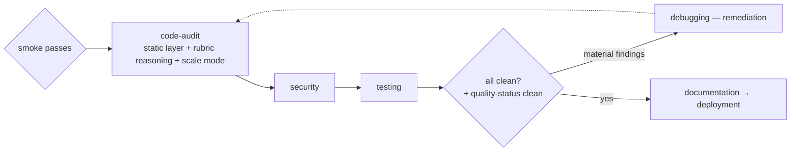

# Code-quality & scalability audit (design)

> **Status: design, not built.** Companion to `docs/agentic-pipeline-plan.md`. It closes the pipeline's
> one un-verified dimension: **code quality and scale are currently *requested* of the implementation agent,
> never *verified* after the code exists.** This doc specifies (A) a **code-audit** agent that makes
> maintainability a checked gate the way security and tests already are, (B) a **scalability review** so
> "serves many users" is checked by default for standalone multi-user apps instead of only when a perf
> budget happens to be declared, and (C) an optional senior-grade review pass for high-stakes features.

## The gap this closes

Every other quality dimension in the pipeline is *proven by a gate*; maintainability and scale are the
exceptions — they run on trust:

| Concern | How it's handled today | Verified? |
|---|---|---|
| Does it build / run? | `smoke-check.sh` hook | ✅ verified (deterministic) |
| Is it secure? | security agent — Semgrep / OSV / Trivy / Checkov | ✅ verified (tools detect it) |
| Does it behave correctly? | testing agent — suite + coverage + `criteria_covered` | ✅ verified (tests pass/fail) |
| Is it **well-written** (SOLID, DRY, low complexity, cohesive, well-named)? | `code-standards` skill *given to the implementation agent* | ❌ **requested only** |
| Will it **scale to many users**? | perf test — **only if planning declared a perf budget** | ❌ **opt-in, usually off** |

`code-standards` is a **write-time instruction**, not a post-write check. Nothing ever confirms the code
obeyed it. Contrast security: the pipeline doesn't *ask* implementation to be secure and trust it — it runs
Semgrep to *prove* it. Quality has no prover. The result today is code that is **functional, tested, and
secure**, but only **structured-by-request** — not verified-maintainable, and not proven at scale.

**Design principle:** move quality and scale from the "trust the writer" column into the "verified by a
gate" column — exactly the move already made for security and tests.

---

## Part A — Code-quality audit

A new **`code-audit`** agent that stands to the *code* as `plan-audit` stands to the *plan*: read-only,
diff-scoped, classifies findings **material vs. advisory**, advisory-first (non-gating) until telemetry
justifies promotion. "plan-audit : plan :: code-audit : code."

### A1. Deterministic static layer (the Semgrep analog — zero-LLM)

Before any model reasons, run cheap deterministic analyzers on the diff and fold their output into the
report. This is the maintainability equivalent of the security agent's scanners:

| Language | Complexity / smell | Duplication | Lint / style |
|---|---|---|---|
| Python (default) | `radon cc` / `radon mi` | `jscpd` | `ruff` |
| JavaScript | `eslint` (complexity rule) | `jscpd` | `eslint` |

These catch the mechanical smells — over-long functions, high cyclomatic complexity, copy-paste blocks,
lint violations — for free, and give the model concrete numbers instead of vibes.

### A2. The `code-audit` agent

| Field | Value | Rationale |
|---|---|---|
| model | `sonnet`, effort `high` | reasons over a scoped diff — not a write stage (security does the same *kind* of work but was later moved to `opus` once its manual reasoning grew; keep this proposal on `sonnet` unless the audit's reasoning proves to need more) |
| tools | `Read, Bash, Grep, Write` | run analyzers (Bash), read code, write the report; **no `Edit`** — reports, never edits source (mirrors security's read-only stance) |
| scope | the working-tree diff (reuse `diff-scoping-conventions`) | same change-set as security/testing; cheap on re-runs |
| preload | `code-standards` (the rubric) + `quality-audit-rubric` (new) | audits against the *same* standard implementation was told to follow |
| position | after smoke passes; alongside security + testing (serial by default) | read-only analysis of working code, same slot class as security |
| output | `.pipeline/quality-report.md` (human) + `.pipeline/quality-status.json` (machine) | mirrors `security-report.md` + `security-status.json` |
| gating | **advisory-first** — routes material findings to debugging (remediation role) or a bounded self-fix; does not block the deploy gate initially | consistent with how `plan-audit` shipped advisory before any promotion |

What it checks that static tools can't: real SOLID adherence, abstraction/coupling quality, naming and
cohesion, dead abstractions, error-handling consistency, whether the facade pattern was actually applied —
the senior-review judgment. It reads the analyzer output from A1 as evidence and reasons on top of it.

### A3. New skill — `quality-audit-rubric` (~60–80 lines, lean)

The only new authoring. Defines:
- **Material vs. advisory** classification (material = ships a maintainability defect a senior would block in
  review; advisory = would nit but not block).
- **Concrete thresholds:** cyclomatic complexity ceiling, max function length, duplication percentage,
  max parameters — so the call isn't subjective.
- **Which analyzers to run and how to read each** (the A1 table).
- The `quality-status.json` schema (`status: clean|issues-found`, `material_count`, `findings[]`).

Everything else is reuse: `code-standards` is already the rubric of record; `diff-scoping-conventions`
already does scoping; `/code-review` and `/simplify` already exist as invocable skills.

---

## Part B — Scalability / many-users review

The classic standalone-app failure is *"works with 10 users, dies at 10,000."* Today those footguns are
checked only when a perf budget is declared, so by default they aren't checked at all.

### B1. The many-users footguns (what to scan for)

N+1 queries · missing DB indexes on filtered/joined columns · unbounded queries with no pagination · no
caching on hot read paths · connection-pool exhaustion · blocking/synchronous I/O on request paths ·
unbounded in-memory accumulation · missing rate limiting · non-idempotent write handlers under retry ·
no back-pressure on queues.

### B2. Wiring — make scale a default acceptance concern, not an optional budget

Reuse the mechanisms already shipped (PR 4 acceptance criteria + PR E perf modes) rather than inventing a
gate:

1. **`PROJECT.md` declares the target** — "standalone app, expected concurrent users: N." For any
   multi-user standalone target this is the default, not an opt-in.
2. **Planning emits scale acceptance criteria** from that target (pagination on list endpoints, indexed
   query paths, a stated concurrency target) into `.pipeline/acceptance.md` — so they ride the existing
   **`criteria_covered`** deploy gate like any other criterion. No new gate hook.
3. **`code-audit` runs a scalability mode** over the diff for the B1 footguns, reporting material findings
   the same way as A2.
4. **The existing conditional perf/concurrency test modes** (testing steps 5e/5f) then *verify* the declared
   concurrency target under load — closing the loop from "declared" → "reviewed" → "tested."

The shift is small but decisive: scale stops being something you must remember to ask for and becomes a
standard question the pipeline asks for any multi-user app.

---

## Part C — Optional senior-grade review pass (high-stakes features)

For a feature you especially care about, add an Opus-grade pass over the diff — either wire `code-audit` to
escalate flagged features to `opus`, or invoke `/code-review ultra` (cloud multi-agent) at the pre-deploy
checkpoint. This buys the senior-eyes judgment that a Sonnet write plus a Sonnet audit still doesn't
*guarantee*. Kept opt-in — it's the most expensive lever and not every feature needs it.

---

## Pipeline placement & blast radius

- **Diff-scoped**, so it costs tokens only on what changed — same discipline as security/testing.
- **Downstream unchanged.** Advisory-first means the deploy gate is untouched at first; material findings
  route through the existing debugging remediation loop (which already re-runs the gates).
- **Promotion path:** once telemetry shows the audit consistently catches real defects, promote its hard
  thresholds (complexity/duplication ceilings) into the deploy gate — the same advisory→enforced path
  `plan-audit`'s completeness check took.

## Honest caveat

No pipeline *guarantees* senior-quality code — the word is too strong for any automated system, human teams
included. What this design does is move quality and scale out of the "trust the writer" column and into the
"verified by a gate" column, raising the floor and making the failure *visible* instead of silent. That is
the realistic target: not a guarantee, but verification where today there is only a request.

---

## How this fits the existing roadmap

The live roadmap is **[`pipeline-june-analysis.md`](../pipeline-june-analysis.md) §10** (the PR-sequenced
master roadmap), *not* the older shipped `pipeline-revision-plan.md`. Reconciled against it honestly, most
of this design is **already on the roadmap — and the roadmap has better evidence than this doc does.**

**The one real end-to-end run partly disconfirmed this doc's pessimism.** The M2 / Linkly run (§8) tested
the core worry here and found the generated architecture *cleanly layered* and the tests *genuinely
rigorous* (real migration up→down→up, Hypothesis with 500 examples, truly-concurrent requests). So
"maintainability is unverified," while true at the design level, was **not where the real defects landed.**
The two gaps the run actually exposed were:

- **F1 — criterion-completeness.** A perf budget of "p95 < 50 ms *under 100 req/s*" was scored
  `covered: true` while the test measured only serial latency (`throughput_rps: null`). A measurable
  dimension of the criterion was never exercised, yet the gate counted it complete.
- **F5 — branch coverage.** The gate rides the flattering `combined lines 86%`; branches (71%) are ungated,
  and that's where logic bugs hide.

**Those are already PR G (M1)** — the roadmap's #1-priority next build, scheduled in §10's "next steps
(2026-07-01)". PR G enforces criterion-completeness, surfaces branch coverage, and adds mutation testing
(`mutmut`/`Stryker`) + an adversarial "what does this test *not* catch" review, folded into the existing
gate via a `quality_ok` field — no new gate hook. That is the **test-quality / semantic-correctness** half
of "high quality, not just functional," and it's ahead of this doc because it targets *observed* failures
rather than a-priori worries. **This doc is best read as supporting rationale for PR G's test-quality half,
not a competing workstream** (and note: "PR G" already denotes M1 — do not reuse that letter for this).

**Where this doc still adds something distinct (and lower-priority):**

- **Code-maintainability audit (Part A)** — SOLID / complexity / duplication verification — is *not*
  explicitly in PR G, which is test-focused. It's a genuine but lesser gap: one clean run isn't a guarantee,
  so a standing check is still worth having, but the evidence says architecture quality wasn't the failure
  point. Best delivered as a **small deterministic static layer** (`ruff`/`radon`/`jscpd`) folded into PR G's
  review surface — *not* a new standalone agent — and only after PR G lands.
- **Pre-merge scalability scan (Part B)** — the many-users code smells (N+1, missing indexes, no
  pagination) — partly overlaps F1/PR G (criterion-completeness already catches "the load half was never
  tested") and otherwise belongs to **Track 2 · PR N + M3**: the sustained load campaign against a
  prod-shaped environment, which is the roadmap's actual answer to "'scalable' is asserted, never validated"
  (§3 #3). Real scale validation is deliberately deferred there because it needs a deployed/staging env; a
  cheap pre-merge static scan is a complement that could ride PR G, not a replacement for PR N.

**Net:** the highest-leverage version of "make quality verified, not just requested" is **PR G, already
first on the roadmap and slated for today** — retargeted by the Linkly run to criterion-completeness +
branch coverage + mutation/adversarial test review. The maintainability static-layer and pre-merge scale
scan in this doc are optional hardening to layer *around* PR G and PR N, once those land. This is not a new
workstream; it's a rationale-and-extras companion to work the roadmap already owns.
