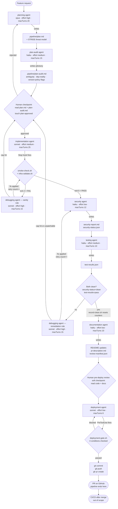
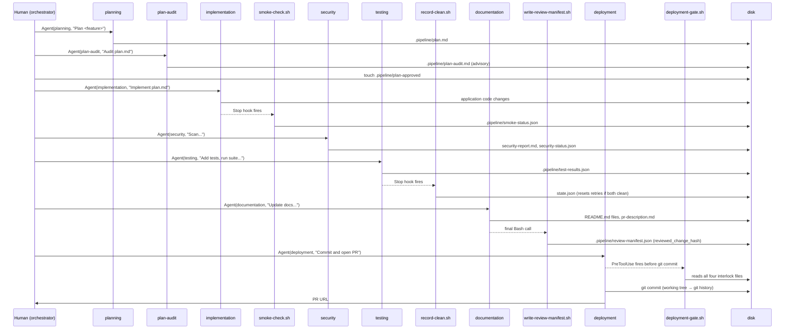
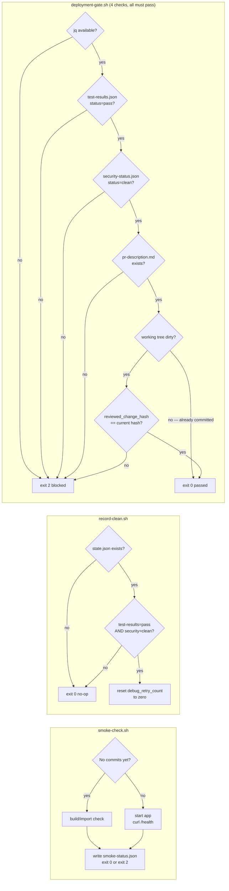

# System architecture

This document is the single reference for how every file in this repo fits together, what each one
does, and why it exists. Read it alongside `docs/agentic-pipeline-plan.md` (the full design rationale)
and the [Anthropic Claude Code docs](https://code.claude.com/docs/en/overview).

---

## Table of contents

- [The mental model in one paragraph](#the-mental-model-in-one-paragraph)
- [Installation layers](#installation-layers)
- [Pipeline flow](#pipeline-flow)
- [Directory layout and file responsibilities](#directory-layout-and-file-responsibilities)
- [Agents](#agents)
- [Hooks](#hooks)
- [Interlock files (.pipeline/)](#interlock-files-pipeline)
- [Skills](#skills)
- [Data flow: how state moves between stages](#data-flow-how-state-moves-between-stages)
- [Gate logic in detail](#gate-logic-in-detail)
- [Telemetry](#telemetry)

---

## The mental model in one paragraph

Eight specialized Claude Code subagents handle one stage each (planning → plan-audit →
implementation → security → testing → documentation → deployment, with a debugging agent
invoked on failures).
They share no conversation context — each starts blank. All cross-stage state travels through files
under `.pipeline/`. Shell scripts (hooks) enforce every deterministic gate at zero LLM cost. Skills
preload reference knowledge into agents that need it. The whole pipeline is installed once globally
(`~/.claude/`) via `install-global.sh` and bootstrapped into each project in seconds via
`bootstrap-project.sh` — no copying files into projects.

---

## Installation layers

```
This repo (source of truth)          Published once to ~/.claude/      Written per project
─────────────────────────────        ──────────────────────────────    ────────────────────
global-agents/*.md          →        ~/.claude/agents/                 .claude/settings.json
global-hooks/*.sh           →        ~/.claude/hooks/                  .pipeline/state.json
global-skills/*/            →        ~/.claude/skills/                 CLAUDE.md
global-project-skills/*/    →        ~/.claude/pipeline-templates/project-skills/   .claude/skills/
templates/                  →        ~/.claude/pipeline-templates/     .claude/skills/
scripts/install-global.sh            (the installer itself)            .gitignore entries
scripts/bootstrap-project.sh →       ~/.claude/pipeline-templates/
```

**Why this split?** The broad command allow-list (git, jq, docker, pytest, …) must stay
project-scoped in `.claude/settings.json` — elevating it to global settings would auto-approve
those commands in every Claude Code session on this machine, regardless of project. Everything else
lives globally so new projects get the pipeline instantly.

**Editing the pipeline:** change files under `global-agents/`, `global-hooks/`, or `global-skills/`,
then run `./scripts/install-global.sh` and restart Claude Code. The repo is the source of truth;
`~/.claude/` is the published runtime copy.

---

## Pipeline flow



---

## Directory layout and file responsibilities

```
claude-agentic-workflow/
├── global-agents/          Eight subagent definitions — the source of truth for agent behavior
│   ├── planning.md
│   ├── plan-audit.md
│   ├── implementation.md
│   ├── debugging.md
│   ├── security.md
│   ├── testing.md
│   ├── documentation.md
│   └── deployment.md
│
├── global-hooks/           Nine deterministic gate scripts — zero LLM cost
│   ├── smoke-check.sh          boots app, hits /health; fires on implementation Stop
│   ├── infra-validate.sh       terraform fmt/validate/plan; fires on implementation Stop
│   ├── record-clean.sh         resets retry counters when both gates pass; fires on testing Stop
│   ├── deployment-gate.sh      blocks git commit unless 4 conditions met; PreToolUse on deployment
│   ├── write-review-manifest.sh writes reviewed_change_hash anchor; called by documentation agent
│   ├── compute-change-hash.sh  SHA-256 of working-tree diff + untracked files; used by the two above
│   ├── log-run.sh              appends one line to run-log.jsonl; fires on every agent's Stop
│   ├── semgrep-scan.sh         runs Semgrep via Docker (no native Windows build)
│   └── post-deploy-check.sh    [UNIMPLEMENTED] CI hook — runs after PR merges, not in pipeline
│
├── global-skills/          Reference knowledge preloaded into agents that need it
│   └── README.md           How to install, update, and add global skills
│   ├── pipeline-orchestration/     stage sequence, interlock contracts, gate semantics
│   ├── stride-threat-model-template/  STRIDE worksheet for planning's threat model
│   ├── code-standards/             naming, SOLID, facade pattern, security invariants
│   ├── diff-scoping-conventions/   how to compute the change set (shared by security + testing)
│   ├── doc-conventions/            README structure, Mermaid rules, PR description format
│   ├── debugging-escalation-protocol/  retry caps, sanity vs remediation, when to escalate
│   ├── deployment-checklist-and-rollback/  pre-flight gates, commit/push/PR sequence
│   ├── auth-patterns/              Firebase/Cognito facade, OAuth, MFA, mfa_verified claim
│   ├── logging-conventions/        structlog/Pino, OTel, CloudWatch/X-Ray, log field schema
│   ├── iac-conventions/            Terraform infra/ layout, AWS provider, IaC security baseline
│   ├── ddia-patterns/              storage, replication, consistency trade-offs (from DDIA)
│   └── containerization-conventions/  Docker vs. serverless decision rubric
│
├── global-project-skills/  Per-project skill templates (installed alongside global-skills)
│   ├── semgrep-ruleset-guide/  which Semgrep rule sets to apply per language/framework (fill <STACK CONFIGS>)
│   └── test-conventions/       project test structure, runner, coverage thresholds (fill per project)
│
├── templates/
│   ├── CLAUDE.md               Seed for the per-project CLAUDE.md (fill in stack + run commands)
│   ├── mcp.json                Sample .mcp.json for projects that opt into MCP servers
│   ├── project-settings.json   Pipeline command allow-list (becomes .claude/settings.json per project)
│   └── state.json              Seed .pipeline/state.json written by bootstrap
│
├── scripts/
│   ├── install-global.sh       Publishes global-agents, global-hooks, global-skills, templates → ~/.claude/
│   └── bootstrap-project.sh    Per-project bootstrap; also installed to ~/.claude/pipeline-templates/
│
├── docs/
│   ├── agentic-pipeline-plan.md      Full design doc — orientation guide, rationale, appendix
│   ├── system_architecture.md        This file
│   ├── pipeline-alternatives.md      Non-default stack scaffolds (Cognito, GCP, JS backend)
│   ├── pipeline-deployment-targets.md  CI/CD patterns for after the PR merges
│   ├── pipeline-mcp-config.md        MCP server wiring per agent
│   └── pipeline-refinement-loops.md  [UNIMPLEMENTED] How to evolve the pipeline over time
│
├── memory/                 Auto-memory persisted across Claude Code sessions
│   ├── MEMORY.md           Index
│   ├── brett-profile.md    Brett's preferences, default stack, collaboration style
│   ├── project-context.md  Pipeline architecture, settled decisions, build status
│   └── audit-prompt.md     Saved prompt for a pre-build readiness audit session (read-only, report only)
│
└── README.md               Install and bootstrap instructions (entry point for new machines)
```

---

## Agents

Each agent is a Markdown file with YAML frontmatter followed by a system-prompt body. The
frontmatter declares the model, tool scope, skills to preload, hooks to wire, and turn cap. The
body tells the agent exactly what to do when invoked. Agents are published to `~/.claude/agents/`
and are invoked via the `Agent` tool from the main Claude Code session (the orchestrator).

**Key property:** every subagent starts with a **fresh context** — it sees only its own system
prompt and the string passed to it via the Agent tool. It cannot see the conversation that invoked
it, which is why all cross-stage state must travel through `.pipeline/` files.

[📖 Create custom subagents](https://code.claude.com/docs/en/sub-agents)
[📖 How the agent loop works](https://code.claude.com/docs/en/agent-sdk/agent-loop)

### planning

| Property | Value |
|---|---|
| Model | `opus` |
| Effort | `high` |
| maxTurns | 20 |
| Tools | Read, Grep, Glob, WebSearch, Write, Skill, mcp__aws-knowledge, mcp__terraform |
| Preloaded skills | `stride-threat-model-template` |
| On-demand skills | `ddia-patterns`, `auth-patterns`, `logging-conventions`, `iac-conventions`, `containerization-conventions` |
| Stop hook | `log-run.sh planning opus` |

**Responsibility:** Read the codebase (or `PROJECT.md` on greenfield), define scope and
approach, then write `.pipeline/plan.md` including a STRIDE threat model. Never writes application
code. The plan explains every non-trivial decision with *what / why / how* so Brett understands the
full reasoning, not just the outcome.

**Why opus + high effort?** Planning is open-ended reasoning over uncertain requirements. Getting
the plan wrong is the most expensive mistake in the pipeline — every downstream agent spends tokens
on a bad direction. Opus at high effort is the right investment here.

**Human checkpoint:** after planning stops, the plan-audit agent runs automatically (below),
then a human reads `plan.md` and `plan-audit.md` and runs `touch .pipeline/plan-approved`.
Implementation refuses to start without this marker.

---

### plan-audit

| Property | Value |
|---|---|
| Model | `haiku` |
| Effort | `medium` |
| maxTurns | 15 |
| Tools | Read, Grep, Glob, Bash, Write |
| Preloaded skills | none (the version policy is inlined in the agent body) |
| Stop hook | `log-run.sh plan-audit haiku` |

**Responsibility:** Runs automatically after planning and **before** the human checkpoint, to
focus the human's manual review. Reads `.pipeline/plan.md` and writes an advisory report
`.pipeline/plan-audit.md` with three classes of flag: (1) **ambiguous wording** that could
lead a downstream agent (especially implementation) to guess at intent and guess wrong;
(2) **dependency reality** — every suggested frontend/backend package is checked for actual
existence on its registry (npm / PyPI) via `curl`, catching hallucinated or slopsquatted names;
(3) **version policy** — pinned versions are checked against a cooldown window (minor/patch
14–30 days old, major 30–90, CVE fixes immediate), the obsolescence limit (no more than one
major behind latest; reject EOL), exact-pin determinism (no `^`/`~`/`*`/ranges), and minimal
dependency-footprint fit.

**Why haiku + advisory, not a gate?** The checks are largely mechanical (registry lookups, pattern
matching, date math), so haiku is sufficient and cheap to run on every feature. It is deliberately
**non-gating** — it never blocks the pipeline or edits `plan.md`; it only surfaces flags for the
human, who remains the decision-maker at the checkpoint.

---

### implementation

| Property | Value |
|---|---|
| Model | `sonnet` |
| Effort | `medium` |
| maxTurns | 25 |
| Tools | Read, Write, Edit, Bash, Skill, mcp__context7, mcp__aws-knowledge, mcp__terraform |
| Preloaded skills | `code-standards` |
| On-demand skills | `auth-patterns`, `logging-conventions`, `iac-conventions` |
| Stop hooks (in order) | `smoke-check.sh`, `infra-validate.sh`, `log-run.sh implementation sonnet` |

**Responsibility:** Verify `plan-approved` exists, read `plan.md`, write code. Runs a
diff-vs-plan check and a security quick scan before reporting done. Creates database migration files
when the plan calls for schema changes. On greenfield projects, scaffolds a `/health` endpoint so
the smoke check has a target.

**Why sonnet?** Implementation is structured and well-scoped by the plan — it does not need
Opus's open-ended reasoning. Sonnet handles well-specified build tasks efficiently.

**What fires when it stops:** `smoke-check.sh` boots the app and hits `/health`. If that passes,
`infra-validate.sh` checks for an `infra/` directory and runs `terraform validate` if found. Then
`log-run.sh` appends a line to `run-log.jsonl` with `status` derived from `smoke-status.json`.

---

### debugging

| Property | Value |
|---|---|
| Model | `sonnet` |
| Effort | `high` |
| maxTurns | 15 |
| Tools | Read, Edit, Bash, Grep |
| Preloaded skills | `debugging-escalation-protocol` |
| Stop hook | `log-run.sh debugging sonnet` |

**Responsibility:** Fix specific, reported problems. Same agent definition, two roles:

- **Sanity role** — triggered when smoke check fails. Reads the error, finds root cause, applies
  a minimal fix, increments `debug_retry_count.sanity`. Loops back to the smoke check (orchestrator
  re-runs implementation → smoke). Cap: `max_retries` (default 3).
- **Remediation role** — triggered when security reports a critical finding or testing reports a
  failure. Fixes the issue, increments `debug_retry_count.remediation`. Orchestrator always re-runs
  *both* security and testing (a fix can break either). Cap: `max_retries` (default 3).

**On cap or unpatchable finding:** stops and escalates to human review / planning. Never loops
indefinitely.

**Why high effort?** Debugging requires thorough reasoning over error messages, stack traces, and
code to find the actual root cause, not just symptoms.

---

### security

| Property | Value |
|---|---|
| Model | `haiku` |
| Effort | `medium` |
| maxTurns | 20 |
| Tools | Read, Edit, Bash, Grep, Write, Skill |
| Preloaded skills | `semgrep-ruleset-guide`, `diff-scoping-conventions` |
| On-demand skills | `iac-conventions` (only when `infra/` exists) |
| Stop hook | `log-run.sh security haiku` |

**Responsibility:** Scan the working-tree change set (tracked diff + untracked files since last
commit), fix exploitable vulnerabilities (any severity) and critical/high hygiene findings
directly, and report remaining findings. Runs:

1. **Semgrep** via `semgrep-scan.sh` Docker wrapper — SAST, SCA, secrets scanning
2. **OSV Scanner** — dependency CVE scanning
3. **Checkov** — IaC scanning (only when `infra/` is in the change set)
4. **Manual checks** — secrets grep, row-level security audit, input sanitization audit

Writes two output files: `security-report.md` (human-readable) and `security-status.json`
(machine-readable, parsed by gate hooks). Status is `clean` unless `critical_count > 0` — warnings
are surfaced but do not block.

**Why haiku + medium effort?** Security scanning is largely mechanical (running Semgrep/OSV/Checkov
and grepping for patterns), but also applies targeted fixes for critical findings — medium effort
gives it enough headroom to do both without the cost of stronger models.

---

### testing

| Property | Value |
|---|---|
| Model | `haiku` |
| Effort | `medium` |
| maxTurns | 10 |
| Tools | Bash, Read, Write, Edit |
| Preloaded skills | `test-conventions`, `diff-scoping-conventions` |
| Stop hooks (in order) | `record-clean.sh`, `log-run.sh testing haiku` |

**Responsibility:** Write missing unit and integration tests for the change set, then run the
full suite with coverage. Writes `test-results.json` including `tested_change_hash` (SHA-256 of the
change set it tested). Never edits production code to make tests pass.

**When it stops:** `record-clean.sh` fires first. It reads both gate artifacts — if
`security-status.json` is `clean` AND `test-results.json` is `pass`, it resets the
`debug_retry_count` in `state.json` to zero. Then `log-run.sh` appends the telemetry line with
coverage and test counts.

---

### documentation

| Property | Value |
|---|---|
| Model | `haiku` |
| Effort | `low` |
| maxTurns | 10 |
| Tools | Read, Write, Edit, Glob, Bash |
| Preloaded skills | `doc-conventions` |
| Stop hook | `log-run.sh documentation haiku` |

**Responsibility:** Only runs once both gates are clean. Finds every directory touched by the
change (via `git diff --name-only`), creates or updates per-directory `README.md` files, updates
`system_architecture.md` if data flow or boundaries changed, and writes `pr-description.md`. As
its **last action**, runs `write-review-manifest.sh` to record the `reviewed_change_hash` — a
SHA-256 hash of the exact bytes the human will review and the deployment agent will commit. The
deployment gate checks this hash for currency.

**Why last?** Documentation writes files (READMEs, architecture diagrams) that are part of the
committed change. The hash must be recorded *after* those writes, so it captures the final state.

---

### deployment

| Property | Value |
|---|---|
| Model | `sonnet` |
| Effort | `low` |
| maxTurns | 8 |
| Tools | Bash |
| Preloaded skills | `deployment-checklist-and-rollback` |
| PreToolUse hook | `deployment-gate.sh` (fires before every Bash call) |
| Stop hook | `log-run.sh deployment sonnet` |

**Responsibility:** The pipeline's only commit point. Creates a feature branch if needed, then
runs `git add -A && git commit`. Before that command executes, `deployment-gate.sh` fires and
blocks unless all four conditions hold. After a clean commit, runs `git push` (requires human
approval — intentionally not in the allow-list) and `gh pr create`. Stops at the PR.

**Why sonnet + low effort?** Deployment is mechanical — branch, commit, push, PR. It does not
reason; it executes a short sequence of git commands.

**Hard gate:** `git push` and `gh pr create` are deliberately excluded from `settings.json`'s
allow-list so they each require explicit human approval even after the gate passes. The human
approves the actual push.

---

## Hooks

Hooks are shell scripts that fire on lifecycle events. They run with no LLM, cost zero tokens,
and are the pipeline's mechanism for deterministic enforcement. Published to `~/.claude/hooks/`.

[📖 Hooks reference](https://code.claude.com/docs/en/hooks)
[📖 Automate actions with hooks](https://code.claude.com/docs/en/hooks-guide)

**Two hook event types used by this pipeline:**

- **`Stop` (declared in agent frontmatter)** — fires when that agent finishes, as a
  `SubagentStop` event. Used for: smoke check, infra validate, record-clean, log-run.
- **`PreToolUse` (declared in agent frontmatter)** — fires before a specific tool runs. Used
  for: deployment gate (blocks the git commit Bash call).

**Global safety rule:** every ambient Stop hook (smoke-check, record-clean, infra-validate,
log-run) opens with `[ -f .pipeline/state.json ] || exit 0` so it no-ops instantly in any repo
that hasn't been bootstrapped. The deployment gate has no such guard — it fails closed when
interlock files are absent.

**maxTurns caveat:** a Stop/SubagentStop hook does not fire if the agent hits its `maxTurns`
cap. The session ends before the hook runs. A missing `run-log.jsonl` entry for a stage is the
signal that it capped out.

---

### smoke-check.sh

**Fires:** on `implementation` Stop (as `SubagentStop`).

**Logic:**
1. Guard: no-op if `.pipeline/state.json` absent.
2. Source `.pipeline/smoke.env` for per-project start/health/build commands (refuses to source if
   git tracks the file — supply-chain security).
3. Greenfield path: if no commits exist yet, runs a build/import check (`python -c "import
   src.main"`) instead of a live `/health` check.
4. Live path: starts the app, waits `STARTUP_WAIT` seconds, curls `HEALTH_URL`.
5. Writes `.pipeline/smoke-status.json` on every exit path (`pass` or `fail`).
6. Exits 2 on failure → routes to debugging (sanity role).

---

### infra-validate.sh

**Fires:** on `implementation` Stop, after `smoke-check.sh`.

**Logic:**
1. Guard: no-op if `.pipeline/state.json` absent.
2. Guard: no-op if no `infra/` directory in the project.
3. Runs `terraform fmt -check`, `terraform init -backend=false`, `terraform validate`.
4. Writes `terraform plan` output to `.pipeline/infra-plan.txt` for human review.

---

### record-clean.sh

**Fires:** on `testing` Stop (as `SubagentStop`), before `log-run.sh`.

**Logic:**
1. Guard: no-op if `.pipeline/state.json` absent.
2. Checks `jq` is available (fails non-silently if not — exit 1, not 2, so it reports without
   blocking the testing agent's stop).
3. Checks `test-results.json` status is `pass` AND `security-status.json` status is `clean`.
4. If both: resets `state.json` `debug_retry_count` to `{sanity: 0, remediation: 0}`.
5. If either gate is not clean: no-op (counters unchanged, debugging budget preserved).

---

### deployment-gate.sh

**Fires:** as `PreToolUse` before every `Bash` call in the `deployment` agent.

**Logic (all four must pass or the command is blocked with exit 2):**

1. `jq` is available — fails closed with a clear error if not.
2. `test-results.json` exists and `status == "pass"`.
3. `security-status.json` exists and `status == "clean"`.
4. `pr-description.md` exists.
5. If the working tree is dirty (change not yet committed): recomputes the change-set hash via
   `compute-change-hash.sh` and verifies it matches `review-manifest.json`'s
   `reviewed_change_hash`. A mismatch means something changed after documentation ran — block.
   If the tree is already clean (post-commit), the currency check is skipped.

**Why currency matters:** documentation writes README files and architecture diagrams that become
part of the commit. The hash ensures the human reviewed exactly the bytes that will be committed —
not a stale or modified version.

---

### compute-change-hash.sh

**Called by:** `write-review-manifest.sh` (documentation) and `deployment-gate.sh` (currency recompute).

**Logic:** Single line — pipes `git diff HEAD` + sorted contents of all untracked files through
`sha256sum`. Both callers use this exact script, so the recorded hash and the recomputed hash are
always comparable byte-for-byte.

---

### write-review-manifest.sh

**Called by:** the `documentation` agent (via Bash, as its final action).

**Logic:** Calls `compute-change-hash.sh`, writes the result to
`.pipeline/review-manifest.json` as `reviewed_change_hash`. This is the currency anchor the
deployment gate checks.

---

### log-run.sh

**Fires:** on every agent's Stop hook (wired in each agent's frontmatter).

**Signature:** `log-run.sh <stage> <model> [status] [retries] [notes]`

**Logic:**
1. Guard: no-op if `.pipeline/state.json` absent.
2. Derives `feature` from the current git branch.
3. Auto-derives `status` from the stage's canonical artifact:
   - `implementation` → `smoke-status.json`
   - `security` → `security-status.json`
   - `testing` → `test-results.json`
   - `debugging` → `state.json` (checks if retry cap hit → `escalated`)
   - other stages → `pass` (ran to completion)
4. Counts `files_changed` (tracked diff + untracked).
5. Pulls stage-specific extras: testing adds coverage + test counts; security adds finding counts.
6. Appends one JSON line to `.pipeline/run-log.jsonl`.

---

### semgrep-scan.sh

**Called by:** the `security` agent (via Bash).

**Logic:** Runs Semgrep inside Docker (Semgrep has no native Windows build). Mounts the repo
root at `/src`. Passes all CLI arguments through unchanged. Fails with a clear message if Docker
Desktop is not running.

---

### post-deploy-check.sh

**Status: [UNIMPLEMENTED]**. Intended as a CI hook that runs after the PR merges and CI deploys
the app. Curls `DEPLOY_HEALTH_URL/health` and exits 2 on non-200. Not wired into the pipeline
itself — the deployment agent stops at the PR. See `docs/pipeline-deployment-targets.md`.

---

## Interlock files (.pipeline/)

`.pipeline/` is gitignored. It is the pipeline's shared memory — the mechanism that lets fresh-
context agents communicate across stage boundaries. The deployment agent makes the first and only
commit; until then, all changes live in the working tree.

[📖 Context window and fresh context](https://code.claude.com/docs/en/context-window)

| File | Writer | Readers | Purpose |
|---|---|---|---|
| `plan.md` | planning agent | plan-audit, human, implementation, testing, documentation | The implementation spec + STRIDE threat model |
| `plan-audit.md` | plan-audit agent | human (read at the checkpoint) | Advisory flags: ambiguity, dependency reality, version policy — non-gating |
| `plan-approved` | human (`touch`) | implementation agent (refuses to start without it) | The human checkpoint gate marker |
| `security-report.md` | security agent | human, documentation | Human-readable findings detail |
| `security-status.json` | security agent | deployment-gate.sh, record-clean.sh, log-run.sh | Machine-readable gate status: `{"status":"clean","critical_count":0,...}` |
| `test-results.json` | testing agent | deployment-gate.sh, record-clean.sh, log-run.sh | Test pass/fail + `tested_change_hash` + coverage |
| `pr-description.md` | documentation agent | deployment agent, deployment-gate.sh | PR body; also required by the gate |
| `review-manifest.json` | write-review-manifest.sh (via documentation) | deployment-gate.sh | `{"reviewed_change_hash":"<sha256>","ran_at":"..."}` — currency anchor |
| `state.json` | bootstrap / security / debugging | debugging agent, record-clean.sh, log-run.sh | `{"debug_retry_count":{"sanity":0,"remediation":0},"max_retries":3}` |
| `smoke-status.json` | smoke-check.sh | log-run.sh (implementation status) | `{"status":"pass|fail","ran_at":"..."}` |
| `smoke.env` | bootstrap-project.sh | smoke-check.sh | Per-project start/health/build commands (gitignored, local only) |
| `infra-plan.txt` | infra-validate.sh | human review | `terraform plan` output for the human checkpoint |
| `run-log.jsonl` | log-run.sh (each agent's Stop hook) | you (metrics) | Append-only telemetry: one JSON line per stage per run |

---

## Skills

Skills are Markdown files that are preloaded into an agent's context or invoked on demand via the
`Skill` tool. Preloaded = costs tokens on every agent invocation. On-demand = costs tokens only
when the feature needs that knowledge.

[📖 Extend Claude with skills](https://code.claude.com/docs/en/skills)

| Skill | Preloaded in | Purpose |
|---|---|---|
| `pipeline-orchestration` | _(invoked by you, the orchestrator)_ | Stage sequence, interlock contracts, gate semantics, debug-loop routing |
| `stride-threat-model-template` | planning | STRIDE worksheet for the threat model |
| `code-standards` | implementation | Naming, SOLID, facade pattern, security invariants |
| `diff-scoping-conventions` | security, testing | How to compute the change set (shared logic) |
| `semgrep-ruleset-guide` | security | Which Semgrep rule sets to apply per language |
| `test-conventions` | testing | Project test structure, runner, coverage thresholds |
| `doc-conventions` | documentation | README structure, allowed Mermaid types, PR description format |
| `debugging-escalation-protocol` | debugging | Retry caps, sanity vs remediation roles, when to escalate |
| `deployment-checklist-and-rollback` | deployment | Pre-flight checks, commit/push/PR sequence |
| `auth-patterns` | on-demand (planning, implementation) | Firebase/Cognito facade, OAuth 2.0, Duo MFA, mfa_verified claim |
| `logging-conventions` | on-demand (planning, implementation) | structlog/Pino, OTel, CloudWatch/X-Ray, log field schema |
| `iac-conventions` | on-demand (planning, implementation, security) | Terraform infra/ layout, AWS provider, IaC security baseline |
| `ddia-patterns` | on-demand (planning) | Storage, replication, consistency trade-offs (from DDIA) |
| `containerization-conventions` | on-demand (planning) | Docker vs. serverless decision rubric |

---

## Data flow: how state moves between stages



---

## Gate logic in detail



---

## Telemetry

`run-log.jsonl` accumulates across all features in a project. Never overwritten. Fields:

```json
{
  "ts": "2026-06-27T14:30:00Z",
  "feature": "file-upload",
  "stage": "security",
  "status": "clean",
  "model": "haiku",
  "retries": 0,
  "files_changed": 6,
  "notes": "",
  "critical_findings": 0,
  "warning_findings": 1
}
```

Testing lines also include `coverage` and `tests.{total,passed,failed}`. Security lines include
`critical_findings` and `warning_findings`.

**Derived metrics to watch:**

| Metric | How | Signal |
|---|---|---|
| Cost proxy per stage | weight by model tier (opus ≫ sonnet ≫ haiku) × files_changed | Primary cost lever |
| First-pass gate rate | % of features reaching documentation with `retries == 0` | Plan + implementation quality |
| Debug-retry rate | mean `retries` across features | Rising = plans too ambitious or stage struggling |
| Wall-clock per stage | timestamp delta between consecutive lines | Spot a hung stage |
| Missing stage line | no entry for a stage | Suspect a `maxTurns` cap-out |
| Coverage trend | `coverage.lines` over time | Regression guard |

A missing stage line in the log means the agent's Stop hook never fired — the most likely cause is
that the agent hit its `maxTurns` cap. `duration_s` and `tokens` are not available to shell hooks;
use timestamp deltas as a duration proxy and `model + files_changed` as the cost proxy.
