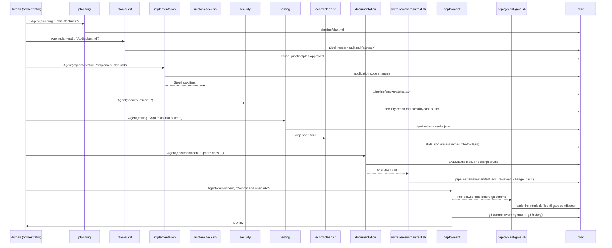
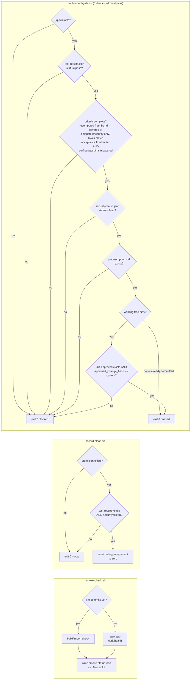

# System architecture

This document is the single reference for how every file in this repo fits together, what each one
does, and why it exists. Read it alongside `docs/agentic-pipeline-plan.md` (the full design rationale)
and the [Anthropic Claude Code docs](https://code.claude.com/docs/en/overview).

---

## Table of contents

- [The mental model in one paragraph](#the-mental-model-in-one-paragraph)
- [Installation layers](#installation-layers)
- [Permission & autonomy model](#permission--autonomy-model)
- [Pipeline flow](#pipeline-flow)
- [Directory layout and file responsibilities](#directory-layout-and-file-responsibilities)
- [Agents](#agents)
- [Hooks](#hooks)
- [Interlock files (.pipeline/)](#interlock-files-pipeline)
- [Skills](#skills)
- [Data flow: how state moves between stages](#data-flow-how-state-moves-between-stages)
- [Gate logic in detail](#gate-logic-in-detail)
- [Telemetry](#telemetry)

---

## The mental model in one paragraph

Ten specialized Claude Code subagents handle one stage each (an optional design-spec stage →
planning → plan-audit → implementation → security → testing → documentation → deployment, with a
debugging agent invoked on failures). The **design-spec** stage runs only when the project
provides a front-end design source; it normalizes that (untrusted) design into a human-vouched
`.pipeline/design-spec.md` before planning. The **triage** agent sits outside the pipeline loop
entirely — an operator-invoked, read-only incident summarizer (one Sentry issue → a human-facing
brief; no Bash, no Edit). The other eight always apply.
They share no conversation context — each starts blank. All cross-stage state travels through files
under `.pipeline/`. Shell scripts (hooks) enforce every deterministic gate at zero LLM cost. Skills
preload reference knowledge into agents that need it. The whole pipeline is installed once globally
(`~/.claude/`) via `install-global.sh` and bootstrapped into each project in seconds via
`bootstrap-project.sh` — no copying files into projects.

The authoring pipeline ends at the PR, but the guarantees now extend **past the merge**: this repo's
own `.github/workflows/eval.yml` runs the full deterministic harness as a required merge check, and
`templates/ci/` gives each project a delivery chain — `pipeline-ci.yml` re-runs the deterministic
gates on the merge commit, `build-provenance.yml` produces a signed, SBOM-attested, SLSA-provenanced
image, and the opt-in `deploy.yml` / `load-campaign.yml` / `dr-drill.yml` / `scheduled-rescan.yml` /
`dast-staging.yml` verify-then-progressively-deploy, load-validate, DR-drill, continuously re-scan,
and staging-DAST-scan it. All of that is per-project scaffolding the pipeline authors — not new
gates in the authoring loop.

---

## Installation layers

```
This repo (source of truth)          Published once to ~/.claude/      Written per project
─────────────────────────────        ──────────────────────────────    ────────────────────
global-agents/*.md          →        ~/.claude/agents/                 .claude/settings.json
global-hooks/*.sh           →        ~/.claude/hooks/                  .pipeline/state.json
global-skills/*/            →        ~/.claude/skills/                 CLAUDE.md
global-project-skills/*/    →        ~/.claude/pipeline-templates/project-skills/   .claude/skills/
templates/                  →        ~/.claude/pipeline-templates/     .claude/skills/
scripts/install-global.sh            (the installer itself)            .gitignore entries
scripts/bootstrap-project.sh →       ~/.claude/pipeline-templates/
```

**Why this split?** The broad command allow-list (git, jq, docker, pytest, …) must stay
project-scoped in `.claude/settings.json` — elevating it to global settings would auto-approve
those commands in every Claude Code session on this machine, regardless of project. Everything else
lives globally so new projects get the pipeline instantly.

**Editing the pipeline:** change files under `global-agents/`, `global-hooks/`, or `global-skills/`,
then run `./scripts/install-global.sh` and restart Claude Code. The repo is the source of truth;
`~/.claude/` is the published runtime copy.

---

## Permission & autonomy model

Between its human checkpoints the pipeline runs unattended. That autonomy comes from Claude Code's
permission system configured with one deliberate asymmetry: **`defaultMode: "auto"` eases
prompting, never enforcement.** The `deny` and `ask` tiers and every hook fire identically in all
permission modes, so switching autonomy off costs prompts (not protection), and switching it on
disables nothing.

### The toggle

Autonomy is a single setting — `"permissions": { "defaultMode": "auto" }` — written into each
project's `.claude/settings.json` by `bootstrap-project.sh` (from `templates/project-settings.json`).
Three override levels, narrowest wins:

| Scope | Mechanism | Typical use |
|---|---|---|
| Session | `Shift+Tab` mode cycling, or `claude --permission-mode default` | Supervise one run interactively |
| Machine | `defaultMode` in `.claude/settings.local.json` (never committed) | Opt this machine in/out |
| Repo | `defaultMode` in `.claude/settings.json` (committed) | The project's default posture |

### Three enforcement layers

**Layer 1 — permission rules (the only layer autonomy eases).** The `allow` list is scoped
per-command (`Bash(git diff:*)`, `Bash(pytest:*)`, …) and per-path (`Read(./**)`, `Write(./**)`),
not blanket. The `ask` tier still prompts in every mode for the actions that would let a run widen
its own blast radius: `git push --force` and edits to the settings files themselves — an agent
cannot loosen its own leash. The `deny` tier is mode-independent and trumps everything: credential
material (`**/.env`, `~/.ssh`, `~/.aws`, tfstate/tfvars, `~/.claude/.credentials.json`) and the
human approval markers are unreadable/unwritable no matter what mode is active. For anything not
matched by a rule, `auto` mode consults the `autoMode` policy block instead of prompting: file
access stays inside the repo, shell egress is limited to the git remote + package registries
(anything else must go through `WebFetch`/MCP where it is visible and auditable), and producing an
approval marker **"by ANY means"** — shell redirection, scripts, git tricks — is hard-denied.

**Layer 2 — hooks (deterministic; the model has no vote).** Gate scripts are wired into agent
frontmatter as `PreToolUse` hooks, which run *before* the tool call executes, outside the model; a
blocking exit stops the call. A prompt-injected agent cannot argue with a shell script — this is
the containment layer that makes eased prompting safe:

| Hook | What it blocks/records under autonomy |
|---|---|
| `guard-approval-markers.sh` | Any tool call that would create or modify `plan-approved` / `diff-approved` / `design-approved` / `waivers.json`, including indirect routes (`echo >`, scripts) a permission glob would miss |
| `deployment-gate.sh` | The final commit, unless it *recomputes* from `.pipeline/*` files that security is clean, tests pass, criteria are covered, `diff-approved` exists, and the tree matches the approved hash — it never trusts agent claims |
| `egress-check.sh` (+ `egress-allowlist.txt`) | Shell network access outside the git remote / package registries |
| `loop-guard.sh` | Runaway retry loops — cap hit means stop and escalate to the human |
| `log-run.sh` (Stop hook, all agents) | Nothing — it writes the `.pipeline/run-log.jsonl` audit trail so an unattended run is reviewable after the fact |

**Layer 3 — the orchestrator (sequencing + least privilege).** The `pipeline-orchestration` skill
never invokes a stage before its interlock file exists (deployment requires `diff-approved`),
re-verifies currency hashes so approvals can't be reused against regenerated content, and each
subagent runs with a minimal toolset (deployment: Bash only; testing: no web; triage: no Bash, no
Edit). The agents exposed to untrusted content — web pages, dependency docs, design bundles,
telemetry — are never the agents that can push.

### Human checkpoints under autonomy

The checkpoints survive because they are **files only a human can produce**: `plan-approved` and
`diff-approved` are human-typed (`approve-diff.sh` refuses to run without a TTY);
`design-approved` is orchestrator-transcribed from an explicit human approval because it embeds a
content hash. Agents are barred from minting them three independent ways — the permission `deny`
rule, the `autoMode` "by ANY means" hard-deny, and the `guard-approval-markers.sh` hook. The worst
case for a fully prompt-injected run is therefore wasted work inside the repo that stops at a gate
it cannot forge: it can't approve itself, can't ship, can't exfiltrate through the shell, and can't
read credentials.

### Limits

This is **policy-level** enforcement — the harness blocks the calls — not an OS sandbox. On Windows
that is the settled trade-off; for kernel-level containment of fully unattended runs, use WSL2 or a
devcontainer with a network firewall. `--dangerously-skip-permissions` is never part of this model:
the `allow`/`autoMode` layering is the substitute for it, not a stepping stone toward it.

### Where it lives

- `templates/project-settings.json` — the canonical model; becomes each project's
  `.claude/settings.json` at bootstrap, so bootstrapped projects are autonomous by default.
- This repo's own `.claude/settings.json` — the same model adapted for framework development
  (writes to `~/.claude/` are additionally expected here, because `install-global.sh` publishes to
  it and session memory lives under it).

---

## Pipeline flow

```mermaid
flowchart TD
    START([Feature request]) --> DSRC{Design source?\ndesign/ · PROJECT.md · Figma MCP}
    DSRC -->|yes| DS[design-spec agent\nopus · effort high · maxTurns 20\nnormalize untrusted bundle]
    DS -->|writes| DSPEC[.pipeline/design-spec.md\n+ injection report]
    DSPEC --> DHC{Human design checkpoint\nread spec + injection report\nrecord design-approved + hash}
    DHC -->|approved| P
    DSRC -->|no design source| P
    P[planning agent\nopus · effort xhigh · maxTurns 30]
    P -->|writes| PLAN[.pipeline/plan.md\n+ STRIDE threat model]
    PLAN --> PA[plan-audit agent\nsonnet · effort medium · maxTurns 20]
    PA -->|writes advisory| PAUDIT[.pipeline/plan-audit.md\nambiguity · dep-reality · version-policy flags]
    PAUDIT --> REV{revision_recommended?\nany material flag}
    REV -->|yes| PREV[planning — ONE revision\naddress material flags\nappend Revision notes]
    PREV --> HC
    REV -->|no| HC{Human checkpoint\nread plan.md + plan-audit.md\ntouch plan-approved}
    HC -->|rejected| P
    HC -->|approved| I[implementation agent — SINGLE-SHOT\nsonnet · effort high · maxTurns 60]
    I -->|Stop hook fires| SC{smoke-check.sh\n+ infra-validate.sh}
    SC -->|exit 2 = FAIL| DB1[debugging agent — sanity role\nopus · effort xhigh · maxTurns 30]
    DB1 -->|fix applied\nretry count++| SC
    DB1 -->|cap hit| HC
    SC -->|exit 0 = PASS\nloop-guard.sh reset| LG{{loop-guard.sh tick\ncycle / wall-clock cap}}
    LG -->|cap hit| HC
    LG -->|ok| SEC[security agent\nopus · effort high · maxTurns 30]
    SEC -->|writes| SECREP[security-report.md\nsecurity-status.json]
    SECREP --> TEST[testing agent\nsonnet · effort medium · maxTurns 50]
    TEST -->|writes| TRES[test-results.json\n+ criteria_covered\n+ test-quality.json advisory]
    TRES --> GREEN{GREEN? deterministic jq\nsecurity=clean · tests=pass\ncriteria_covered complete\n· perf-completeness}
    GREEN -->|no| DB2[debugging agent — remediation role\nopus · effort xhigh · maxTurns 30]
    DB2 -->|fix applied\nretry count++| LG
    DB2 -->|cap hit or unpatchable| HC
    GREEN -->|yes\nrecord-clean.sh resets counters\nloop-guard done + run-summary.sh| DR{.pipeline/ui.env present?\nFE Layer 4 — conditional}
    DR -->|yes| UIC[ui-capture.sh → design-review-check.sh\nadvisory design-review.json\nnever a gate]
    UIC --> DA
    DR -->|no| DA{.pipeline/dast.env present?\nDAST Layer 1 — conditional}
    DA -->|yes| DAC[dast-capture.sh → dast-review.sh\nZAP passive baseline\nadvisory dast-review.json · never a gate]
    DAC --> DOC
    DA -->|no| DOC[documentation agent\nsonnet · maxTurns 25]
    DOC -->|writes| DOCS[README updates\npr-description.md\ndocs/decisions/branch records\nreview-manifest.json]
    DOCS --> CR["/code-review — standard automated pre-step\nreview-only triage of the diff"]
    CR --> HARDCK{Human diff-review checkpoint M5\nreview diff + code-review findings + reports\nrun approve-diff.sh — TTY-only, writes diff-approved}
    HARDCK --> DEP[deployment agent\nsonnet · maxTurns 25]
    DEP -->|PreToolUse fires| GATE{deployment-gate.sh\n5 conditions checked}
    GATE -->|blocked| DEP
    GATE -->|passed| COMMIT[git commit\ngit push\ngh pr create]
    COMMIT --> PR([PR on GitHub\nauthoring pipeline ends here])
    PR --> CI[pipeline-ci.yml — CI merge gate\nre-runs the deterministic gates\non the merge commit]
    CI --> BP[build-provenance.yml\nSHA-tagged image · SBOM\ncosign sign · SLSA attestation\nself-skips without a Dockerfile]
    BP --> DEPL[deploy.yml — opt-in\nverify signature → staging →\ncanary 10/50/100 → prod\nburn-rate auto-rollback]
    DEPL --> OPS([operate\nobservability + triage agent\nload-campaign · dr-drill\nscheduled-rescan · dast-staging])
```



---

## Directory layout and file responsibilities

```
claude-agentic-workflow/
├── global-agents/          Ten subagent definitions (incl. conditional design-spec + standalone triage) — the source of truth for agent behavior
│   ├── design-spec.md
│   ├── planning.md
│   ├── plan-audit.md
│   ├── implementation.md
│   ├── debugging.md
│   ├── security.md
│   ├── testing.md
│   ├── documentation.md
│   ├── deployment.md
│   └── triage.md           operator-invoked, read-only incident summarizer — outside the pipeline loop (PR O)
│
├── global-hooks/           Thirty-two deterministic scripts (+ the ui-capture.mjs Node helper) — zero LLM cost
│   ├── smoke-check.sh          boots app, hits /health; fires on implementation Stop
│   ├── infra-validate.sh       terraform fmt/validate/plan; fires on implementation Stop
│   ├── record-clean.sh         resets per-cycle retry counters when both gates pass; fires on testing Stop
│   ├── stamp-ran-at.sh         stamps real UTC ran_at into test-results/security-status JSON; fires first on testing + security Stop (F6)
│   ├── loop-guard.sh           circuit-breaker; orchestrator calls reset@feature / tick@cycle / done@GREEN-exit (caps the loop)
│   ├── deployment-gate.sh      blocks git commit unless 5 conditions met (incl. human diff-approval); PreToolUse on deployment
│   ├── approve-diff.sh         human-only (TTY) M5 checkpoint: writes diff-approved (approved_change_hash); the gate's review + currency anchor
│   ├── record-waiver.sh        human-only (TTY) waiver recorder: writes .pipeline/waivers.json (osv/asvs); the gate honors only human-recorded waivers (Option B)
│   ├── asvs-sast.sh            security Stop hook: deterministic ASVS Tier-1 SAST (JWT-none/pw-KDF/CSPRNG/cipher) → asvs-sast.json; gate blocks on critical>0 (ASVS-DET)
│   ├── store-compliance.sh     security Stop hook: deterministic app-store checks (privacy manifest, usage strings, Required-Reason API compare, targetSdk floor, debuggable release, permission declared↔used, debug-log flood) for a declared Apple/Play target → store-compliance.json; gate blocks on critical>0 (store-compliance Layer C, SC-1…SC-9); no store target ⇒ no-op
│   ├── guard-approval-markers.sh  PreToolUse Bash hook on all Bash-carrying subagents: blocks a subagent from writing the human-owned markers diff-approved/plan-approved/design-approved + waivers.json (PR K + Option B + DS structural guard)
│   ├── guard-source-markers.sh  Stop hook on implementation + debugging AND a deployment-gate hard block (audit E3): greps the change set for revert/do-not-commit-class markers (TEMP-REVERT, DO NOT COMMIT, …) and blocks; plain TODO/FIXME pass
│   ├── guard-tree-hygiene.sh   Stop hook on security + debugging (U-08): blocks scanner/scratch junk (reports/, scratch_*, raw tool dumps) left untracked in the repo tree — the deterministic form of the "tool output goes to .pipeline/, never the tree" rule
│   ├── check-doc-identifiers.sh  documentation Stop hook (U-13, warn-first): every identifier written into a README must resolve in the tree and documented signatures must match the def site — blocks invented API names once promoted to enforce
│   ├── osv-scan.sh / checkov-scan.sh  U-09 scan-evidence wrappers: run the real osv-scanner/checkov with identical args, then stamp the execution into .pipeline/scan-log.jsonl (project settings grant the wrappers, not the raw binaries; semgrep/trivy/gitleaks wrappers stamp too)
│   ├── stamp-scan.sh           U-09: appends one hash-anchored execution stamp per scanner run to .pipeline/scan-log.jsonl — a report may claim "executed this pass" only for a stamped tool; everything else is honestly "carried forward"
│   ├── reconcile-scans.sh      security Stop hook (U-09): recomputes every per-tool finding count from the hash-named raw artifact in .pipeline/ and blocks (exit 2) on any mismatch with security-status.json — "stop trusting a summary integer" applied to the security stage
│   ├── write-review-manifest.sh writes reviewed_change_hash (documentation's record + approve-diff's sanity check); called by documentation agent
│   ├── compute-change-hash.sh  SHA-256 of working-tree diff + untracked files; used by the two above
│   ├── log-run.sh              appends one line to run-log.jsonl; fires on every agent's Stop
│   ├── semgrep-scan.sh         runs Semgrep via Docker (no native Windows build)
│   ├── trivy-scan.sh           runs Trivy via Docker — container CVE scan + broad `fs` SCA/secret/misconfig (SB)
│   ├── gitleaks-scan.sh        dedicated secrets scan (native-first, Docker fallback); folds into critical_count (SB)
│   ├── lockfile-check.sh       supply-chain integrity (M6): manifest-without-lockfile blocks, unpinned deps warn; run by security, folds into its findings
│   ├── generate-sbom.sh        writes .pipeline/sbom.cdx.json (CycloneDX via Trivy); run by security; best-effort, non-gating (M6)
│   ├── egress-check.sh         security Stop hook (EG Layer 3): reads .pipeline/egress-log.jsonl, warns on any DENIED egress host (signal, not a gate)
│   ├── egress-allowlist.txt    the default-deny egress ACL (single source of truth); egress-proxy/ = the operator-provisioned Layer-2 proxy recipe (Docker/WSL2)
│   ├── ui-capture.sh + .mjs    FE Layer 4 (runtime-bound): Playwright render → screenshot → pixelmatch diff vs baseline → axe → .pipeline/ui-capture.json (no ui.env/Playwright ⇒ no-op)
│   ├── design-review-check.sh  FE Layer 4 (deterministic): compares ui-capture.json to the design budget → advisory .pipeline/design-review.json (never a gate)
│   ├── dast-capture.sh         DAST Layer 1 (runtime-bound): boots the app + runs OWASP ZAP passive baseline in Docker → raw .pipeline/dast-capture.json (opt-in via dast.env; no dast.env/Docker ⇒ no-op)
│   ├── dast-review.sh          DAST Layer 1 (deterministic): tallies dast-capture.json alerts by severity vs .pipeline/dast-budget.json → advisory .pipeline/dast-review.json (never a gate)
│   └── post-deploy-check.sh    CI-homed: reborn as pipeline-ci.yml's deploy-verify job (probes DEPLOY_HEALTH_URL; inert until deploy.yml is enabled) — never a pipeline Stop hook
│
├── global-skills/          Reference knowledge preloaded into agents that need it
│   └── README.md           How to install, update, and add global skills
│   └── VENDORED.md         Third-party provenance ledger (TA/B-0): every vendored tool/skill is pinned + reviewed + rowed here; tests/suites/vendored.sh enforces it
│   ├── pipeline-orchestration/     stage sequence, interlock contracts, gate semantics
│   ├── stride-threat-model-template/  STRIDE worksheet + ASVS 5.0.0 scope (sibling asvs-5.0-checklist.md)
│   ├── code-standards/             naming, SOLID, facade pattern, security invariants
│   ├── diff-scoping-conventions/   how to compute the change set (shared by security + testing)
│   ├── doc-conventions/            README structure, Mermaid rules, PR description format
│   ├── debugging-escalation-protocol/  retry caps, sanity vs remediation, when to escalate
│   ├── deployment-checklist-and-rollback/  pre-flight gates, commit/push/PR sequence
│   ├── auth-patterns/              Firebase/Cognito facade, OAuth, MFA, mfa_verified claim
│   ├── logging-conventions/        structlog/Pino, OTel, CloudWatch/X-Ray, log field schema
│   ├── secrets-management/         runtime-secret fetch facade (Secrets Manager/SSM), caching, rotation
│   ├── data-protection-conventions/  on-demand: classify each stored field → at-rest control (KDF/KMS/SSE); crypto facade (DP)
│   ├── iac-conventions/            Terraform infra/ layout, AWS provider, IaC security baseline
│   ├── ddia-patterns/              storage, replication, consistency trade-offs (from DDIA)
│   ├── containerization-conventions/  Docker vs. serverless decision rubric
│   ├── api-edge-conventions/        on-demand: rate limiting, CORS, security headers, idempotency (planning + implementation)
│   ├── dependency-audit-policy/     on-demand: plan-audit's dependency reality-check + version policy (loaded only when the plan adds deps)
│   ├── ci-conventions/              on-demand: the per-project CI merge gate — what each pipeline-ci.yml job re-verifies, SCAN_BASE contract, CI waiver channel, branch-protection checklist (PR L)
│   ├── dast-conventions/            on-demand: DAST layer guarantees + opt-in mechanics + the DAST-readiness ACs planning emits for a served HTTP surface (schema / test user / auth context) + tuning protocol (dast-plan Layer 4)
│   ├── delivery-conventions/        on-demand: build/tag/sign/provenance rules — immutable SHA tags, cosign, SBOM/SLSA, verify-before-rollout, canary + rollback rubrics (PRs M/N)
│   ├── observability-conventions/   on-demand: Sentry release-tagging, OTel→CloudWatch/X-Ray, SLO burn-rate alarms (feeds the canary rollback), synthetics, mobile crash reporting (PR O)
│   └── triage-conventions/          preloaded in triage: incident-brief schema, redaction rule, injection-report format, read-only Sentry MCP checklist (PR O)
│
├── global-project-skills/  Per-project skill templates (installed alongside global-skills)
│   ├── semgrep-ruleset-guide/  which Semgrep rule sets to apply per language/framework (fill <STACK CONFIGS>)
│   ├── test-conventions/       project test structure, runner, coverage thresholds (fill per project)
│   ├── design-system-conventions/  design-spec's extraction schema (screens/components/tokens, needs-native-mapping)
│   ├── swift-conventions/          iOS: SwiftUI architecture, state model, XCTest + the web→SwiftUI mapping cheat-sheet
│   ├── apple-hig-compliance/       iOS: native nav patterns, Dynamic Type, dark mode — the web→native design seam
│   ├── claude-design-to-swiftui/   iOS: Claude Design export → faithful SwiftUI replication recipe
│   ├── app-store-submission-requirements/  Apple: signing, privacy manifest, data-use — planning emits them as ACs
│   ├── google-play-submission-requirements/  Google Play: Data safety, targetSdk floor, account-deletion (incl. web), Play Billing — planning emits them as ACs (store-compliance Layer A)
│   └── ast-grep-rules/         security's optional structural-search adjunct (TA/B-2): starter AST rules + the advisory-only boundary (findings never feed a count or gate)
│
├── templates/
│   ├── CLAUDE.md               Seed for the per-project CLAUDE.md (fill in stack + run commands)
│   ├── mcp.json                Sample .mcp.json for projects that opt into MCP servers
│   ├── project-settings.json   Pipeline command allow-list (becomes .claude/settings.json per project)
│   ├── state.json              Seed .pipeline/state.json written by bootstrap
│   ├── ui.env                  FE Layer 4 opt-in: copy to .pipeline/ui.env to declare the servable UI (base URL + screens) — its presence activates the design-review stage
│   ├── design-budget.json      FE Layer 4: copy to .pipeline/design-budget.json — per-screen visual-diff tolerance + a11y violation caps
│   ├── dast.env                DAST Layer 1 opt-in: copy to .pipeline/dast.env to declare the scan target + boot command — its presence activates the post-GREEN DAST stage
│   ├── dast-budget.json        DAST Layer 1: copy to .pipeline/dast-budget.json — per-severity ZAP finding caps
│   ├── renovate.json           Continuous dependency remediation (PR P): update PRs flow through the same gates
│   └── ci/                     Per-project GitHub Actions delivery chain (bootstrap copies what applies)
│       ├── pipeline-ci.yml         the CI merge gate — re-runs the deterministic gates on the merge commit (SCAN_BASE mode); + the codeql deep-SAST job (CQ, alert-only), deploy-verify (= the reborn post-deploy-check), and an opt-in advisory mutation job (U-22: runs mutmut/Stryker on the Linux runner where the local win32 pipeline honestly can't; never fails the gate)
│       ├── build-provenance.yml    post-merge: hadolint → OIDC AWS → SHA-tagged build → dockle → CycloneDX SBOM → cosign keyless sign → SLSA attestation; self-skips without a Dockerfile
│       ├── deploy.yml              opt-in (DEPLOY_ENABLED): cosign verify-before-rollout → staging (snapshot→migrate→rollout) → prod behind the GitHub production rule → weighted canary + burn-rate auto-rollback
│       ├── load-campaign.yml       dispatch+weekly vs staging: k6 thresholds from the acceptance budget + failover drill + scale-ceiling ramp (proves autoscaling fires)
│       ├── dr-drill.yml            monthly opt-in: executed restore into a throwaway instance, positive-count verify, RTO/RPO asserted, teardown
│       ├── scheduled-rescan.yml    weekly OSV+Trivy re-scan of the shipped artifact (continuous vuln management)
│       └── dast-staging.yml        DAST Layers 2+3 (opt-in DAST_STAGING_ENABLED): nightly Schemathesis API fuzz + authenticated ZAP active scan vs staging; High fails, Medium annotates
│
├── scripts/
│   ├── install-global.sh       Publishes global-agents, global-hooks, global-skills, templates → ~/.claude/
│   ├── bootstrap-project.sh    Per-project bootstrap; also installed to ~/.claude/pipeline-templates/
│   ├── run-log-digest.sh       Zero-LLM run-log.jsonl summary + inverted-pyramid flag; → ~/.claude/pipeline-templates/
│   ├── run-summary.sh          Writes .pipeline/run-summary.json at GREEN (per-stage attempts/models from the run log + loop journal, plus the reduced-assurance stamp); → ~/.claude/pipeline-templates/
│   └── list-skills.sh          Repo-side tool: classifies every SKILL.md as preloaded vs on-demand from agent frontmatter (the authoritative view; --annotate writes breadcrumbs)
│
├── tests/                  Eval/regression harness (M8) — deterministic, zero-LLM; run `bash tests/run-eval.sh`
│   ├── run-eval.sh             Entry: runs every suite against golden fixtures; exit 0 iff all pass (CI-ready)
│   ├── suites/                 28 suites: static, gate, diff-approved, marker-guard, lockfile-check, loop-guard,
│   │                           loop-exit-invariant, stamp-ran-at, record-clean, hash-determinism, asvs,
│   │                           waiver-guard, asvs-sast, design-spec, egress, assurance, design-review, dast-review,
│   │                           store-compliance, ci-scan-base, triage, bootstrap-integration (U-11), smoke-check
│   │                           (U-04), tree-hygiene (U-08), scan-reconcile (U-09), doc-identifiers (U-13),
│   │                           telemetry (U-16), vendored (B-0) — 467 assertions; run in CI by eval.yml
│   ├── agent-evals/            U-23 planted-defect golden trees + run-agent-evals.sh — invokes the REAL agent
│   │                           against a frozen tree with a documented defect and greps its output for the
│   │                           finding; needs model access, so it's a separate step, NOT part of run-eval.sh
│   ├── fixtures/linkly-green/  Golden pipeline snapshot (Linkly, perf corrected to a passing state)
│   ├── fixtures/m3/            Preserved evidence from all three M3-series validation runs (run3 .pipeline
│   │                           snapshot, decision records, reconstructed artifacts) — audit corpus + suite fixtures
│   └── helpers/                assert.sh helpers + loop-exit-predicate.jq (canonical GREEN predicate)
│
├── docs/
│   ├── agentic-pipeline-plan.md      Full design doc — chronological design log (historical; lags the live pipeline)
│   ├── system_architecture.md        This file
│   ├── pr-history.md                 Every PR made against this repo + a by-concept summary
│   ├── pipeline-threat-model.md      Engine-scope STRIDE model (PR K) — the pipeline itself as target
│   ├── asvs-determinism-roadmap.md   ASVS-DET: agent-reasoned checks promoted to deterministic gates (Slices A–D shipped)
│   ├── design-spec-stage-plan.md     DS side-track plan — design bundle → vouched design-spec.md (Layers 0–4 built)
│   ├── ios-swiftui-target-plan.md    iOS side-track plan (skills/planning layers built; Layer 3 gate adapters macOS-bound)
│   ├── data-protection-enforcement-plan.md  DP side-track plan — per-field at-rest accountability (built)
│   ├── egress-control-plan.md        EG side-track plan — default-deny egress (deterministic slices built; proxy operator-provisioned)
│   ├── dast-plan.md                  DAST side-track plan — fully delivered: Layer 1 (PR #26) + Layers 2–4 (PR #33: dast-conventions, planning ACs, dast-staging.yml); Layer 5 (Nuclei) optional
│   ├── store-compliance-plan.md      STORE side-track plan — fully delivered: Layers A–E (PR #27) + SC-6/7/9 (PR #33)
│   ├── finding-ledger.md             U-10: one row per verifier-CONFIRMED escape/incident — each becomes a permanent check (suite case, hook, or agent-eval), never a re-learned lesson
│   ├── m3-validation-run-plan.md     The M3 validation-run plan (Meterly): 4 phases, scorecard, evidence rule 0
│   ├── ci-merge-gate-plan.md         PR L spec — CI as the merge gate (built, PR #28)
│   ├── delivery-operations-plan.md   PRs M–P spec — artifact/provenance, observability, scale/DR (built, PRs #29/#31/#32)
│   ├── environments-delivery-plan.md PR N spec — environments + progressive delivery + real load (built, PR #30)
│   ├── triage-agent-plan.md          PR O spec — the read-only triage agent (built, PR #31)
│   ├── DOC-consolidation-plan.md     Planned doc-set consolidation (the DOC roadmap row)
│   ├── decisions/<branch>/           Design-record retention (PR L Layer 0): documentation copies plan/acceptance/plan-audit/security-report here before the review manifest
│   ├── pipeline-alternatives.md      Non-default stack scaffolds (Cognito, GCP, JS backend)
│   ├── pipeline-deployment-targets.md  CI/CD patterns for after the PR merges
│   ├── pipeline-mcp-config.md        MCP server wiring per agent
│   ├── pipeline-code-quality-audit.md  [DESIGN, not built] code-audit stage spec
│   └── pipeline-refinement-loops.md  Candidate refinement loops (the planning loop shipped; the rest are designs)
│
├── .github/workflows/
│   └── eval.yml            The engine's own CI merge gate: runs the full 28-suite / 467-assertion harness on every push/PR to main (PR L Layer 1; `eval` is a required check)
│
├── memory/                 Auto-memory persisted across Claude Code sessions — one file per durable
│                           fact (profile, project context, settled decisions, run findings);
│                           MEMORY.md is the index loaded each session
│
└── README.md               Install and bootstrap instructions (entry point for new machines)
```

---

## Agents

Each agent is a Markdown file with YAML frontmatter followed by a system-prompt body. The
frontmatter declares the model, tool scope, skills to preload, hooks to wire, and turn cap. The
body tells the agent exactly what to do when invoked. Agents are published to `~/.claude/agents/`
and are invoked via the `Agent` tool from the main Claude Code session (the orchestrator).

**Key property:** every subagent starts with a **fresh context** — it sees only its own system
prompt and the string passed to it via the Agent tool. It cannot see the conversation that invoked
it, which is why all cross-stage state must travel through `.pipeline/` files.

[📖 Create custom subagents](https://code.claude.com/docs/en/sub-agents)
[📖 How the agent loop works](https://code.claude.com/docs/en/agent-sdk/agent-loop)

### planning

| Property | Value |
|---|---|
| Model | `opus` — **planned move to `fable` (Claude Fable 5)**, see note below |
| Effort | `xhigh` |
| maxTurns | 30 |
| Tools | Read, Grep, Glob, WebSearch, Write, Skill, mcp__aws-knowledge, mcp__terraform |
| Preloaded skills | `stride-threat-model-template` |
| On-demand skills | `ddia-patterns`, `auth-patterns`, `logging-conventions`, `secrets-management`, `iac-conventions`, `containerization-conventions`, `api-edge-conventions`, `data-protection-conventions`, `ci-conventions`, `dast-conventions`, `delivery-conventions`, `observability-conventions` (+ the store/Swift skills on a declared iOS/Play target) |
| Stop hook | `log-run.sh planning` (model auto-derived from frontmatter) |

**Responsibility:** Read the codebase (or `PROJECT.md` on greenfield), define scope and
approach, then write `.pipeline/plan.md` including a STRIDE threat model. Never writes application
code. The plan explains every non-trivial decision with *what / why / how* so Brett understands the
full reasoning, not just the outcome. On a large/brownfield target the orchestrator may pre-generate
`.pipeline/repomix-pack.xml` (TA/B-1, a single-file repo map — untrusted generated data) so planning
reads one artifact instead of sweeping the tree. Planning also owns **criteria arithmetic** (U-01):
`acceptance.md` frontmatter declares `criteria_total` and any `delegated_criteria:` (ids whose
verification is the security stage's deliverable, not a test) — human-reviewed at the checkpoint,
cross-checked by the deploy gate, so testing can neither shrink the denominator nor self-delegate.

**Why opus + xhigh effort?** Planning is open-ended reasoning over uncertain requirements. Getting
the plan wrong is the most expensive mistake in the pipeline — every downstream agent spends tokens
on a bad direction. It is also a low-volume stage, so Opus barely dents the weekly cap. Opus at
xhigh effort is the right investment here.

> **Planned (near future): `opus` → `fable` (Claude Fable 5).** Brett intends to move the planning
> agent to Fable 5 — Anthropic's most capable model — for its open-ended, long-horizon reasoning
> strength on exactly the uncertain-requirements work planning does. It fits the same low-volume
> rationale above: Fable's higher price ($10/$50 vs Opus's $5/$25 per MTok) is affordable on a stage
> that fires once per feature, and it draws only the shared all-models weekly cap. `effort: xhigh`
> carries over (Fable supports the effort levels). **Not yet applied** — this note records the intent.

**Human checkpoint:** after planning stops, the plan-audit agent runs automatically (below); if it
sets `revision_recommended: true`, planning is re-invoked **once** to address the material flags
(it reads `plan-audit.md`, fixes each, and appends a `## Revision notes` block). Then a human reads
`plan.md` and `plan-audit.md` and runs `touch .pipeline/plan-approved`. Implementation refuses to
start without this marker. Planning also emits `.pipeline/acceptance.md` — the downstream
definition-of-done that implementation builds to and testing maps to tests.

---

### plan-audit

| Property | Value |
|---|---|
| Model | `sonnet` |
| Effort | `medium` |
| maxTurns | 20 |
| Tools | Read, Grep, Glob, Bash, Write, Skill |
| Preloaded skills | none — the dependency reality-check + version policy live in the **on-demand** `dependency-audit-policy` skill (invoked only when the plan introduces a new dependency) |
| Stop hook | `log-run.sh plan-audit` |

**Responsibility:** Runs automatically after planning and **before** the human checkpoint, to
focus the human's manual review. Reads `.pipeline/plan.md` and writes an advisory report
`.pipeline/plan-audit.md` with four classes of flag: (0) **completeness** — a structural check
that every applicable layer section is present, acceptance criteria are traced, STRIDE threats
name a concrete mechanism, boundary inputs carry validation contracts, the test strategy is
declared, and **Files affected** is concrete; (1) **ambiguous wording** that could lead a
downstream agent (especially implementation) to guess at intent and guess wrong; (2) **dependency
reality** — every suggested frontend/backend package is checked for actual existence on its
registry (npm / PyPI) via `curl`, catching hallucinated or slopsquatted names; (3) **version
policy** — pinned versions are checked against a cooldown window (minor/patch 14–30 days old,
major 30–90, CVE fixes immediate), the obsolescence limit (no more than one major behind latest;
reject EOL), exact-pin determinism (no `^`/`~`/`*`/ranges), and minimal dependency-footprint fit.
Flag classes (2) and (3) — the dependency reality-check + version policy — are carried in the
**on-demand `dependency-audit-policy` skill**, invoked only when the plan introduces a new
third-party dependency; a no-new-deps plan records "no new dependencies" and never loads it.

Each flag is classified **material vs. advisory**, and the frontmatter carries
`revision_recommended: true` iff any material flag exists. **Conditional revision loop:** when
`revision_recommended` is true, the orchestrator re-invokes planning **exactly once** to address
the material flags before the human sees the plan (capped — no recursion); the human checkpoint
stays the hard stop regardless.

**Why sonnet + advisory, not a gate?** Moved off Haiku so its `effort` setting is real and to give
the completeness/ambiguity/dependency judgment more capability. Still cheap enough to run on every
feature. It is deliberately **non-gating** — it never blocks the pipeline or edits `plan.md`; it
surfaces flags and the `revision_recommended` signal, but the human remains the decision-maker at
the checkpoint.

---

### implementation

| Property | Value |
|---|---|
| Model | `sonnet` |
| Effort | `high` |
| maxTurns | 60 *(U-06: raised from 40 after the M3 runs capped; paired with a warm-resume contract — a progress note appended to `.pipeline/implementation-progress.md` every ~15 turns so a cap resumes warm instead of re-reading cold)* |
| Tools | Read, Write, Edit, Bash, Skill, mcp__context7, mcp__aws-knowledge, mcp__terraform |
| Preloaded skills | `code-standards` |
| On-demand skills | `auth-patterns`, `logging-conventions`, `secrets-management`, `iac-conventions` |
| Stop hooks (in order) | `smoke-check.sh`, `infra-validate.sh`, `guard-source-markers.sh`, `log-run.sh implementation` |

**Responsibility:** Verify `plan-approved` exists, read `plan.md`, write code. Runs a
diff-vs-plan check and a security quick scan before reporting done. Creates database migration files
when the plan calls for schema changes. On greenfield projects, scaffolds a `/health` endpoint so
the smoke check has a target.

**Why sonnet (high effort)?** Implementation is structured and well-scoped by the plan — it does
not need Opus's open-ended reasoning, and as the highest-volume stage it stays on the dedicated
Sonnet weekly pool. Sonnet at high effort handles well-specified build tasks efficiently.

**What fires when it stops:** `smoke-check.sh` boots the app and hits `/health`. If that passes,
`infra-validate.sh` checks for an `infra/` directory and runs `terraform validate` if found;
`guard-source-markers.sh` then blocks if the change set still carries a revert/do-not-commit-class
marker. Then `log-run.sh` appends a line to `run-log.jsonl` with `status` derived from
`smoke-status.json`.

---

### debugging

| Property | Value |
|---|---|
| Model | `opus` |
| Effort | `xhigh` |
| maxTurns | 30 |
| Tools | Read, Write, Edit, Bash, Grep |
| Preloaded skills | `debugging-escalation-protocol` |
| Stop hooks (in order) | `guard-source-markers.sh`, `guard-tree-hygiene.sh`, `log-run.sh debugging` |

**Responsibility:** Fix specific, reported problems — reproduce-first, author a failing→passing
regression test (its `Write` tool authors the new test file and `.pipeline/debug-notes.md`),
discriminate flakiness by re-running 5–10×, remove debug probes, and log the root-cause hypothesis
to `.pipeline/debug-notes.md`. Testing still owns full-suite validation on the post-remediation
re-run. Same agent definition, two roles:

- **Sanity role** — triggered when smoke check fails. Reads the error, finds root cause, applies
  a minimal fix, increments `debug_retry_count.sanity`. Loops back to the smoke check (orchestrator
  re-runs implementation → smoke). Cap: `max_retries` (default 3).
- **Remediation role** — triggered when security reports a critical finding or testing reports a
  failure. Fixes the issue, increments `debug_retry_count.remediation`. Orchestrator always re-runs
  *both* security and testing (a fix can break either). Cap: `max_retries` (default 3).

**On cap or unpatchable finding:** stops and escalates to human review / planning. Never loops
indefinitely.

**Why opus + xhigh effort?** Debugging requires thorough reasoning over error messages, stack
traces, and code to find the actual root cause — and to distinguish intermittent flakes from real
fixes, not just symptoms. It fires only on failure, so the Opus cost is small in absolute terms.

---

### security

| Property | Value |
|---|---|
| Model | `opus` |
| Effort | `high` |
| maxTurns | 30 |
| Tools | Read, Edit, Bash, Grep, Write, Skill |
| Preloaded skills | `semgrep-ruleset-guide`, `diff-scoping-conventions` |
| On-demand skills | `iac-conventions` (only when `infra/` exists), `data-protection-conventions` (stored user data), `ast-grep-rules` (optional structural-search adjunct) |
| Stop hooks (in order) | `guard-tree-hygiene.sh`, `asvs-sast.sh`, `store-compliance.sh`, `egress-check.sh`, `stamp-ran-at.sh security`, `reconcile-scans.sh`, `log-run.sh security` |

**Responsibility:** Scan the working-tree change set (tracked diff + untracked files since last
commit), fix exploitable vulnerabilities (any severity) and critical/high hygiene findings
directly, and report remaining findings. **Scan evidence is enforced (U-09):** scanners run through
stamping wrappers (`semgrep-scan.sh`, `osv-scan.sh`, `trivy-scan.sh`, `checkov-scan.sh`,
`gitleaks-scan.sh` — project settings grant the wrappers, not the raw binaries), each execution
leaves a hash-anchored stamp in `.pipeline/scan-log.jsonl`, raw outputs go to `.pipeline/<tool>.json`
(never the repo tree — `guard-tree-hygiene.sh` blocks that — and never OS temp, which is how the M3
evidence was lost), and the `reconcile-scans.sh` Stop hook recomputes every per-tool count from
those artifacts and blocks on mismatch. A report may claim "executed this pass" only for a
this-pass-stamped tool. **Presence is not efficacy (U-02):** each verified STRIDE mechanism must
also answer its per-category efficacy question with file:line evidence (is the throttle keyed on
the real client IP behind the LB? is the RLS backstop actually enforced?) — a "no" is a critical,
same as an absent mechanism. An optional **ast-grep** structural-search adjunct (TA/B-2,
`ast-grep-rules` skill) finds syntax-shaped issues regex misses — advisory only, never feeds a
count or gate. Runs:

1. **Semgrep** via `semgrep-scan.sh` Docker wrapper — SAST, SCA, secrets scanning (stack-specific rule packs per `semgrep-ruleset-guide`, SB)
2. **OSV Scanner** — dependency CVE scanning
2b. **Gitleaks (SB)** via `gitleaks-scan.sh` (native-first, Docker fallback) — a dedicated secrets scan beyond regex-grep + Semgrep `p/secrets`; findings fold into `critical_count`
3. **Checkov** — IaC scanning (only when `infra/` is in the change set)
3b. **Trivy** via `trivy-scan.sh` Docker wrapper — container image / Dockerfile CVE + misconfig scanning (when a `Dockerfile`/image is in the change set), **plus `trivy fs` broad multi-ecosystem SCA/secret/misconfig (SB)** as a second opinion alongside OSV; critical CVEs fold into `critical_count` and block at the deploy gate
3c. **Supply-chain (M6)** — `lockfile-check.sh`: a manifest changed without its lockfile blocks (folds into `critical_count`); unpinned/floating deps and bare re-locks warn. Plus `generate-sbom.sh` writes a CycloneDX `.pipeline/sbom.cdx.json` (best-effort, non-gating)
3d. **ASVS Tier-1 SAST (ASVS-DET)** — `asvs-sast.sh`: a deterministic, high-precision grep scan over the change set for four high-value ASVS 5.0.0 violations — JWT `alg:none` (9.1.2), password fast-hash instead of a slow KDF (11.4.2), non-CSPRNG for a security value (11.5.1), insecure cipher/mode (11.3.1). Writes `.pipeline/asvs-sast.json`; runs as a security **Stop hook** (agent-independent) and the deploy gate blocks on `critical > 0`. This is the deterministic counterpart to the agent-reasoned ASVS check (step 6g)
3e. **Egress detection (EG Layer 3)** — `egress-check.sh` (security **Stop hook**) reads the default-deny proxy's `.pipeline/egress-log.jsonl` (present when the operator has provisioned the Layer-2 proxy) and surfaces any **denied** outbound host as a warning — a signal (folds into `warning_count`), not a gate; absent log ⇒ no-op
3f. **Data-protection reconciliation (DP)** — when the change stores user data, reconcile the implemented storage surface against the plan's classification and list any sensitive field lacking its declared at-rest control (KDF/KMS/SSE) or a waiver in `data_surface.unprotected`; a non-empty list flips `status` off `clean` and blocks (a deterministic floor mirrored into loop-exit, see below)
4. **Manual checks** — secrets grep, row-level security audit, input sanitization, context-specific
   output encoding (HTML body/attribute, JavaScript, URL sinks), log-sink safety (log forging,
   secrets/PII in logs), STRIDE-mechanism verification, and **STRIDE delta / attack-surface
   reconciliation** — reconciles the diff's new/changed entry points, trust boundaries, and data
   flows against the plan's threat model, so the implemented app's attack surface is checked against
   what was planned (uses the implementation agent's `.pipeline/surface-delta.md` hint, but the diff
   is the source of truth). Newly-discovered exploitable gaps that are minimally fixable are patched
   in place; design-level gaps are raised as critical findings that route to debugging.
5. **ASVS 5.0.0 verification (step 6g) — enforcing.** Against the deep per-chapter checklist
   (`asvs-5.0-checklist.md`, a sibling of the `stride-threat-model-template` skill), verify the OWASP
   ASVS 5.0.0 requirements for every triggered chapter (V1–V17). **L1 + L2 are universal** (mandatory
   on every project); **L3 is project-specific** (planning selects in-scope items in the plan's
   `## ASVS Compliance` block). An unmet, unwaived **code/config** L1/L2 (or in-scope L3) item —
   auth, authz, tokens, crypto, validation, encoding, headers, TLS, secrets, logging, error handling
   — is a **critical** finding regardless of independent exploitability, so it blocks via the existing
   `status` gate (no new gate hook). Documentation/org-level items (each chapter's `X.1` section) are
   surfaced as warnings. This makes ASVS as first-class as STRIDE and the Top 10 (Semgrep
   `p/owasp-top-ten`): the Top 10 is the SAST net for injection-class chapters, ASVS 6g covers the
   chapters SAST cannot reach.

Writes two output files: `security-report.md` (human-readable — including a **Complete findings
inventory** listing every finding regardless of severity/exploitability/remediation, plus a STRIDE
delta addendum) and `security-status.json` (machine-readable, parsed by gate hooks; carries
`critical_count`, `warning_count`, `fixed_count`, `total_findings`, `stride_new_threats`, the
`osv_max_cvss` CVE-severity floor, the `input_surface` reconciliation, the `data_surface`
reconciliation — `{classified, sensitive, unprotected, reconciled}` (per-field at-rest protection,
DP plan) — and the **`asvs`** reconciliation object — `{l1_l2_universal, in_scope_l3,
triggered_chapters, l1_l2_missing, l3_in_scope_missing, doc_advisory, waivers, reconciled}`). Status
is `clean` unless `critical_count > 0` — and the agent writes `clean` only when `asvs.reconciled`,
`input_surface.reconciled`, and `data_surface.reconciled` are all true. An unmet ASVS L1/L2 code/config item is itself a critical (→ status not clean), **and**
`deployment-gate.sh` + the loop-exit predicate independently block on `.asvs.reconciled == false`
(a deterministic backstop, CVSS-floor-style) — so a `clean` status that contradicts an unreconciled
ASVS state cannot ship. Warnings are surfaced but do not block.

**Why opus + high effort?** The scanners (Semgrep/OSV/Checkov/Trivy) are deterministic and
model-independent, but triage, the manual IDOR/RLS/validation checks, STRIDE-mechanism verification,
the **STRIDE delta reconciliation**, and remediation are real reasoning — and that reasoning half
grew when attack-surface reconciliation (6f) was added, tipping the choice to Opus for its stronger
bug-finding recall and precision. **This overrides the earlier settled decision to keep security on
`sonnet/high`** (2026-06-29, made to spare the shared all-models weekly cap since the stage re-fires
on every remediation cycle). The override accepts that higher cap draw in exchange for the reasoning
quality the expanded manual analysis now warrants; see the decision docs for the full rationale.
The stage is still the highest-volume re-firing one, so this is the deliberate cost/quality trade,
not a free upgrade.

> **Two threat-model scopes — don't conflate them.** This agent's step 6f and planning's
> `stride-threat-model-template` skill threat-model **the application the pipeline builds** (per
> feature, inside a run). The **pipeline engine itself** — prompt injection via untrusted inputs, a
> subagent forging an approval marker, etc. — is threat-modeled separately in
> `docs/pipeline-threat-model.md` (PR K), and hardened by `guard-approval-markers.sh` + the settings
> deny. App scope = what gets built; engine scope = the tool that builds it.

---

### testing

| Property | Value |
|---|---|
| Model | `sonnet` |
| Effort | `medium` |
| maxTurns | 50 *(E2/U-06: raised from 30 after cap-outs; paired with an incremental-artifact contract — a valid `test-results.json` after every sub-step, so a cap resumes warm)* |
| Tools | Bash, Read, Write, Edit |
| Preloaded skills | `test-conventions`, `diff-scoping-conventions` |
| Stop hooks (in order) | `stamp-ran-at.sh testing`, `log-run.sh testing`, `record-clean.sh` *(U-16f: log-run runs BEFORE record-clean so the final clean line still records the cycle's true retry count — record-clean zeroes it)* |

**Responsibility:** Write missing unit and integration tests for the change set, then run the
full suite with coverage. Follows the plan's `test_strategy` shape (`pyramid` default, or
`integration-heavy`) as a tier-priority bias. Writes `test-results.json` including
`tested_change_hash` (SHA-256 of the change set it tested), the realized `tests_by_type` counts,
merged `combined` coverage (the only gated figure), and **`criteria_covered`** — per-criterion
acceptance coverage mapped from `.pipeline/acceptance.md` (a distinct axis from line coverage; PR C's
deploy gate will require it complete). Never edits production code to make tests pass.
**Conditional resilience/perf modes** fire only on their trigger and write a `resilience`/`perf`
block: migration up/down/up round-trip (migration files present), property/fuzz tests
(parsers/validators), concurrency/idempotency (declared idempotent handler), and load-vs-budget
(a perf budget declared in `acceptance.md`). They are reported by default and only block when the
guarantee is a declared acceptance criterion (riding `criteria_covered`) — they add no new gate.
For a perf-backed criterion, **criterion-completeness (PR G / F1)** applies: every dimension the
budget names must be measured — the gate + loop-exit block a non-null `perf.budget.*` paired with a
null `perf.measured.*`, so a serial-latency-only test can't score a throughput criterion complete.
Separately writes the **advisory** `test-quality.json` (mutation over changed core modules +
adversarial "what does this test not catch" review); it is surfaced by documentation in the PR
description and **read by no gate or loop-exit**. Branch coverage is surfaced (reported), not gated.

**Delegated criteria (U-01):** a criterion whose verification is the *security* stage's
deliverable (e.g. ASVS reconciliation — never a test-suite assertion) is marked
`covered: false, delegated: "security"` — but **only** when `acceptance.md`'s frontmatter
declares that id under `delegated_criteria:` (planning declares; testing copies, never invents).
The gate recomputes both integers from `by_id`, so delegation can never inflate the numerator.

**When it stops:** `stamp-ran-at.sh` normalizes the timestamp, then `log-run.sh` appends the
telemetry line with coverage, test counts, and the cycle's true retry tally, and **then**
`record-clean.sh` reads both gate artifacts — if `security-status.json` is `clean` AND
`test-results.json` is `pass`, it resets the `debug_retry_count` in `state.json` to zero
(U-16f: this order keeps the retry telemetry honest, since record-clean zeroes the count
log-run reports).

---

### documentation

| Property | Value |
|---|---|
| Model | `sonnet` *(U-06 experiment: documentation capped on haiku three runs straight on trivial updates — M4 tests the model hypothesis at the same maxTurns; if caps persist, revert to haiku@35)* |
| Effort | *(unset)* |
| maxTurns | 25 |
| Tools | Read, Write, Edit, Glob, Bash |
| Preloaded skills | `doc-conventions` |
| Stop hooks (in order) | `check-doc-identifiers.sh` *(U-13, warn-first: every identifier written into docs must resolve in the tree; signatures must match the def site — the invented-API-name guard)*, `log-run.sh documentation` |

**Responsibility:** Only runs once both gates are clean. Finds every directory touched by the
change (via `git diff --name-only`), creates or updates per-directory `README.md` files, updates
`system_architecture.md` if data flow or boundaries changed, and writes `pr-description.md`. It
also performs **design-record retention (PR L Layer 0)**: copies `plan.md`, `acceptance.md`,
`plan-audit.md`, `security-report.md` (+ `design-spec.md`/`run-summary.json` when present) into
`docs/decisions/<branch>/` so the gitignored `.pipeline/` reasoning survives the merge. As
its **last action** — after those copies, so they ride the reviewed hash — it runs
`write-review-manifest.sh` to record the `reviewed_change_hash` — a
SHA-256 hash of the exact bytes the human will review and the deployment agent will commit. The
deployment gate checks this hash for currency.

**Why last?** Documentation writes files (READMEs, architecture diagrams) that are part of the
committed change. The hash must be recorded *after* those writes, so it captures the final state.

---

### deployment

| Property | Value |
|---|---|
| Model | `sonnet` |
| Effort | *(unset in frontmatter — Sonnet defaults to `high`)* |
| maxTurns | 25 *(U-06: raised from 15 — the pre-commit inspection + gate-retry cycles were capping)* |
| Tools | Bash |
| Preloaded skills | `deployment-checklist-and-rollback` |
| PreToolUse hook | `deployment-gate.sh` (fires before every Bash call) |
| Stop hook | `log-run.sh deployment` |

**Responsibility:** The pipeline's only commit point. Creates a feature branch if needed, then
**inspects the pending change set read-only** (paths + content) against the pre-commit checklist in
the `deployment-checklist-and-rollback` skill — pipeline interlock files, secrets/credentials,
build/dependency junk, scratch blobs, and conflict/debug markers — and stops for a human on any hit.
Only once clean does it run `git add -A && git commit` as a single atomic command. Before that
command executes, `deployment-gate.sh` fires and blocks unless all five conditions hold. After a
clean commit, runs `git push` and `gh pr create`. Stops at the PR.

**Why sonnet?** Deployment is no longer purely mechanical — it now performs a **read-only pre-commit
content inspection** (scan the change set for secrets, junk, interlock files, and conflict markers;
stop for a human on a hit) before the pipeline's single commit. That inspection is real judgment
Haiku handles poorly, so the model was moved `haiku` → `sonnet` (maxTurns 8 → 15, then → 25 at
U-06 when the inspection + gate-retry cycles capped). It fires once per
feature and only makes git calls after the gate passes, so absolute cost stays small. *(This
supersedes the earlier "deployment = haiku" allocation — the inspection capability is worth the bump.)*

**Hard gate:** the human approval sits *before* the commit, not at the push: `deployment-gate.sh`
blocks the commit unless `.pipeline/diff-approved` exists and the tree matches the exact hash the
human approved, so the allow-listed `git push` / `gh pr create` (see
[Permission & autonomy model](#permission--autonomy-model)) can only ever ship a diff a human
already reviewed. `git push --force` stays in the `ask` tier and always prompts.

---

### triage

| Property | Value |
|---|---|
| Model | `opus` |
| Effort | `high` |
| maxTurns | 15 |
| Tools | Read, Glob, Grep, Write, mcp__sentry — **deliberately no Bash, no Edit** |
| Preloaded skills | `triage-conventions` |

**Responsibility:** **Not part of the pipeline loop.** An operator invokes it on demand with one
Sentry issue id; it pulls that incident's evidence (read-only Sentry MCP), grounds a hypothesis in
the repo (Read/Grep/Glob), writes a human-facing `.pipeline/incident-brief.md` — facts, quoted
evidence, a repo-grounded hypothesis, a suggested next step, and an **injection report** (telemetry
is untrusted: instruction-shaped strings are quoted, never obeyed) — and stops. A fix happens only
if a human feeds the brief into a normal pipeline run (planning → … → PR).

**Safety is by tool absence, not instruction:** no Bash (no git/gh/aws/curl surface for an injected
command), no Edit (cannot modify anything), Write scoped to the brief, and the global marker deny
applies. `tests/suites/triage.sh` (21 assertions) fails loud if Bash or Edit is ever added to its
frontmatter. The Sentry MCP token must be read-only (setup checklist in `triage-conventions`).

---

## Hooks

Hooks are shell scripts that fire on lifecycle events. They run with no LLM, cost zero tokens,
and are the pipeline's mechanism for deterministic enforcement. Published to `~/.claude/hooks/`.

[📖 Hooks reference](https://code.claude.com/docs/en/hooks)
[📖 Automate actions with hooks](https://code.claude.com/docs/en/hooks-guide)

**Two hook event types used by this pipeline:**

- **`Stop` (declared in agent frontmatter)** — fires when that agent finishes, as a
  `SubagentStop` event. Used for: smoke check, infra validate, source-marker guard,
  tree-hygiene guard, ASVS Tier-1 SAST, store compliance, egress detection, scan-count
  reconciliation, doc-identifier check, ran-at stamping, record-clean, log-run.
- **`PreToolUse` (declared in agent frontmatter)** — fires before a specific tool runs. Used
  for: the deployment gate (blocks the git commit Bash call) and `guard-approval-markers.sh`
  (on all 7 Bash-carrying agents — blocks a subagent from forging a human approval marker).

**Global safety rule:** every ambient Stop hook (smoke-check, record-clean, infra-validate,
log-run, stamp-ran-at, asvs-sast, store-compliance, egress-check, guard-source-markers,
guard-tree-hygiene, reconcile-scans, check-doc-identifiers, ui-capture,
design-review-check, dast-capture, dast-review) — and the orchestrator-invoked `loop-guard.sh` — opens with
`[ -f .pipeline/state.json ] || exit 0` so it no-ops instantly in any repo that hasn't been
bootstrapped. The deployment gate has no such guard — it fails closed when interlock files are
absent.

**Not all deterministic scripts are lifecycle hooks.** `loop-guard.sh` (the loop circuit-breaker)
is called explicitly by the orchestrator each cycle, and `run-log-digest.sh` is a read-only
operator tool — both are deterministic shell, but neither fires on a Claude Code lifecycle event.

**maxTurns caveat:** a Stop/SubagentStop hook does not fire if the agent hits its `maxTurns`
cap. The session ends before the hook runs. The orchestrator therefore writes an explicit
breadcrumb on observing a cap (`log-run.sh <stage> "" capped`, audit T1/T2), and
`loop-events.jsonl` + `run-summary.json` keep the durable history — a stage line that is simply
*missing* now means the breadcrumb protocol itself failed.

---

### smoke-check.sh

**Fires:** on `implementation` Stop (as `SubagentStop`).

**Logic:**
1. Guard: no-op if `.pipeline/state.json` absent.
2. Source `.pipeline/smoke.env` for per-project start/health/build commands (refuses to source if
   git tracks the file — supply-chain security).
3. Greenfield path: if no commits exist yet, runs a build/import check (`python -c "import
   src.main"`) instead of a live `/health` check.
4. Live path: starts the app, waits `STARTUP_WAIT` seconds, curls `HEALTH_URL`.
5. Writes `.pipeline/smoke-status.json` on every exit path (`pass` or `fail`).
6. Exits 2 on failure → routes to debugging (sanity role).

---

### infra-validate.sh

**Fires:** on `implementation` Stop, after `smoke-check.sh`.

**Logic:**
1. Guard: no-op if `.pipeline/state.json` absent.
2. Guard: no-op if no `infra/` directory in the project.
3. Runs `terraform fmt -check`, `terraform init -backend=false`, `terraform validate`.
4. Writes `terraform plan` output to `.pipeline/infra-plan.txt` for human review.

---

### record-clean.sh

**Fires:** on `testing` Stop (as `SubagentStop`), before `log-run.sh`.

**Logic:**
1. Guard: no-op if `.pipeline/state.json` absent.
2. Checks `jq` is available (fails non-silently if not — exit 1, not 2, so it reports without
   blocking the testing agent's stop).
3. Checks `test-results.json` status is `pass` AND `security-status.json` status is `clean`.
4. If both: resets `state.json` `debug_retry_count` to `{sanity: 0, remediation: 0}`.
5. If either gate is not clean: no-op (counters unchanged, debugging budget preserved).

**Independence note:** record-clean touches **only** `state.json`'s `debug_retry_count`. It does
**not** touch `loop-state.json` (the circuit-breaker budget) — otherwise a transiently-clean cycle
would refill the breaker and defeat the feature-level cap.

---

### loop-guard.sh

**Invoked by:** the orchestrator (not an agent lifecycle hook) — `reset` once at feature start,
then `tick` at the top of every `security ⇄ debugging ⇄ testing` cycle. It is the **circuit-breaker
that ships with the autonomous loop** (PR C).

**Logic:**
1. Guard: no-op if `.pipeline/state.json` absent.
2. Sources optional `.pipeline/loop.env`; caps default to `LOOP_MAX_CYCLES=5`, `LOOP_MAX_WALL_S=3600`.
3. Fails **closed** (exit 2 = stop) if `jq` is missing — looping blind is the unsafe outcome.
4. `reset` (re)initializes `.pipeline/loop-state.json` (`cycles:0`, `started_epoch`, caps, `status:"running"`).
5. `tick` increments `cycles`; if `cycles > max_cycles` **or** elapsed `> max_wall_clock_s`, it marks
   `status:"capped"` and exits **2** (CAP HIT → stop the loop, escalate to a human, do not auto-clear).
   Otherwise exits 0 (continue). `status` prints the current budget read-only.
6. `done` is the terminal **GREEN-exit** stamp (F6): the orchestrator calls it once after the loop
   exits GREEN and before documentation, setting `status:"completed"` (+ `completed_at`). It is the
   successful counterpart to the cap-out `capped`, so `loop-state.json` never reads `running` after a
   clean run. Idempotent and non-fatal — a missing state file just no-ops (exit 0), never blocking the
   GREEN→documentation handoff.

**Why a separate file:** `loop-state.json` is owned solely by loop-guard, so the feature-level budget
is **independent of** the per-cycle `debug_retry_count` that `record-clean.sh` resets on every clean
pass. That independence is what lets the breaker bound a thrashing loop the per-cycle counters can't.

**Durable journal:** every `reset` / cap-out / `done` also appends a line to
`.pipeline/loop-events.jsonl`, so a later `reset` can never erase the record of a prior cap-out.
`loop-state.json` is the current view; the journal is the durable history (`run-summary.sh` reads
both to report honest attempt counts even when a capped stage's Stop hook never fired).

---

### deployment-gate.sh

**Fires:** as `PreToolUse` before every `Bash` call in the `deployment` agent.

**Logic (all must pass or the command is blocked with exit 2):**

1. `jq` is available — fails closed with a clear error if not.
2. `test-results.json` exists and `status == "pass"`.
3. **Acceptance criteria fully covered — with honest arithmetic (PR C + U-01).** When
   `criteria_covered.by_id` is present, the summary integers are **recomputed from it** (the M3
   run shipped `covered: 24/24` while `by_id` marked AC20 `covered:false` — two trusted integers
   compared, both wrong): every entry must be `covered:true` or `delegated:"security"` (the only
   valid delegate — its checks are already gate conjuncts), the recorded `covered` must equal the
   `covered==true` count (delegation never inflates the numerator), and `total` must equal the
   `by_id` length. Deploy-only frontmatter anchors cross-check `acceptance.md`: `total` must equal
   planning's `criteria_total`, and every delegated id must appear under `delegated_criteria:` —
   so testing can neither shrink the denominator nor self-delegate. The loop exits on this **same**
   recompute (asserted by `loop-exit-invariant.sh`). A legacy file without `by_id` keeps the
   original integer compare; absent/empty `criteria_covered` is `0 >= 0` → passes, so it never
   blocks a legitimately criteria-less change.
3b. **Criterion-completeness — perf-pairing (PR G / F1).** When perf mode ran
   (`.perf.status != "n/a"`), every non-null `perf.budget.*` dimension (`p95_ms`,
   `throughput_rps`) must have a non-null `perf.measured.*` counterpart. A declared budget
   with an unmeasured dimension means the load/latency half of the criterion was never
   exercised — block, so a partial verification can't score the AC complete. Deterministic
   `jq`, mirrored into the loop-exit condition, so loop-exit ≡ gate (no drift).
   **Scope (deliberate design choice):** the check keys on `perf.status != "n/a"`, **not**
   on whether the perf block backs a specific acceptance criterion — the results schema has
   no perf→AC link, and `perf.budget.*` is populated from the acceptance criterion's wording
   (testing step 5f), so keying on perf-mode-ran catches F1 exactly with zero model-trust.
   The trade-off: a *reported-only* perf budget (perf measured but not itself an AC) with a
   partially-measured budget also blocks. This is intended — declaring a budget dimension
   commits you to measuring it. The honest escapes are all legitimate: measure the dimension,
   omit a budget field you won't measure (leave it `null`), or set `perf.status:"n/a"` when
   perf mode genuinely didn't run. Nulling a budget dimension that the AC *names* is not an
   escape — that hides the criterion and fails the `criteria_covered` check above instead.
4. `security-status.json` exists and `status == "clean"`. Four deterministic floors ride this
   file even when `status` is `clean`: the **B6 CVE floor** (`osv_max_cvss >= 7.0` without an
   `osv_waiver` → block), the **input-surface floor** (`input_surface.uncontrolled` non-empty →
   block), the **data-surface floor** (`data_surface.unprotected` non-empty → block — a stored
   sensitive field shipped without its declared at-rest mechanism/waiver, DP plan), and the **ASVS
   floor** (`asvs.reconciled == false` → block — an unmet ASVS 5.0.0 L1/L2 or in-scope-L3
   code/config requirement remains). All four are mirrored in the loop-exit predicate so
   `loop-exit ≡ gate` (asserted by `loop-exit-invariant.sh`). A further,
   **deploy-only** check (like the M5 diff-approval and the WS3-1 mutation-scope check, and
   therefore *not* in the loop-exit predicate) is **waiver authenticity (Option B):** any
   `osv_waiver` or `asvs.waivers` the security agent *claimed* in `security-status.json` must have
   a matching human record in `.pipeline/waivers.json` (written only by `record-waiver.sh`, TTY-only)
   — a fabricated waiver blocks, closing the "agent self-waives to go green" vector. A second
   deploy-only floor is **ASVS Tier-1 SAST (ASVS-DET):** `.pipeline/asvs-sast.json` `critical > 0`
   → block (an unfixed JWT-none / fast-hash-password / non-CSPRNG / insecure-cipher finding);
   also not in the loop-exit predicate (absent file ⇒ 0 ⇒ no-op). Two more deploy-only blocks
   ride here: **source markers (E3)** — the gate invokes `guard-source-markers.sh`, so a
   revert/do-not-commit-class marker (TEMP-REVERT, DO NOT COMMIT, …) left anywhere in the change
   set blocks; and the **mutation-scope honesty check (WS3-1)** — a `test-quality.json` that claims
   `quality_ok: true` while its mutation run did not cover the configured scope (and no
   `quality_waiver` is recorded) blocks. An honest `quality_ok: false` stays advisory and ships.
5. `pr-description.md` exists.
6. **Human diff approval + currency (M5 + F3).** If the working tree is dirty (change not yet
   committed): `.pipeline/diff-approved` must exist (a human ran `approve-diff.sh`, which refuses
   without a TTY — the deploy-side counterpart to `plan-approved`), **and** the recomputed change-set
   hash (`compute-change-hash.sh`) must equal that file's `approved_change_hash`. A mismatch means
   something changed after the human approved — block. If the tree is already clean (post-commit), the
   check is skipped. The anchor is the **human** approval, not documentation's machine-written
   `review-manifest.json` (which the deployer could regenerate — that was **F3**).

**Why currency matters:** documentation writes README files and architecture diagrams that become
part of the commit. The hash ensures the human reviewed exactly the bytes that will be committed —
not a stale or modified version.

---

### compute-change-hash.sh

**Called by:** `write-review-manifest.sh` (documentation) and `deployment-gate.sh` (currency recompute).

**Logic:** Single line — pipes `git diff HEAD` + sorted contents of all untracked files through
`sha256sum`. Both callers use this exact script, so the recorded hash and the recomputed hash are
always comparable byte-for-byte.

---

### write-review-manifest.sh

**Called by:** the `documentation` agent (via Bash, as its final action).

**Logic:** Calls `compute-change-hash.sh`, writes the result to
`.pipeline/review-manifest.json` as `reviewed_change_hash`. This is documentation's record of the
reviewed tree; `approve-diff.sh` verifies the tree still matches it before recording the human
approval. It is **no longer the deploy gate's currency anchor** — the human-owned
`diff-approved.approved_change_hash` is (F3).

---

### approve-diff.sh

**Called by:** a **human** at the diff-review checkpoint (M5), after documentation — never an agent.

**Logic:** Refuses unless stdin is a TTY (a subagent's Bash has no controlling terminal, so it cannot
approve *through this helper*; deployment is separately instructed never to write the marker directly,
and a fabricated marker is now structurally blocked by `guard-approval-markers.sh` + the settings
`Write`/`Edit` deny — see below). Computes the change-set hash via `compute-change-hash.sh`, verifies it matches
documentation's `reviewed_change_hash`, prompts for a typed `approve`, then writes
`.pipeline/diff-approved` = `{approved_change_hash, approved_at, note}`. This is the gate's human
review + currency anchor.

---

### guard-approval-markers.sh

**Fires:** as a `PreToolUse` Bash hook on **all 7 Bash-carrying subagents** (deployment,
implementation, security, testing, debugging, documentation, plan-audit).

**Logic:** Reads the PreToolUse event on stdin, extracts `.tool_input.command` (falls back to
scanning the raw payload if the field is absent — fail toward inspection), and **blocks (exit 2)**
any command that *writes* a human-owned approval marker — `.pipeline/diff-approved` (M5) or
`.pipeline/plan-approved` (plan checkpoint). Matches redirection-into / mutating-command-targeting /
in-place-edit of a marker; **reads pass through** (implementation legitimately runs
`test -f .pipeline/plan-approved`). `review-manifest.json` is deliberately not matched (documentation
writes it legitimately, and post-F3 the gate ignores it). This is the PR K structural closure of the
marker-fabrication vector; paired with a settings `Write`/`Edit` deny on the human-owned markers
(plan/diff/design-approved + waivers.json — the non-Bash tool vector). Residual obfuscated-Bash risk
is documented in `docs/pipeline-threat-model.md`.

---

### The scan-evidence chain (U-09): wrappers → stamp-scan.sh → reconcile-scans.sh

**Why it exists:** the M3-series runs shipped security reports whose "Semgrep/OSV executed this
pass" claims were uncheckable — the on-disk artifacts were a prior run's, or had evaporated with
the session scratchpad. Three runs in a row. The chain makes every count reproducible:

1. **Wrappers** (`semgrep-scan.sh`, `osv-scan.sh`, `trivy-scan.sh`, `checkov-scan.sh`,
   `gitleaks-scan.sh`) run the real tool with identical args; `project-settings.json` grants the
   wrapper paths, not the raw binaries, so an unstamped execution can't happen by permission.
2. **`stamp-scan.sh`** appends one stamp per execution to `.pipeline/scan-log.jsonl` —
   tool, exit code, and the SHA-256 of the output artifact. A report may say "executed this pass"
   only for a this-pass stamp; everything else is honestly "carried forward".
3. **`reconcile-scans.sh`** (security Stop hook) recomputes each per-tool finding count from the
   hash-named artifact `security-status.json.scan_artifacts` points at, and blocks (exit 2,
   feeding the mismatch back to the model) until the numbers are corrected.

### guard-tree-hygiene.sh

**Fires:** on `security` and `debugging` Stop (U-08). Blocks (exit 2) when **untracked** files
matching scanner/scratch junk classes (`reports/`, `scratch_*`, raw tool dumps) sit in the repo
tree — the deterministic form of the "tool output goes to `.pipeline/`, never the tree" rule that
prose alone failed to hold in the M3 run.

### check-doc-identifiers.sh

**Fires:** on `documentation` Stop (U-13). Extracts identifiers written into changed docs and
verifies each resolves in the tree (and documented call signatures match the def site) — the
guard against invented API names, which happened on two consecutive M3 runs. **Warn-first** (exit
0 + stderr report) while the extraction is calibrated; flip `DOC_IDENT_ENFORCE=1` to make it
blocking. Never a deploy-gate conjunct — it's a documentation-stage quality signal.

---

### log-run.sh

**Fires:** on every agent's Stop hook (wired in each agent's frontmatter).

**Signature:** `log-run.sh <stage> [model] [status] [retries] [notes]` — the Stop wiring passes
only `<stage>`; `model` auto-derives from the agent's frontmatter, the rest from the stage artifact.

**Logic:**
1. Guard: no-op if `.pipeline/state.json` absent.
2. Derives `feature` from the current git branch; stamps `branch` and the per-`(feature,stage)`
   `attempt` number (audit T2 — caps/resumes are countable lines, not silent gaps). An explicit
   `capped` status suppresses artifact-derived fields (U-16d: a prior run's artifact can't
   masquerade as this attempt's result).
3. Auto-derives `status` from the stage's canonical artifact:
   - `implementation` → `smoke-status.json`
   - `security` → `security-status.json`
   - `testing` → `test-results.json`
   - `debugging` → `state.json` (checks if retry cap hit → `escalated`)
   - other stages → `pass` (ran to completion)
4. Counts `files_changed` (tracked diff + untracked).
5. Pulls stage-specific extras: testing adds coverage + test counts; security adds finding counts.
6. Appends one JSON line to `.pipeline/run-log.jsonl`.

---

### semgrep-scan.sh

**Called by:** the `security` agent (via Bash).

**Logic:** Runs Semgrep inside Docker (Semgrep has no native Windows build). Mounts the repo
root at `/src`. Passes all CLI arguments through unchanged. Fails with a clear message if Docker
Desktop is not running.

---

### post-deploy-check.sh

**Status: CI-homed (PR L).** Its role — probe `DEPLOY_HEALTH_URL/health` after a merge deploys —
now lives as the **deploy-verify job in `templates/ci/pipeline-ci.yml`**, inert until a project
enables `deploy.yml` (PR N) and sets `DEPLOY_HEALTH_URL`. It was never, and still isn't, a pipeline
Stop hook: the deployment agent stops at the PR; there is no live instance to probe inside the
authoring loop. See `docs/ci-merge-gate-plan.md`.

---

## Interlock files (.pipeline/)

`.pipeline/` is gitignored. It is the pipeline's shared memory — the mechanism that lets fresh-
context agents communicate across stage boundaries. The deployment agent makes the first and only
commit; until then, all changes live in the working tree.

[📖 Context window and fresh context](https://code.claude.com/docs/en/context-window)

| File | Writer | Readers | Purpose |
|---|---|---|---|
| `design-spec.md` | design-spec agent (conditional stage) | human (design-approved review), planning (authoritative visual intent when approved) | Normalized design: screen/component/token inventory, layout & interaction intent, needs-native-mapping, provenance + **injection report**. **Untrusted content — bytes are data, never instructions** |
| `design-approved` | **human** via orchestrator (in-session) | orchestrator (re-verifies currency before planning), planning (treats design-spec.md as authoritative when present) | `{"approved_at":"...","note":"...","design_spec_hash":"<sha256>"}` — human vouch for the design's **visual intent**; currency-pinned (F3 pattern), subagent-forgery-guarded like plan/diff-approved |
| `plan.md` | planning agent | plan-audit, human, implementation, testing, documentation | The implementation spec + STRIDE threat model |
| `plan-audit.md` | plan-audit agent | orchestrator (`revision_recommended`), planning (revision pass), human (checkpoint) | Advisory flags: completeness, ambiguity, dependency reality, version policy — each material/advisory; non-gating |
| `acceptance.md` | planning agent | implementation (definition-of-done), testing (`criteria_covered`), plan-audit (untraced-criterion flag), deployment-gate.sh (U-01 frontmatter anchors) | Per-criterion contract: ID, criterion, file/layer, how verified. Frontmatter declares `criteria_total` + `delegated_criteria:` (ids verified by the security stage, not tests) — human-reviewed at the plan checkpoint, cross-checked by the gate |
| `plan-approved` | human (`touch`) | implementation agent (refuses to start without it) | The human checkpoint gate marker |
| `surface-delta.md` | implementation agent | security agent (6f STRIDE-delta reconciliation) | Best-effort hint listing new/changed attack surface (entry points, trust boundaries, data flows, privilege surface); non-authoritative — the diff is the source of truth |
| `debug-notes.md` | debugging agent | human (advisory) | Append-only root-cause hypothesis log: cause, evidence, what was tried, the closing fix + regression test |
| `security-report.md` | security agent | human, documentation | Human-readable findings detail |
| `security-status.json` | security agent (+ `stamp-ran-at.sh` normalizes `ran_at`) | deployment-gate.sh, record-clean.sh, log-run.sh | Machine-readable gate status: `{"status":"clean","critical_count":0,"warning_count":0,"fixed_count":0,"total_findings":0,"stride_new_threats":0,"osv_max_cvss":0,"input_surface":{...,"reconciled":true},"data_surface":{"classified":N,"sensitive":M,"unprotected":[],"reconciled":true},"asvs":{"l1_l2_universal":true,"in_scope_l3":[],"triggered_chapters":[...],"l1_l2_missing":[],"l3_in_scope_missing":[],"reconciled":true},...}`. Includes `lockfile-check.sh` supply-chain violations (block → `critical_count`); the `asvs` object (ASVS 5.0.0 6g — L1/L2 universal, in-scope L3) and `data_surface` (DP — per-field at-rest protection) are deterministic floors: `deployment-gate.sh` + loop-exit block on `asvs.reconciled==false` and on `data_surface.unprotected` non-empty |
| `sbom.cdx.json` | `generate-sbom.sh` (via security) | documentation (surfaces component count in the PR) | CycloneDX SBOM (M6); **best-effort, non-gating** — absent when Docker is unavailable |
| `scan-log.jsonl` | `stamp-scan.sh` (called by every scanner wrapper) | reconcile-scans.sh, security agent (may only claim "executed this pass" for a this-pass stamp) | Append-only scan-execution stamps (U-09): `{tool, exit_code, artifact_sha256, ts}` per real scanner run — the evidence behind every count |
| `<tool>.json` (semgrep/osv/trivy-config/checkov/gitleaks) | the scanner wrappers | reconcile-scans.sh (recounts findings from these exact artifacts) | Raw scanner output, kept in gitignored `.pipeline/` — never the repo tree (guard-tree-hygiene blocks) and never OS temp (how the M3 evidence was lost) |
| `implementation-progress.md` | implementation agent (~every 15 turns) | implementation on a warm resume (read FIRST after a cap) | U-06 warm-resume state: what's built, what remains — a cap costs a resume, not a cold re-read |
| `repomix-pack.xml` | orchestrator (optional, large/brownfield targets — TA/B-1) | planning (reads it as the codebase map; untrusted generated data) | Single-file repo map via `repomix`; absent ⇒ planning sweeps the tree as usual |
| `design-src/` | orchestrator (`markitdown`, TA/B-4 — only when the design bundle has PDF/DOCX/PPTX) | design-spec (reads the conversions instead of binaries it can't open) | Mechanical Markdown conversions of non-text design docs — **still untrusted bundle content** |
| `asvs-sast.json` | `asvs-sast.sh` (security Stop hook) | deployment-gate.sh (blocks on `critical>0`), security agent (fixes findings) | `{"critical":N,"warning":M,"findings":[{rule,asvs,severity,file,line,match}]}` — deterministic ASVS Tier-1 SAST (ASVS-DET); absent ⇒ 0 ⇒ no-op |
| `store-compliance.json` | `store-compliance.sh` (security Stop hook) | deployment-gate.sh (blocks on `critical>0`), security agent (fixes findings) | `{"ran_at","scope":"apple\|android\|apple+android","critical":N,"warning":M,"findings":[{store,rule,severity,match}]}` — deterministic app-store submission checks (store-compliance Layer C); **repo-state scoped**, activated by a declared Apple/Play target; absent ⇒ 0 ⇒ no-op (deploy-only, not in loop-exit) |
| `test-results.json` | testing agent (+ `stamp-ran-at.sh` normalizes `ran_at`) | deployment-gate.sh, record-clean.sh, log-run.sh | Test pass/fail + `tested_change_hash` + `test_strategy` + `tests_by_type` + `criteria_covered` + `perf` (budget/measured — gate enforces criterion-completeness) + `coverage` (gated `combined` lines + surfaced `branches` + best-effort per-suite) |
| `test-quality.json` | testing agent | documentation (surfaces in PR description) | **Advisory — no gate/loop-exit reads it.** Mutation over changed core modules (`{tool,scope,score,killed,survived}`) + adversarial `gaps[]` ("what the tests don't catch") + `quality_ok` |
| `pr-description.md` | documentation agent | deployment agent, deployment-gate.sh | PR body; also required by the gate |
| `diff-approved` | **human** via `approve-diff.sh` (TTY-only) | deployment-gate.sh | `{"approved_change_hash":"<sha256>","approved_at":"...","note":"..."}` — the **M5 human-review gate + F3 currency anchor**: gate requires it and that the commit hash equals `approved_change_hash` |
| `waivers.json` | **human** via `record-waiver.sh` (TTY-only) | security agent (reads/honors), deployment-gate.sh (authenticity cross-check) | `{"osv":[{id,reason,approved_by}],"asvs":[{...}]}` — **human-owned security waivers (Option B)**. The security agent may honor a waiver but cannot create one (marker-guard + settings deny); the gate blocks any `osv_waiver`/`asvs.waivers` the agent *claimed* that has no matching human record here |
| `review-manifest.json` | write-review-manifest.sh (via documentation) | approve-diff.sh (sanity: tree == reviewed hash) | `{"reviewed_change_hash":"<sha256>","ran_at":"..."}` — documentation's record; **no longer the gate's anchor** (F3) |
| `state.json` | bootstrap / security / debugging | debugging agent, record-clean.sh, log-run.sh | `{"debug_retry_count":{"sanity":0,"remediation":0},"max_retries":3}` |
| `loop-state.json` | loop-guard.sh (`reset`/`tick`/`done`) | loop-guard.sh | Feature-level breaker budget: `{"cycles":N,"max_cycles":5,"started_epoch":...,"max_wall_clock_s":3600,"status":"running\|capped\|completed"}`. `done` stamps the terminal `completed` on GREEN exit (counterpart to cap-out `capped`); left `running` only mid-loop. Independent of `record-clean.sh` resets |
| `smoke-status.json` | smoke-check.sh | log-run.sh (implementation status) | `{"status":"pass|fail","ran_at":"..."}` |
| `smoke.env` | bootstrap-project.sh | smoke-check.sh | Per-project start/health/build commands (gitignored, local only) |
| `infra-plan.txt` | infra-validate.sh | human review | `terraform plan` output for the human checkpoint |
| `run-log.jsonl` | log-run.sh (each agent's Stop hook) | you (metrics), run-summary.sh | Append-only telemetry: one JSON line per stage per run |
| `loop-events.jsonl` | loop-guard.sh (`reset`/cap-out/`done`) | run-summary.sh | Append-only cap-out/reset/complete journal — a `reset` can never erase a prior cap-out |
| `run-summary.json` | run-summary.sh (orchestrator, at GREEN after `loop-guard.sh done`) | documentation + the retrospective (must quote per-stage models/costs from it, never hand-write them), orchestrator (assurance) | Deterministic machine summary of the run (per-stage invocations/attempts/caps/models); carries **`assurance`** — `"standard"`, or `"reduced (swift adapters absent)"` on a Swift/iOS target without Swift gate adapters, in which case the run must never be described as "gate-verified" |
| `egress-log.jsonl` | operator-provisioned Layer-2 egress proxy (EG) | egress-check.sh (security Stop hook) | ALLOWED/DENIED outbound-host log; any DENIED host surfaces as a security warning (signal, not a gate); absent ⇒ no-op |
| `ui.env` | operator (copied from `templates/ui.env`) | ui-capture.sh | FE Layer 4 opt-in: declares the servable UI (base URL, screens, start command); its presence activates the design-review stage (4d) |
| `design-budget.json` | operator (copied from `templates/design-budget.json`) | design-review-check.sh | Per-screen visual-diff tolerance + a11y violation caps — the budget the review compares against |
| `ui-capture.json` | ui-capture.sh + ui-capture.mjs (runtime-bound: Playwright render → screenshot → pixelmatch diff vs baseline → axe) | design-review-check.sh | Per-screen `{diff_pct, axe_violations}`; no ui.env / no Playwright ⇒ fail-safe no-op (file absent) |
| `design-review.json` | design-review-check.sh (deterministic budget compare) | documentation (surfaces over-budget screens/a11y in the PR) | **Advisory — never a gate, not in loop-exit** (FE Layer 4); malformed ui-capture.json ⇒ clean no-op rather than an invalid file |
| `dast.env` | operator (copied from `templates/dast.env`) | dast-capture.sh | DAST Layer 1 opt-in: declares the target URL + how to boot the app for the scan; its presence activates the post-GREEN DAST stage (4e). Kept local/untracked (git-tracked copy refused, smoke.env posture) |
| `dast-budget.json` | operator (copied from `templates/dast-budget.json`) | dast-review.sh | Per-severity caps (high/medium/low/informational) the ZAP baseline is compared against — safe defaults if absent |
| `dast-capture.json` | dast-capture.sh (runtime-bound: OWASP ZAP passive baseline in Docker vs the booted app) | dast-review.sh | Raw ZAP report (`site[].alerts[]`); no dast.env / no Docker ⇒ fail-safe no-op (file absent) |
| `dast-review.json` | dast-review.sh (deterministic severity tally vs budget) | documentation (surfaces over-budget severity bands in the PR) | **Advisory — never a gate, not in loop-exit** (DAST Layer 1); malformed capture ⇒ clean no-op |
| `incident-brief.md` | triage agent (operator-invoked, outside the pipeline loop) | human (decides whether to start a normal pipeline run from it) | One Sentry incident → facts, quoted evidence, repo-grounded hypothesis, suggested next step, injection report. **Never triggers anything itself** — a fix happens only via a normal human-started run (PR O) |

---

## Skills

Skills are Markdown files that are preloaded into an agent's context or invoked on demand via the
`Skill` tool. Preloaded = costs tokens on every agent invocation. On-demand = costs tokens only
when the feature needs that knowledge.

[📖 Extend Claude with skills](https://code.claude.com/docs/en/skills)

| Skill | Preloaded in | Purpose |
|---|---|---|
| `pipeline-orchestration` | _(invoked by you, the orchestrator)_ | Stage sequence, interlock contracts, gate semantics, debug-loop routing |
| `stride-threat-model-template` | planning | STRIDE worksheet + threat-model output format (Mermaid DFD conventions, copy-paste visualization prompt) + the **ASVS 5.0.0 compliance scope** (`## ASVS Compliance` block: triggered chapters, in-scope L3, waivers) and the STRIDE→ASVS map. Sibling `asvs-5.0-checklist.md` holds the deep per-chapter L1/L2/L3 checklist (security 6g reads it) |
| `code-standards` | implementation | Naming, SOLID, facade pattern, security invariants |
| `diff-scoping-conventions` | security, testing | How to compute the change set (shared logic) |
| `semgrep-ruleset-guide` | security | Which Semgrep rule sets to apply per language |
| `test-conventions` | testing | Project test structure, runner, coverage thresholds |
| `doc-conventions` | documentation | README structure, allowed Mermaid types, PR description format |
| `debugging-escalation-protocol` | debugging | Retry caps, sanity vs remediation roles, when to escalate |
| `deployment-checklist-and-rollback` | deployment | Pre-flight checks, commit/push/PR sequence |
| `auth-patterns` | on-demand (planning, implementation) | Firebase/Cognito facade, OAuth 2.0, Duo MFA, mfa_verified claim |
| `logging-conventions` | on-demand (planning, implementation) | structlog/Pino, OTel, CloudWatch/X-Ray, log field schema |
| `secrets-management` | on-demand (planning, implementation) | Runtime-secret fetch facade (AWS Secrets Manager / SSM), caching, rotation — only when a feature consumes a credential |
| `data-protection-conventions` | on-demand (planning, implementation, security, plan-audit) | Data classification → at-rest control per class (KDF / KMS envelope / SSE), crypto facade — only when a feature stores user data (DP) |
| `iac-conventions` | on-demand (planning, implementation, security) | Terraform infra/ layout, AWS provider, IaC security baseline |
| `ddia-patterns` | on-demand (planning) | Storage, replication, consistency trade-offs (from DDIA) |
| `containerization-conventions` | on-demand (planning) | Docker vs. serverless decision rubric |
| `api-edge-conventions` | on-demand (planning, implementation) | Rate limiting, CORS, security headers, idempotency, outbound timeouts |
| `dependency-audit-policy` | on-demand (plan-audit) | Dependency reality-check + version policy — loaded only when the plan adds a new dependency |
| `ast-grep-rules` | on-demand (security — optional adjunct) | Starter structural (AST) search rules + the hard boundary: findings are advisory prose only, never a `security-status.json` count or gate conjunct (TA/B-2) |
| `design-system-conventions` | design-spec | The design-bundle extraction schema: screens/components/tokens, layout & interaction intent, needs-native-mapping, injection report (DS) |
| `swift-conventions` | on-demand (planning, implementation, testing — iOS target only) | SwiftUI architecture, state model, XCTest shape + the web→SwiftUI mapping cheat-sheet |
| `apple-hig-compliance` | on-demand (planning, design stages — iOS target only) | Native nav patterns, SF Symbols, Dynamic Type, dark mode — mapping web idioms to iOS-native equivalents |
| `claude-design-to-swiftui` | on-demand (planning, implementation — iOS target only) | Claude Design export → faithful SwiftUI replication recipe |
| `app-store-submission-requirements` | on-demand (planning, deployment — Apple App Store target) | Signing, privacy manifest, data-use declarations — emitted as acceptance criteria early |
| `google-play-submission-requirements` | on-demand (planning, deployment — Google Play target) | Data safety form, targetSdk floor, permission justifications, in-app + web account deletion, Play Billing — emitted as acceptance criteria early (store-compliance Layer A) |
| `ci-conventions` | on-demand (planning — when the project has or needs GitHub Actions CI) | The per-project CI merge gate: what each `pipeline-ci.yml` job re-verifies, the SCAN_BASE re-run contract, the CI waiver channel, branch-protection checklist (PR L) |
| `dast-conventions` | on-demand (planning — when the feature exposes a served HTTP surface) | DAST layer guarantees, `dast.env`/`dast-budget.json` opt-in mechanics, the DAST-readiness acceptance criteria (served OpenAPI schema; seeded test user + auth context when authenticated), tuning/false-positive protocol (dast-plan Layer 4) |
| `delivery-conventions` | on-demand (planning — when the change ships a container image or touches a deploy workflow) | Tag/digest rules, cosign keyless signing, SBOM + SLSA attestation, verify-before-rollout, D2 migration sequence, D3 canary rubric + rollback runbook, continuous vuln management (PRs M/N) |
| `observability-conventions` | on-demand (planning — when a change ships to a real environment or defines SLOs) | Sentry release-tagging, OTel→CloudWatch/X-Ray, SLO burn-rate alarms (the signal `deploy.yml`'s canary rollback consumes), synthetics, mobile crash reporting (PR O) |
| `triage-conventions` | triage | Incident-brief schema, redaction rule, provenance + injection-report format, read-only Sentry MCP setup/scope checklist (PR O) |

---

## Data flow: how state moves between stages



---

## Gate logic in detail



---

## Telemetry

`run-log.jsonl` accumulates across all features in a project. Never overwritten. Fields:

```json
{
  "ts": "2026-06-27T14:30:00Z",
  "feature": "file-upload",
  "branch": "feature/file-upload",
  "stage": "security",
  "status": "clean",
  "model": "opus",
  "attempt": 1,
  "retries": 0,
  "files_changed": 6,
  "notes": "",
  "critical_findings": 0,
  "warning_findings": 1
}
```

The `attempt` field (audit T2) numbers each `(feature, stage)` invocation, so caps/resumes are
countable lines instead of silent gaps. When the orchestrator observes a `maxTurns` cap-out it
emits the breadcrumb `log-run.sh <stage> "" capped` — a `capped`-status line whose artifact-derived
fields are suppressed (U-16d: a prior run's on-disk artifact can't masquerade as this attempt's
result). The eventual clean resume then logs the next attempt number.

Testing lines also include `coverage` (the merged `combined` figure),
`tests.{total,passed,failed}`, `tests_by_type`, and `test_strategy`. Security lines include
`critical_findings` and `warning_findings`. The `notes` field carries a short, auto-derived
per-stage summary (smoke result, finding counts, test pass/fail, or debug-retry tally).

**Derived metrics to watch:**

| Metric | How | Signal |
|---|---|---|
| Cost proxy per stage | weight by model tier (opus ≫ sonnet ≫ haiku) × files_changed | Primary cost lever |
| First-pass gate rate | % of features reaching documentation with `retries == 0` | Plan + implementation quality |
| Debug-retry rate | mean `retries` across features | Rising = plans too ambitious or stage struggling |
| Wall-clock per stage | timestamp delta between consecutive lines | Spot a hung stage |
| Cap-outs | `status:"capped"` lines + `attempt` gaps; cross-check `loop-events.jsonl` | Stage budget too tight, or a stage struggling |
| Missing stage line | no entry for a stage | A cap-out the orchestrator failed to breadcrumb — itself a finding |
| Coverage trend | `coverage.combined.lines` over time | Regression guard |

A capped stage's Stop hook never fires, so its line exists only because the orchestrator writes the
`capped` breadcrumb (T1/T2); `loop-events.jsonl` and `run-summary.json` are the durable cross-checks
(`run-summary.sh` reads both, and the retrospective must quote its numbers from that file, never
hand-write them — B7). `duration_s` and `tokens` are not available to shell hooks; use timestamp
deltas as a duration proxy and `model + files_changed` as the cost proxy. For real per-stage
token/$ figures, the **codeburn** operator tool (TA/B-6 — `npx codeburn`, operator-run, never
agent-invoked) snapshots session cost out-of-band; the convention is one snapshot per phase in the
run journal.
