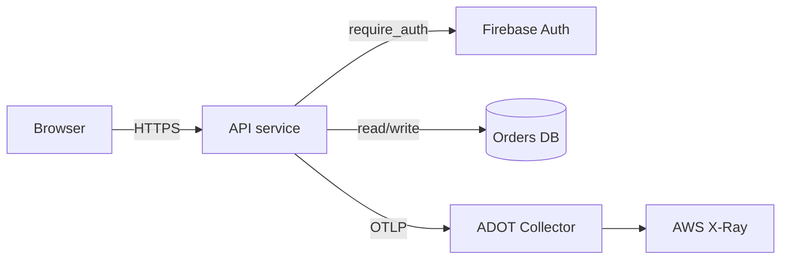
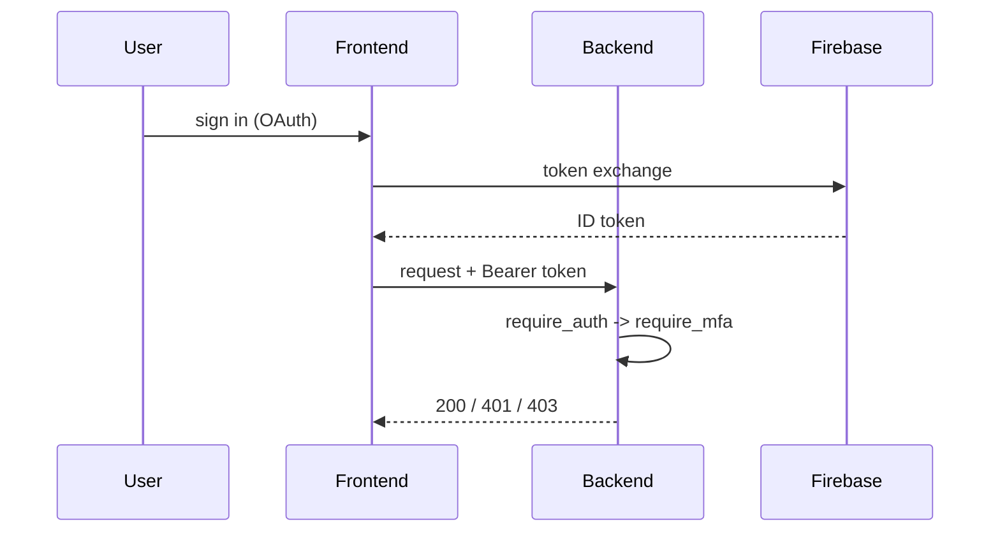
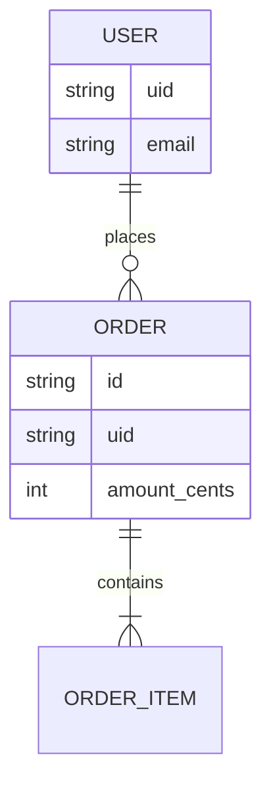

# Mermaid diagram examples

Canonical shapes for `system_architecture.md`. Regenerate only the diagram the
change affects.

## Request / data flow (flowchart)

## Auth handshake (sequenceDiagram)

## Data model (erDiagram)

